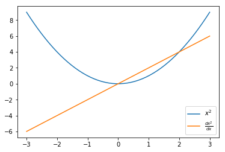
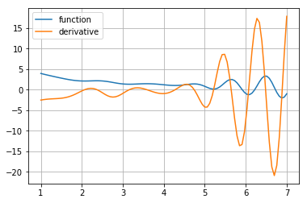
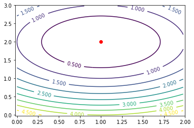
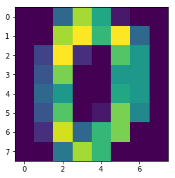

# Going deeper with Tensorflow

In this video, we're going to study the tools you'll use to build deep learning models. Namely, [Tensorflow](https://www.tensorflow.org/).

If you're running this notebook outside the course environment, you'll need to install tensorflow:
* `pip install tensorflow` should install cpu-only TF on Linux & Mac OS
* If you want GPU support from offset, see [TF install page](https://www.tensorflow.org/install/)


```python
import sys
sys.path.append("..")
import grading
```

# Visualization

Plase note that if you are running on the Coursera platform, you won't be able to access the tensorboard instance due to the network setup there. If you run the notebook locally, you should be able to access TensorBoard on http://127.0.0.1:7007/


```python
! killall tensorboard
import os
os.system("tensorboard --logdir=/tmp/tboard --port=7007 &");
```


```python
import tensorflow as tf
s = tf.InteractiveSession()
```

# Warming up
For starters, let's implement a python function that computes the sum of squares of numbers from 0 to N-1.


```python
import numpy as np
def sum_sin(N):
    return np.sum(np.arange(N)**2)
```


```python
%%time
sum_sin(10**8)
```

    CPU times: user 36 ms, sys: 5.14 s, total: 5.17 s
    Wall time: 6.38 s


    662921401752298880


# Tensoflow teaser

Doing the very same thing


```python
# An integer parameter
N = tf.placeholder('int64', name="input_to_your_function")

# A recipe on how to produce the same result
result = tf.reduce_sum(tf.range(N)**2)
```


```python
result
```


    <tf.Tensor 'Sum:0' shape=() dtype=int64>


```python
%%time
result.eval({N: 10**8})
```

    CPU times: user 496 ms, sys: 1.92 s, total: 2.42 s
    Wall time: 2.78 s


    662921401752298880


```python
writer = tf.summary.FileWriter("/tmp/tboard", graph=s.graph)
```

# How does it work?
1. Define placeholders where you'll send inputs
2. Make symbolic graph: a recipe for mathematical transformation of those placeholders
3. Compute outputs of your graph with particular values for each placeholder
  * `output.eval({placeholder:value})`
  * `s.run(output, {placeholder:value})`

So far there are two main entities: "placeholder" and "transformation"
* Both can be numbers, vectors, matrices, tensors, etc.
* Both can be int32/64, floats, booleans (uint8) of various size.

* You can define new transformations as an arbitrary operation on placeholders and other transformations
 * `tf.reduce_sum(tf.arange(N)**2)` are 3 sequential transformations of placeholder `N`
 * There's a tensorflow symbolic version for every numpy function
   * `a+b, a/b, a**b, ...` behave just like in numpy
   * `np.mean` -> `tf.reduce_mean`
   * `np.arange` -> `tf.range`
   * `np.cumsum` -> `tf.cumsum`
   * If if you can't find the op you need, see the [docs](https://www.tensorflow.org/api_docs/python).
   
`tf.contrib` has many high-level features, may be worth a look.


```python
with tf.name_scope("Placeholders_examples"):
    # Default placeholder that can be arbitrary float32
    # scalar, vertor, matrix, etc.
    arbitrary_input = tf.placeholder('float32')

    # Input vector of arbitrary length
    input_vector = tf.placeholder('float32', shape=(None,))

    # Input vector that _must_ have 10 elements and integer type
    fixed_vector = tf.placeholder('int32', shape=(10,))

    # Matrix of arbitrary n_rows and 15 columns
    # (e.g. a minibatch your data table)
    input_matrix = tf.placeholder('float32', shape=(None, 15))
    
    # You can generally use None whenever you don't need a specific shape
    input1 = tf.placeholder('float64', shape=(None, 100, None))
    input2 = tf.placeholder('int32', shape=(None, None, 3, 224, 224))

    # elementwise multiplication
    double_the_vector = input_vector*2

    # elementwise cosine
    elementwise_cosine = tf.cos(input_vector)

    # difference between squared vector and vector itself plus one
    vector_squares = input_vector**2 - input_vector + 1
```


```python
my_vector =  tf.placeholder('float32', shape=(None,), name="VECTOR_1")
my_vector2 = tf.placeholder('float32', shape=(None,))
my_transformation = my_vector * my_vector2 / (tf.sin(my_vector) + 1)
```


```python
print(my_transformation)
```

    Tensor("truediv:0", shape=(?,), dtype=float32)


```python
dummy = np.arange(5).astype('float32')
print(dummy)
my_transformation.eval({my_vector:dummy, my_vector2:dummy[::-1]})
```

    [ 0.  1.  2.  3.  4.]


    array([ 0.        ,  1.62913239,  2.09501147,  2.62899613,  0.        ], dtype=float32)


```python
writer.add_graph(my_transformation.graph)
writer.flush()
```

TensorBoard allows writing scalars, images, audio, histogram. You can read more on tensorboard usage [here](https://www.tensorflow.org/get_started/graph_viz).

# Summary
* Tensorflow is based on computation graphs
* The graphs consist of placehlders and transformations

# Mean squared error

Your assignment is to implement mean squared error in tensorflow.


```python
with tf.name_scope("MSE"):
    y_true = tf.placeholder("float32", shape=(None,), name="y_true")
    y_predicted = tf.placeholder("float32", shape=(None,), name="y_predicted")
    # Your code goes here
    # You want to use tf.reduce_mean
    # mse = tf.<...>
    mse = tf.reduce_mean(tf.squared_difference(y_true, y_predicted)) 
def compute_mse(vector1, vector2):
    return mse.eval({y_true: vector1, y_predicted: vector2})
```


```python
writer.add_graph(mse.graph)
writer.flush()
```

Tests and result submission. Please use the credentials obtained from the Coursera assignment page.


```python
import submit
```


```python
submit.submit_mse(compute_mse, "ssq6554@126.com", "adoEuwVXGdMn5aDs")
```

    Submitted to Coursera platform. See results on assignment page!


# Variables

The inputs and transformations have no value outside function call. This isn't too comfortable if you want your model to have parameters (e.g. network weights) that are always present, but can change their value over time.

Tensorflow solves this with `tf.Variable` objects.
* You can assign variable a value at any time in your graph
* Unlike placeholders, there's no need to explicitly pass values to variables when `s.run(...)`-ing
* You can use variables the same way you use transformations 
 


```python
# Creating a shared variable
shared_vector_1 = tf.Variable(initial_value=np.ones(5),
                              name="example_variable")
```


```python
# Initialize variable(s) with initial values
s.run(tf.global_variables_initializer())

# Evaluating shared variable (outside symbolicd graph)
print("Initial value", s.run(shared_vector_1))

# Within symbolic graph you use them just
# as any other inout or transformation, not "get value" needed
```

    Initial value [ 1.  1.  1.  1.  1.]


```python
# Setting a new value
s.run(shared_vector_1.assign(np.arange(5)))

# Getting that new value
print("New value", s.run(shared_vector_1))
```

    New value [ 0.  1.  2.  3.  4.]


# tf.gradients - why graphs matter
* Tensorflow can compute derivatives and gradients automatically using the computation graph
* True to its name it can manage matrix derivatives
* Gradients are computed as a product of elementary derivatives via the chain rule:

$$ {\partial f(g(x)) \over \partial x} = {\partial f(g(x)) \over \partial g(x)}\cdot {\partial g(x) \over \partial x} $$

It can get you the derivative of any graph as long as it knows how to differentiate elementary operations


```python
my_scalar = tf.placeholder('float32')

scalar_squared = my_scalar**2

# A derivative of scalar_squared by my_scalar
derivative = tf.gradients(scalar_squared, [my_scalar, ])
```


```python
derivative
```


    [<tf.Tensor 'gradients/pow_1_grad/Reshape:0' shape=<unknown> dtype=float32>]


```python
import matplotlib.pyplot as plt
%matplotlib inline

x = np.linspace(-3, 3)
x_squared, x_squared_der = s.run([scalar_squared, derivative[0]],
                                 {my_scalar:x})

plt.plot(x, x_squared,label="$x^2$")
plt.plot(x, x_squared_der, label=r"$\frac{dx^2}{dx}$")
plt.legend();
```





# Why that rocks


```python
my_vector = tf.placeholder('float32', [None])
# Compute the gradient of the next weird function over my_scalar and my_vector
# Warning! Trying to understand the meaning of that function may result in permanent brain damage
weird_psychotic_function = tf.reduce_mean(
    (my_vector+my_scalar)**(1+tf.nn.moments(my_vector,[0])[1]) + 
    1./ tf.atan(my_scalar))/(my_scalar**2 + 1) + 0.01*tf.sin(
    2*my_scalar**1.5)*(tf.reduce_sum(my_vector)* my_scalar**2
                      )*tf.exp((my_scalar-4)**2)/(
    1+tf.exp((my_scalar-4)**2))*(1.-(tf.exp(-(my_scalar-4)**2)
                                    )/(1+tf.exp(-(my_scalar-4)**2)))**2

der_by_scalar = tf.gradients(weird_psychotic_function, my_scalar)
der_by_vector = tf.gradients(weird_psychotic_function, my_vector)
```


```python
# Plotting the derivative
scalar_space = np.linspace(1, 7, 100)

y = [s.run(weird_psychotic_function, {my_scalar:x, my_vector:[1, 2, 3]})
     for x in scalar_space]

plt.plot(scalar_space, y, label='function')

y_der_by_scalar = [s.run(der_by_scalar,
                         {my_scalar:x, my_vector:[1, 2, 3]})
                   for x in scalar_space]

plt.plot(scalar_space, y_der_by_scalar, label='derivative')
plt.grid()
plt.legend();
```





# Almost done - optimizers

While you can perform gradient descent by hand with automatic grads from above, tensorflow also has some optimization methods implemented for you. Recall momentum & rmsprop?


```python
y_guess = tf.Variable(np.zeros(2, dtype='float32'))
y_true = tf.range(1, 3, dtype='float32')
loss = tf.reduce_mean((y_guess - y_true + tf.random_normal([2]))**2) 
#loss = tf.reduce_mean((y_guess - y_true)**2) 
optimizer = tf.train.MomentumOptimizer(0.01, 0.5).minimize(
    loss, var_list=y_guess)
```


```python
from matplotlib import animation, rc
import matplotlib_utils
from IPython.display import HTML

fig, ax = plt.subplots()
y_true_value = s.run(y_true)
level_x = np.arange(0, 2, 0.02)
level_y = np.arange(0, 3, 0.02)
X, Y = np.meshgrid(level_x, level_y)
Z = (X - y_true_value[0])**2 + (Y - y_true_value[1])**2
ax.set_xlim(-0.02, 2)
ax.set_ylim(-0.02, 3)
s.run(tf.global_variables_initializer())
ax.scatter(*s.run(y_true), c='red')
contour = ax.contour(X, Y, Z, 10)
ax.clabel(contour, inline=1, fontsize=10)
line, = ax.plot([], [], lw=2)

def init():
    line.set_data([], [])
    return (line,)

guesses = [s.run(y_guess)]

def animate(i):
    s.run(optimizer)
    guesses.append(s.run(y_guess))
    line.set_data(*zip(*guesses))
    return (line,)

anim = animation.FuncAnimation(fig, animate, init_func=init,
                               frames=400, interval=20, blit=True)
```





```python
try:
    HTML(anim.to_html5_video())
# In case the build-in renderers are unaviable, fall back to
# a custom one, that doesn't require external libraries
except RuntimeError:
    anim.save(None, writer=matplotlib_utils.SimpleMovieWriter(0.001))
```


<img src="data:image/jpeg;base64,/9j/4AAQSkZJRgABAQAAAQABAAD/2wBDAAIBAQEBAQIBAQECAgICAgQDAgICAgUEBAMEBgUGBgYFBgYGBwkIBgcJBwYGCAsICQoKCgoKBggLDAsKDAkKCgr/2wBDAQICAgICAgUDAwUKBwYHCgoKCgoKCgoKCgoKCgoKCgoKCgoKCgoKCgoKCgoKCgoKCgoKCgoKCgoKCgoKCgoKCgr/wAARCAEgAbADASIAAhEBAxEB/8QAHwAAAQUBAQEBAQEAAAAAAAAAAAECAwQFBgcICQoL/8QAtRAAAgEDAwIEAwUFBAQAAAF9AQIDAAQRBRIhMUEGE1FhByJxFDKBkaEII0KxwRVS0fAkM2JyggkKFhcYGRolJicoKSo0NTY3ODk6Q0RFRkdISUpTVFVWV1hZWmNkZWZnaGlqc3R1dnd4eXqDhIWGh4iJipKTlJWWl5iZmqKjpKWmp6ipqrKztLW2t7i5usLDxMXGx8jJytLT1NXW19jZ2uHi4%2BTl5ufo6erx8vP09fb3%2BPn6/8QAHwEAAwEBAQEBAQEBAQAAAAAAAAECAwQFBgcICQoL/8QAtREAAgECBAQDBAcFBAQAAQJ3AAECAxEEBSExBhJBUQdhcRMiMoEIFEKRobHBCSMzUvAVYnLRChYkNOEl8RcYGRomJygpKjU2Nzg5OkNERUZHSElKU1RVVldYWVpjZGVmZ2hpanN0dXZ3eHl6goOEhYaHiImKkpOUlZaXmJmaoqOkpaanqKmqsrO0tba3uLm6wsPExcbHyMnK0tPU1dbX2Nna4uPk5ebn6Onq8vP09fb3%2BPn6/9oADAMBAAIRAxEAPwD9/KKKKACiiigAooooAKKKKACiiigAooooAKKKKACiiigAooooAKKKKACiiigAooooAKKKKACiiigAooooAKKKKACiiigAooooAKKKKACiiigAooooAKKKKACiiigAooooAKKKKACiiigAooooAKKKKACiiigAorj/AAR%2B0J8A/iZ431n4Z/Dj44eD/EHiTw5JJH4h8P6J4ltbu%2B0t0kMTrcQRSNJAVkBQh1GGG088VZtfjb8Gb74p3PwLsvi54Ym8b2dgL288HRa/btqsFqQpE72gfzljIdPnK7fmXnkUAdPRRRQAUUUUAFFFFABRRRQAUUUUAFFFFABRRRQAUUUUAFFFFABRRRQAUUUUAFFFFABRRRQAUUUUAFFFFABRRRQAUUUUAFFFFABRRRQAUUUUAFFFFABRRRQAUUUUAFFFFABRRRQAUUUUAfIz%2BIrvxH/wUT0j40aVp3xZ1nw/4Z8I6/pWr2XiP4WX%2Bn6b4Ukmn0yMNpUo06CbVWu5bUtJiS%2BRUQyxvbxjbLy/g74f/EGL9qTw98N5fhR4oh17Qf2nfEnj3WvGcvhq6TSpvDt5oWp29tImpmP7NPIVvbDT/sqyGZPszMYxHCr19w0UAeIftr%2BO/wBp34WeFtF8bfAPx94D022ufF/hzw/qFj4v8B3uqyO%2Bq67Y6X9ojlttVsxGIkvDJ5ZR95jA3oDkWf8AhB/%2BChf/AEdB8Gf/AAw%2Brf8AzUUft4f8kQ0P/ss3w4/9TXRK9moA8Z/4Qf8A4KF/9HQfBn/ww%2Brf/NRVbWdA/bz8OaRdeIPEP7W3wQsLCyt3nvb29%2BB2qRQ28SAs0ju3ikKigAkkkAAZrtvhz8ddL%2BIPxC8S/DO58F65oGp%2BHTHIkWuxQx/2nZvJNEt5biOVy0JlglTLBW4UlQHUnwnxj4Y%2BMnh7SfE/w8%2BNujX%2BsaZ8RPFEvhqz8ZS%2BM3nuFS8eQ2EkOlRwrDawQsyQuY2EpCNOwKqSOulhHOfLN2emnVp9tbOyu/6dsZ1Uo3Svv/X3lHxB8b/27NYt/Cy/AD9pj4A%2BOLnxXqV3bWWPhRqtnboLWBp58y/8JHKfNCqAsRUFtwJKoC47H4Paz%2B3j8Zfh1p3xD0P9pT4RWkd4JYrqwvPgJqyz2V1DK8FxbSj/AISjiSKaOSNscbkOOKzfC3wc%2BK/xk%2BI914s8Z%2BCNU8Aatplhpl2de32sscviW1M0TXVtHHI3m272k8sT7wm%2BO5ZPvLlPb/gn8K5vhL4RuNG1LxGNX1PUtYvNV1nU0sVtUuLu5lMkjJCpYRoMgBdzHC5LMSSdcTTwtKlyxfvffvfqtNrbWflrpNKVWUrvb%2BvmeEeBx/wWR8RfFHWNF8XeKPgJ4e8H2FxPDpniCf4dapc32qbWxHMlnF4gKRRuAW/eThxkZTOcegf8IP8A8FC/%2BjoPgz/4YfVv/mor2aiuKclN3UUvS/6tm0U0tXc8Z/4Qf/goX/0dB8Gf/DD6t/8ANRR/wg//AAUL/wCjoPgz/wCGH1b/AOaivZqw/iF8T/ht8JPDsni/4qfEDRPDWlQ/63Ute1SGzgXjODJKyrn8amMZSdoq7K3PNf8AhB/%2BChf/AEdB8Gf/AAw%2Brf8AzUUf8IP/AMFC/wDo6D4M/wDhh9W/%2BaiuQn/4Kh/BjxncPpn7Lfwu%2BInxlulcx/afAPhOX%2BzEkzgB9SvDBaBf9pZH78HFNHiv/gqv8XOfD3wo%2BFXwe0%2BX5Wl8V65ceJtVjH98QWQgtVb2M7jPr1rs/s/ER/i2h/iaT%2B7WX/kpfJLrodj/AMIP/wAFC/8Ao6D4M/8Ahh9W/wDmorK8XH9tXwBpZ1vx5%2B2j8BNEsl%2B9eav8F9Stoh/wOTxUB%2BtYn/DB3xr%2BIH779or/AIKJfFfXc8PpvgZ7TwnYsvdStjGbgj63BODyTWt4R/4JZ/sB%2BE9UGv3H7NOh%2BItT6vqnjiWfX7h267i%2BoyTHOeeMY7Yo9lgYfHVcv8Mf1k1%2BQWgup4x4q/4KMP4T1I6Kf%2BCo37O2tXwyBZeD/gRrmuzE%2BgTTvEs5J7YxWb/w3d%2B3rr//ACSnwjrXi1H/AOPe8tP2O9a022l9CJdT8W2w2%2B/P0r7m8K%2BCvBvgTTRovgjwlpmjWa/dtNKsI7eIf8BjUD9K06Pa4CPw0pP1lb8Ix/ULw7HwPH8av%2BDgjxA4bwj%2BzN8I7OBz8k3jHRfsJx6lLTxNeMv0IzXffCy1/wCC7ev%2BI7T/AIW94p/ZT8N6I%2B77ZLo/hPxHqd9F8jbdsTalBE3z7QcyjAJPJAB%2BuqKieIpSjaNKK/8AAm/xl%2BgnJdjxn/hB/wDgoX/0dB8Gf/DD6t/81FH/AAg//BQv/o6D4M/%2BGH1b/wCaivZqK5STxn/hB/8AgoX/ANHQfBn/AMMPq3/zUUf8IP8A8FC/%2BjoPgz/4YfVv/mor2aigDxn/AIQf/goX/wBHQfBn/wAMPq3/AM1FH/CD/wDBQv8A6Og%2BDP8A4YfVv/mor2aigDxn/hB/%2BChf/R0HwZ/8MPq3/wA1FH/CD/8ABQvt%2B1B8Gf8Aww%2Brf/NRXs1FAHxJ4k1P/g4i8P7pdK0j9kfX0H3E0%2Bw8RW8jD3E96qg/8CNYI/aJ/wCC63hg%2Bd8Sv2XvBot1/wBZP4J8CQ6wf%2BAxyeMLaRv%2B%2BRX3zRXZHE0bWlRi/wDwJflJ/kVzLsfK/wCz98Sv%2BChPx%2B0zUr9/GnhvwRNpk8cU1j8Qf2YtX06WYspO6EjxY6TKMYLIxAJA71pfEvxF/wAFBvh74t8EeC7f9oL4M6he%2BNvEj6Xbr/wpTVYRaxRWNzeTXJ/4qZt4VLbbs%2BXLSKNwr6Wrzbx/%2BzPoHjv4y6D8dU%2BI/jDSdb8O288NhbafrKyaeVmiaKQtZ3EcsIYqeXRVf5R83XMU5Yd13Jq0bOy1lrZ27PfW/QFy3PBf2g/jh/wUO%2BCWpXmmaH8V/hH4kfQPDMniXxhJD8GdStk0nR42kDT5fxOTNKfJmKQqAWELfMOM60Hxz/aoufinb/CGL9rP4VnUrm7SyS7/AOGbde%2BwrfvaC8Wxa6/4SXyluTbETeUWB2%2B4xXb/ABj/AGSvHXxJ8U31xpHxXtLTR/Fvh6w0bx8l1ope9u7e1mkk3WsiSpHCZlkeGRWjZQrFkw2c8PqP7PH7SK6v4g8LaD4b06z0/TfFeu%2BL9B8S/wBqKf7Sv5bcppVsIBmSLySyrK78MLddmRIQnXTo4GpSScrO3e333XR9F038qSg0dT4Q179rv4gavqvh/wACftzfs%2Ba1qGhXAg1ux0r4O6hcTafISQEnRPFZaIkq2AwGcH0rf/4Qf/goX/0dB8Gf/DD6t/8ANRXF/sZeCtWfxvoXiLRPBHiDw54Z8GfCDTvCaQeJdBm0271HUzMJrl3imVXkEIiTE2NjyXc5RnBLH0f4l/ttfsqfBj4q2/wW%2BMHxs0fwr4gu7OO5s4vEbPZW1wjlgoS7mVbdnypygk3jIyBuGeethJKu6dFOVlfRXfntfyfW1yXHWyMz/hB/%2BChf/R0HwZ/8MPq3/wA1FH/CD/8ABQv/AKOg%2BDP/AIYfVv8A5qK9f0vVdM1zTodX0XUoLy0uYxJb3VrMskcqHoyspIYH1FT1x7EnjP8Awg//AAUL/wCjoPgz/wCGH1b/AOaivP8AwGP%2BCyGo/FLVfB/xL8UfATSfDkFvLNo3i/R/h1ql9HeYlVUhltpPEEMsEpRi5wHjGxhvPy5%2BpqKuM1FNOKd/XTzWv53Jaba1Pmf48eIv%2BCh/wV%2BHFx41sPjv8F9d1F7q3sdG0I/BrV7RtRvriVYbeBZB4jl2lpHUE7DhdzHhTV/4ieI/2wPhBo9pr3xY/ba%2BAnh2zvb2Ozgu9W%2BCmqQwtcPnam9/FIAzg8nA47V6B8VvgFqvxB%2BJ3hf4raX8TdStJfCt2bq28M30Edzo93N9nuIVmki2rKkyi5YrIkgA2qSjEDHC/tNQ/EnxB4m8NL4X%2BFfixvF2g3kEnhzWNKeCbQLk3Pl29/HeCQsUiSCSfJliRyozCxc7R10aVCqoQv3bezXZa6WVt9d3poZTnUhzO3a39I2bTwl/wUAv7WK/sP2qvgrPBPGskM0PwK1VkkQjIZSPFOCCDkEVJ/wg/wDwUL/6Og%2BDP/hh9W/%2BaivNdS%2BMuueHtf0z4uRfEy50Hw1a%2BK9StLHwjZ20MenQeGNKW4TULuaLZv377d3VwRtCRqnDkN7F8G/j74n%2BIXjWbwN47%2BFzeFr2Xw3a6/pVrLq4uZ3sppHj23MYjX7NOrpgx5cfNw5KsqzVwVWnHmWq/L/O11e2g4V4SdjjNS8Y/tm/CX40/Crw18Ufi38MPEvh/wAeeNbvQdTtNA%2BF2o6ReW4j8P6vqcc0VxNrl2gPm6dGjK0JysjYKkA19A14z%2B1B/wAlv/Zx/wCyzX3/AKhXiivZq4zYKKKKACiiigAooooAKKKKACiiigDxn9vD/kiGh/8AZZvhx/6muiV0/gH9pT4cfFD4t%2BIvhB4Dg1jUbnwoGj17Wo9HlXS7a8V1VrEXTAJJcru3MibtoByQRiuY/bw/5Ihof/ZZvhx/6muiV7KiJGCI0CgkkgDHJ5Jq4umovmV301tb/P00Jak2rM8u%2BLvwe%2BKHi/41eDviZ8MfGOkeHP7Ds72013Ubqwe8ub%2BynMTGzSHckajfEsgmdm2OgxGwZs9XafB34fJ4nsPHus%2BHrbV/EemWrW9l4i1W2jlvIUZmLBH2gR53EHYFyMA8AV09FW69VxUb2sraaaeb3e//AABKnFNvuFVtY1nSPD2lXOva/qttY2NnA015e3k6xRQRqMs7uxAVQASSTgAVT8bjxq3hHUV%2BHEulprptWGlPrUUj2izY%2BUyrGyuyDuFZSemR1rxI634q/ae/ZI8b/C/4i32k6V430d7vw94oxGYLAalAUeGULIzMltcxtbTKCzER3O3cWXNOlR9ouZvS6T7q/W3b9TRK50PxC/a50a2t/C6/s/aJp3xJufFUeoXGm/2P4khjtpYLKBZpglwFkR52EkYjh%2BXduLFkVGYeLeI/2k/G2seIvHnx48DfE3XI38H2eka/o3gW/mt4dP1fwsSseoRLGU3C/W5ttShLl2MU0duufLlUHV8I/Br4i/Gf40%2BIfGll4M1/4Z3UA0vV5dQ1PTY2iTxVbyPb3Eluqybby2ubGOGOZl2hl2bX3l9nr/gL9kj4Z6b4G0zw78X/AA5oHjjU7DXb3WhqeqeG4hFDfXVzJcubaGQym3iV5SI497lAifMSoNelfA4RWau9L7N66vvHbTRp63NPcid/418PXXjjwNqfhfTfFeqaDNqumy28GtaQUjvLBpEKrPF5qMqyoSGG9CARyp6V4z8Pf%2BCZ37IngzxFH498YeA7r4ieK05bxb8UtVl8QX5bsym7LRwkdvJjjA7CvfaK82nicRRg405OKe9tPxWvyvbyM1KSWgy3t4LSBLW1gSOKNAsccahVVQMAADoBT6KKwEFFFc/8SPiv8Lfg34bk8ZfF34k6B4V0iLPm6p4j1iCxt04zzJMyqPzpqMpOyV2NJydktToKK%2BVbz/gsN%2Byj4lvJdI/Zo8N/Eb4330LlJYvhD4AvNTtUYcfNfyrDYgZ4z5%2BB37UwftEf8FW/iv8Au/hN/wAE/PB3w9tZPmg1f4x/FJJZdnYtY6NDclWxztadT2OOtdX1HEr40o/4mo/g3f8AA6fqWIXxpR/xNL8G7/gfVtFfKY/Z0/4KwfEX/S/iR/wUZ8HeBkk4l0v4VfByGTYO4W61i5ujn38ketL/AMOsh4k/efF//goR%2B0x4saTm5th8UTo1rJ6jydIgtcL/ALJJ%2BtH1fDx%2BKsvkpP8ASKD2FCPxVV8lJ/okfVTukal3YKoGSScACuR8S/tBfAXwYzJ4w%2BN3hDSSn3xqXiW1gK/XfIMV4Kn/AARR/wCCal2wm8Xfs%2BXXimbOZJ/GfjjWtZaRvUi8vJF/IAV13hr/AIJX/wDBNPwkqjRP2BvhAGT7st18PdPuJB/wOWJm/WjlwC%2B1J/8AbsV%2BcmHLgl9qT%2BSX5yZtar/wUO/YB0Jimt/ty/B6zK/eF18TNKjI/wC%2BrgVjzf8ABUv/AIJoQNtf/goJ8Fyf9j4m6W38p67DSv2Nf2QdCULon7Knw2swv3Ra%2BBtPjx/3zCK2If2d/wBn%2B3XZB8DPByD0TwzaD%2BUdF8v7T/8AJP8AIP8AYe0//Jf8jzq2/wCCon/BNS7YJD/wUE%2BCuT0D/FDSl/8AQrgVvaN%2B3p%2Bwz4iYJ4f/AGz/AIT3xb7os/iLpkuf%2B%2BZzXSXX7N/7O96uy9%2BAnguYHqJfC1ow/WOsHWP2HP2KfEKlNf8A2PvhbfBvvC8%2BH%2Bmy5/76hNH/AAn/AN//AMkD/Yf7/wD5Kdn4X%2BK3wu8blV8F/EnQNXLfdGl6xBcZ%2Bnlsa36%2BdPFH/BIn/gl74vDDVv2B/hVFu6nS/BtrYn8DbIhFYB/4Iv8A7BGknz/hr4P8beBrkf6u68DfFnxDphj/AN1Ir7yx/wB8UcmAe05L1in%2BUg5cE9pyXrFP8pH1VRXyp/w7X%2BLPg7/Svgj/AMFR/wBojQrhf9VD4n1/TvE9qvplNTspZG/GWk/4Vb/wWO%2BGf/Im/tY/Bf4oQdfI%2BIPw3vNBuSPT7Rpd1LGD/tfZ8f7NP6tRl8FaPzUo/mmvxD6vRl8NVfNSj%2Baa/E%2BrKK%2BUT%2B2h%2B338Kv8Ak4f/AIJda/qljD8s%2Bu/BXx3p/iFXP95bK7%2BxXQHsFc8dzgVreB/%2BCvP7BfiXxDD4G8efF24%2BGfiWY7T4Z%2BL2gXnhe7V%2BmwHUY4opGyQP3bvycUngcVa8Y8y/utS/Jt/gDweJteMeZf3Wpfk2/wAD6YoqtpGsaR4g0yDW9B1W2vrK5jEltd2c6yxSoejK6khh7g1Zrk2OXYKzfFng3wh4%2B0Kfwt468K6brWmXK4udO1axjuYJR6NHICrfiK0qKabi7oD5r1P/AIJe/A3wrqVx4o/ZU8aeMPglrM8hmkk%2BHGuNDps8nUedpdwJbKRAf4REv1FV28af8FL/ANnH/kffh14Z%2BPfhuD7%2BseCGXQPEiRjlnfT7l2tLlsdFhmiJ7L2P05RXasfWnpWSqL%2B9q/8AwJWl%2BLL5299Txv4E/t6/s0fH/wARv8PNA8ZT6B40gH%2Bm/D/xrp8mka5btjJH2S5CtKB3eLzE/wBqvZK4T48fsxfAD9p3w4nhb48/CjSPEltCd1nLfW%2BLmyf/AJ6W9whWW3f/AG43VvevFn%2BCH7cf7JP%2Bn/syfFR/i/4Og5b4a/FHVNmr28Y/g0/W9uWPQLHeK6gDHmjrR7LCYj%2BFLkl2lt8p/wDySXqFoy20PqSivHP2eP24fgz%2B0D4hufhkU1Twd8QdNi36x8N/Gtl9g1i1UdZEjYlbqHjImgaSMgg5GcV7HXLVo1aE%2BSorP%2BvvXmm15ktNOzPOPHX7K3wb8WeG/GGmaH4K0nQNT8a2jRazrul6TCtxNIWDrLJ8uJT5gV2DcOR82au/CL4O6j4C1zXPH3jbxmfEfirxILWPVdXWw%2ByQrb2yOsFtBAHfyokaWeTBdiXnkJY547qiqeIrOm4OV0/%2BB13totPJGfs4KV7HjH7TrF/jb%2BzkShX/AIvPfjB9vBXijmvZ68Z/ag/5Lf8As4/9lmvv/UK8UV7NWJYUUUUAFFFFABRRRQAUUUUAeD%2BFPjN%2B0Fof7Z9v%2Bzp8QvEHgjxJpes%2BEdV8RLF4V8OXlje%2BFbaC9toLFb6Wa9uI7oXQmuFR1jtSXsZiiSKshiwvhX%2B1P8Xdd/bS8V/A34seJtE8M6Lb%2BJ7nTfAGgX/wn1u0ufE9tFpdvdm4tdenuxp93IrtdlreCBpBHauSAEZx0Xwm/YlvPg58QvG/xG8OftZfE27uvH2uT6rrcGrW3h2cLO7IIljm/sgXHlW8KLbwxPK6RxcBS3z1v337LUHiL45aL8a/Hvxv8a%2BIofC2tXOr%2BEfB2pHTI9J0W%2Bms7iyaeL7NZRXUxW2u7qNBc3EyqJ2IG5UZQDjP%2BChfxc%2BFHhrwf4M%2BFHiP4neHtP8AFPiD4w/D2XQfDV7rUEWoakkfjPRmka3t2cSTBVVixRSAFJOMGvoevGf28P8AkiGh/wDZZvhx/wCprolezUAFcT8ff2h/hD%2BzH8PZviZ8Z/F8OlaakqwWsexpbm/uX4jtraFAXuJnPCxoCx5PQEjH/an/AGpPBn7LXge11zV9Ivde8Ra7fLpvgvwXowD6h4h1Fx8ltAvYD7zyt8kaAs3YHhP2dv2RfGep/EGD9rX9tPVbLxL8UXiYaDpFsS%2Bj%2BBbZ%2BtppyNw05GBLeN%2B8kIwpVOG7KOHgqftq7tDolvJ9l2S6yei2V3oqUVa72PRP2afih8YvjD4JuvHvxb%2BBs3w%2BjvdRZvDWhanqaz6kdO2J5ct9Gi7LWdm3kwB3KKVViGBFJo37LXwo0z40678ftSt9Q1bxJrwgSWTVdQaS1tYoVVYo4bVdsClduRKyNNyQZCOK9GorF1pKcnT91S0sr7dtdenz/AV9dAooorEQUUV4H%2B1B/wAFAfh78BfGlt8Bfhr4M1b4o/F/VbYTaR8L/BpRrtIjgC6v53Pk6ZaZK5nnIyD8iuQRWlKlUrT5YK7/AK1fRLzdkaU6VStLlgrv%2Bt%2By82e9SyxQRNNNIqIilndjgKB1JPYV8w%2BP/wDgqp8FLjxfe/CX9kbwN4l%2BP3jayk8m70n4YWyT6bpsx6LfavKyWNoM5BBlZ1I5SsC0/YK%2BP/7YEi%2BKf%2BCnXxm%2B3aJMwktvgR8Nr%2Bew8M2y9Vj1G6UpdazIMKWDtHb7gcRFTX1L8Pfhx8PvhL4Qsvh/8LfA%2BkeHNC06Ly7DR9D06O0tbdfRIolVV/AV08uEofE%2BeXZaR%2B/d/JJeZvy4Wh8T532Wkfv3fySXmfMq/CH/AIKp/tN/6R8Z/wBofwz8AvDVx97wp8IrJdZ19om6xzazqEfkQyD%2B9bWp9nrovht/wSX/AGGvAviSP4g%2BMfhTN8S/Fy8yeMvi7q8/ifUXfOd6tftJHCfTyUjA7CvpKipljcRblg%2BRdo6fe1q/nITxle1oPlXaOn4rV/NkVlZWWm2cWn6daRW9vCgSGCCMIkagYCqo4AA7CpaKK5DlCiiigAooooAKKKKACiiigAooooAKKKKACsjxx8PvAXxO8OzeEPiV4I0jxDpNwMXGl65psV3by/70cqsrfiK16Kabi7oabTuj5W1n/gkN%2BzT4Z1OfxV%2ByV4t8cfAPXJpDK9x8JPE0llp88nUedpUwlsJUz1XyFyO44Ipv4k/4K0/stjd4r8JeDf2lvC0H%2Bs1DwwE8K%2BLI4%2BpdrSZ30%2B8YD%2BGOW3Zj0XkCvrWiutY2tLSraa/vav8A8C0l%2BLOlYyrLSraa/vav79Jfizwn9nX/AIKOfst/tH%2BLX%2BFWk%2BKdQ8I/EG3TN98MviJpUmieILfgk4tLjBuFwM%2BZA0seP4q92rzr9o79kr9nD9rfwmngv9or4QaP4otIH8ywnvYCl3p8uQRLa3MZWa1kBA%2BeJ0b3rwGb4c/8FBP2BR/afwV8Wap%2B0Z8LLUZuPAfjDUI08aaNAOT/AGfqb7Y9VVRki3u9sxCqqzMTT9lhq/8ACfLLtJ6fKWn3SS9R%2Bzw9f%2BG%2BV9pPT5S/%2BSS9T7DorzL9lz9r/wCA/wC2F4MuPF/wU8WvcTaZc/ZPEfh7VLR7PVtBvBndaX1nKBLbSqQwwww20lSy816bXLOnOlNxmrNdGc04TpycZKzQUUUVBJ5z%2B0Z%2Byj8Dv2p/D1tonxd8ICe702Xz9B8Q6dcNaarotwMFZ7O7iIlgcEA/Kdp2gMGHFeKj42/tJfsAzppH7W9/efEf4So4js/jJp2n/wDE18Px5wq65aQjEsQHH26BccZljUtur6wplxb293bva3UCSxSoUkjkUMrqRggg8EEdq66OLcIeyqrmh2fTzi94v8H1T3KUrKz2KvhvxL4d8Y6BZeK/CWu2eqaXqNslxp%2Bo6fcrNBcwuMrJG6Eq6kEEEEg1dr5I8Y/CT4if8E5NevfjV%2Byv4bvtf%2BEF3cveePvg5YL5kuhhjum1TQkP3ccvLYjCONxj2tgD6a%2BGPxN8A/GbwBpPxT%2BF3im01vw/rlkl1pWqWUm6OeJu47gg5BUgMrAqQCCKWIw6pxVSm%2BaD2fVPtJdH%2BDWqdtiUbarY82/ag/5Lf%2Bzj/wBlmvv/AFCvFFezV4z%2B1B/yW/8AZx/7LNff%2BoV4or2auUkKKKKACiiigAooooAKKKKACiiigDxn9vD/AJIhof8A2Wb4cf8Aqa6JXoXxh%2BLfgP4D/C7XvjH8T9cTTtA8OabLfapduMlY0GdqjqzscKqjlmZVHJFee/t4f8kQ0P8A7LN8OP8A1NdErg/2h7YftXfts%2BDv2S5P3/gz4c2Nv4%2B%2BJUA5ivrzzmj0XTpexXzYp7x42BDC2iz1rpwtGNar7%2BkUm5ei3t5vRLzfkVFXepe/Y4%2BC3jz4i%2BNLj9vT9qPQXtvHXiayMPgrwrd/Mvgbw%2B53RWaKeBeTLtkuZcBizCIbVQg/SlFFTiK8sRU5notklsktkvJfjq3q2KTcmFFFFYCCiivnH/goV%2B0B8UPCGmeE/wBlX9mPUYrb4t/GPUZtL8MalJF5ieG9OhQPqWuyp0ZbWFhsUn555YVw2SK1o0pV6ihHr9yW7b8ktTSlSlWqKC/4ZdW/JLU539oD9qD42/tFfGTVf2I/%2BCf2r21hq2iMsPxY%2BMdzai5sPA6uM/YrWM/JeauyHIiJ8uAENLydo9e/ZT/Y7%2BCH7HXgq48KfCXRLmW/1a5%2B2eKfFuuXRvNZ8R3xyXu7%2B7f57iViWPOFXcQiqvFaX7L/AOzR8Lf2Rvgro/wM%2BEemSxaZpaM9ze3kvm3eqXkh33F9dSnma4mkLO7nqTgYAAHoFbVq8eX2VHSH4yfd/otl5u7Nq1ePL7KlpD8Zeb/RbLzd2FFFFchyhRRRQAUUUUAFFFFABRRRQAUUUUAFFFFABRRRQAUUUUAFFFFABRRRQAUUUUAfPH7WH7BenfF/xlB%2B0r%2Bzv42f4ZfHDRbby9H8faXbhotVhXBGnavbDC6hZNtA2v8AvIsBo2UjBt/saftoX/x31XXPgJ8efAyeA/jV4HijPjPwS1yZILm3Y7YtW0yVsG60%2BYj5XHzRMfLkAYAt75Xzz%2B31%2Byj4t%2BMugaP8ff2c7230b43fDCSTUvh1rcnyx34I/wBI0W8OR5lleIDE4JGxykikFDntpVY14qjWf%2BGX8vk/7vdfZ3XVPspVY1oqlVfpL%2BXyf93y6brqn9DUV5t%2ByJ%2B0x4R/a%2B/Z48N/H7wfp9xp6a1asup6LejFzpGoQu0N3YzggESwTxyRNkDOzI4Ir0muScJ05uElZrRnLOEqc3GSs1oFFFFSSFfI/iuw/wCHa3x9X4m%2BHl%2Bz/Aj4na/HB4y0teLfwT4huXCRapEOkVldSFY514WOVkkBAZlr64rB%2BKHw08GfGT4c658KPiLoseo6F4i0ubT9VspRxLBKhRgD/C2DkMOQQCOQK6sLXVGbjNXhLSS8u681un302bKi7PXY83/ag/5Ld%2Bzj/wBlmvv/AFCvFFezV8vz/DTx98G7X9kv4U/Ez4jDxbq/h74qXthJ4iNoYXvYYvBnipYGkUsxMohEau%2BfndWbA3YH1BWFSMYTcYu6T37%2BfzE9GFFFFQIKKKKACiiigAooooA5DwL%2B0H8A/ih4y1n4dfDT43%2BEPEXiHw67J4g0LQvEtrd3mmMrmNluIIpGeEhwVIcDDAjrVi1%2BNvwZvvinc/Auy%2BLnhibxvZ2AvbzwdFr9u2qwWpCkTvaB/OWMh0%2Bcrt%2BZeeRXzX8NfivpnxY/bf1b4p%2BLPhJ8RfCWk/CzSda8L%2BBdNuPg14hh/tr7VeWZ1HVmuhYfZ3gkltIEtYIpGZ41muXB3xiHmfB3w/8AiDF%2B1J4e%2BG8vwo8UQ69oP7TviTx7rXjOXw1dJpU3h280LU7e2kTUzH9mnkK3thp/2VZDMn2ZmMYjhV6APe/28P8AkiGh/wDZZvhx/wCprolch/wTui/4TbxD8c/2ir8ebd%2BMvjTqthaXX97TNHCaVaoP9kG2nce8pq9/wUL034rz%2BD/Bmo%2BHPGnh618LQ/GH4ejXtGvfDE9xqF458Z6N5bW94t7HHbBW2lg9tMWAIBTIIr/8EsZo4v2X9R8OvbJDeaL8UvGVhqUSFjtuE8QXzNncSdxDqx578ADArto6YGs11cF8ryf5pFr4H8j6PoooriICiiigAr5L/ZFs2%2BOv/BRL9of9qbWWFxbeCL7T/hT4I3jmzhtLaHUdWK/9db29iUt1ItFGeMD60r5U/wCCW7LYah%2B0l4Uu/lv9O/al8VS3cbcNsuks7yByPQwzx4P%2Bz7V2Yf3cNWkt7RXyctfySOqh7uHqyW9kvk5a/kkfVdFFFcZyhRRRQAUUUUAFFFFABRRRQAUV5V%2B1t%2B2L8Hv2MPAFr4/%2BLjanMmoXws9M0zRbMT3V5NjcVQMyIAFBYl3UdhkkA/Dl9/wcNa1/wlEx039li2XRrXeZIr7xd5d5KnmBUYf6PtVsFcxgPjk7toJHu5bw1neb0XWwtFuHdtJO3RXev9angZpxRkWTV1RxdZKfZJtpPq7J2%2Bf3H6cUV%2BS37TP/AAXv%2BL/jex07Sv2YfB6%2BCNn7zVdU1VYNQuZmyMRRI8ZiSPAbcxVmbcMeXtJf52/bq/4KS/tOft1/DPSvhh4zudH0DTtPu3uL608OR3EEWrMVjEf2gPLJkRlZGUD5cycrlQa7MdwRxZhsrliqOGVSaTapqcVN29dNd7KV/m0a8McYcBZzxTQyzM8x%2Bp4eckpYmVOc6cE09Woe%2B9bK/Kkm7t8qbP3yor8u/wDgkF/wUh%2BEv7PH7KP/AAqP9rn4xarFqen6/O/hhp9Fvr2NdJMcQWGOSGJyRHMtwcNjaHVRkDA%2ByF/4Kf8A7CU/w1m%2BKVh%2B0Ro1xZRzNDHpyLImpzyAhdkdi6rcPksuGEe3BzkDJHiUcn4glh4Tr4KpTlK14uLbTfS6uvx%2B7W3t55j%2BFMuzvE4PAZpRxVGlKSjWhK0akFa04qfLJJp7NXTTSurN%2B%2BUV8KftI/Gz9v8A/bZ8PWPgP9iT4KeNfh14furhv7b8aeLzDo1xdQ/KIxAC5njizuYvEDIwCgYG5W8%2B/an/AGHT%2Bzz8DPB%2BgeKPjZ438f8AxR8d%2BL7HwxoWs6x40u7fT9Lu7kkJOlujtI0cIUAZL/MwYgLiOvZw3DtOTpwxGIjCpNtciXPJJXbcrS5YpJN6ybstr6HymJ4lqwVSphsNKdKCTc2%2BSMm2klBSjzSbbSuopXe9tT9LKK479n/4a%2BJPg98GvD3wz8X/ABI1Lxfqej2AgvfEerMTPevuLbmyScDO1clm2quWY5J7GvnKsYQqyjCXMk3Z6q672eqvvrqfTUpTnSjKceVtJtaOzttdaO22mgUUUVmaBRRRQAUUUUAFFFFAHyb%2BzBar8AP%2BCmXx1/Zr08eVoHxA0LSvit4eso/9XbXlxJLpusY95Li1tZyP71wx/ir6yr5UnZdU/wCC3tp9hO7%2BxP2V7ldTK/wm98SW5tw3uRY3JA%2BtfVddmM1nCT3cIt%2BtmvySOrF6yhJ7uMW/ua/JIKKKK4zlCiiigDxn9qD/AJLf%2Bzj/ANlmvv8A1CvFFezV4z%2B1B/yW/wDZx/7LNff%2BoV4or2agAooooAKKKKACiiigAooooAKKKKAPGf28P%2BSIaH/2Wb4cf%2BprolcZ%2BydMPg3%2B2f8AHb9mTUf3UOv6xbfEvwmH63NrqMSW2obfaO/tWJH/AE9Kf4q7P9vD/kiGh/8AZZvhx/6muiVy/wC374E8aeEj4U/be%2BDegz6l4r%2BENzPcarotmv73X/DVwqrqdgo/jlCIlzCDnEtuAAS9duCanKVCTtzqy/xJ3j%2BOn/bxcNdO59HUVifDb4jeC/i94A0f4o/DnxBBquha/p0V9pWoWzZSeCRQyt6g4OCDyCCCAQRW3XHKMoycWrNEbBRRRSAK%2BRb6/H7H/wDwVTl1fWm%2Bz%2BCP2n9FtLSG%2Bk4is/GukQNHHAx4VDe6aFCZ5eTT9oyWFfXVebftZ/sw%2BAv2v/gZq/wQ8fXN1ZJeGK60bXdNk8u90PUoHEtpqFrIOY54ZVV1IPOCpyrMD04arCnNxn8MlZ/5/JpP711OjD1IQm4z%2BGSs/wDP5NJ/f3PSaK%2Baf2Jv2ufHev8Aim%2B/Yv8A2xYLXRvjl4NshJdNEnlWXjbS1OyPXtMzgPHJgedCvzW8u5GVRtr6WrOtRnQqcsv%2BA10a7p/1rdLOrSnRnyy/4DXRryf9dUFFFFZGYUUUUAFFFFABRRRQAjIjkFkBKnKkjoa%2BQfiR/wAEgvBnx7uYr79oz9rD4r%2BLZbWV3so31Wzhgt93UJE1tIF4AGQQeK%2BstV8SeHdC51zX7Kz4z/pd0kfHr8xFeN/Gz/goV%2Bzd8HNSg8HaZ4juPG/i29bZp/g3wFCNU1Cd/QrEdsXHPzspxyAa9fKa2c0K3/CfzKT6xSurf3nF8q7u8V3Z42cUckr0V/aPK4LpKTSd/wC6pLmfZcsn2R%2BT37av7CPg34F/tf6T%2By78BPibJ4nvfEM9la2um6ohS70i6uXjWKO6lSIRSq6yLIHjAKqx3Iu1Wk4P4q/s3fEL9mPx43wu%2BMXg%2BHw54ugtG1K2utY1m0utOurFiyK0cQgkWRjslxl8kpgIHUKf1O1/9t7W4dffX/EP/BLn4lt47NqP%2BERn/wCEVt7szr8wUS3qAtZqrMdw%2BYqrk45rC8c/8E1P2jv2z9L0rxJ%2B2z%2B07HZzPcLcXHg/wj4Us400uBmLGyjvjmSTAI5cSIHUHEm1Wr9PwnFuLwtOlHMmowUbSk5Kc5y/miqd1ypaPm5bvrdM/KcZwdg8XUrSytOc3K8YqMoQhHblk6tnzN6rl5ml0s0fnj%2ByT/wUY%2BN37E154p/4VV4c8G6oPFFzbyX8mraNMI1MHmhDCltLbiNSJWO0r6YC857b9nb/AIJ0ftDftT/De6%2BN/wAN/DHiTw14ws/EFvqFjq3iK8aystZt7jzJUurCXyVkSSF1jcuGkVxKCrIy4b7T1b/gg1%2BzM/h4%2BH/Dfxk%2BI1nCsnnxWt5qNldWouQoXz2hNqoLEABsFcgbeBxXZ2Pgb/grH8D9OtfD3gPxt8I/iLoenWotbKLWNHm0a9EYGyLCW2LdVQBcgNyAQBnBGWM4ryurzVMpcIVptczqc0OZRVktVKMtLppuKSta7NsFwhmtLlpZwqk6EE%2BSNLlnyuTu3o4yjrZppSbd72R8JftC/Er/AIKA/D79p/wP%2Bzd%2B1r%2B2FrNhBNeaeNQ1DwT4g%2Bzi0sLu5EUkspto4jJMqK7DzlYhSCOH5/SX4Pf8E6f2cvhD4/tPixJH4i8W%2BKNPB/s/XvHPiCXU57Rj1eMPhEfgYcLuHYivHv8Ah2L8cPjJ%2B0n4N/al/ay%2BOHhLWdT8O3tvPeeHNA8GeRbSJAxlii%2B0eYrzBZMf61D8owQQStfbFfKcRZ5TqYehRwU4xfI1V9klGDk3srRi2redrM%2Bu4ayCpSxOIr46nKS506XtZOc1FR3d5SSd/K6aCiiiviT7sKKKKACiiigAooooAKg1XVNM0PTLnW9a1CC0s7OB57u7uZQkcMSKWZ3Y8KoAJJPAAqeviv4/eN9Y/wCCn3xW1P8AYe%2BA%2BsXMfwe8N6kLf9oD4iadMUi1RkIZvCmnzL/rJJOBeSocQxExbt8hWt8PQdaWrtFat9l/m9kur%2Bdt6FF1pau0Vq32X%2BfRLq/nbof%2BCZUOpfHbxP8AFT/go1rtjNBb/GTX7e1%2BHsF1EUePwhpSSW2nTbWG6M3Uj3d4V7rcRnpivrOquhaFovhfRLPw14c0q3sNO060jtbCxtIRHFbwxqESNFXhVVQAAOAABVqliKvt6zmlZbJdktEvuX33FXq%2B2quSVl0XZLRL7l%2BYUUUViYhRRXkX7af7Sdz%2BzX8HW1Twfo66z458S30ehfDnw0py%2Bq61cZWBCO0UfM0rEgLFE5JHFaUaU69VU4LV/wBfd1b6JNjSbdkVv2oP%2BS3/ALOP/ZZr7/1CvFFezV8vT/CjxJ8D7X9kv4X%2BM/iDqXivW9L%2BKl6Nb8RateSTzX97J4M8VSzyBpCWWPzXcInRIwiDAUV9Q0qkYxm1F3Se/fz%2BYPRhRRRUCCiiigAooooAKKKKACivF/2Ofi78cPiVdfFLwd8fr3wpd6z8P/iY3h62vvB%2Bi3Nha3Fq2jaVqSForm6uXMitqDxlw4VxGrBEyRXJfsT/ALU/xd%2BNHxC8R%2BCPj34m0TR9dtbnWJdJ%2BH5%2BE%2Bt%2BH9QTTbXVpLSG/jvtRu5IdXgaH7Kzy2kKxq91Hll3qpAOv/bw/wCSIaH/ANlm%2BHH/AKmuiV7NXzx/wUL%2BLnwo8NeD/Bnwo8R/E7w9p/inxB8Yfh7LoPhq91qCLUNSSPxnozSNb27OJJgqqxYopACknGDX0PQB8hX8l5/wS5%2BKd5rwtpX/AGcvG%2BstcagIYyy/DbWbiT55to%2B5pVzI2Wx8tvM5OFR%2BfriyvbPUrOHUdOu4ri3uIlkgngkDpIjDKsrDgggggjgg1HrWi6P4k0e68PeIdKtr%2BwvrZ7e9sryBZYbiJ1KvG6MCGVlJBBGCDivk5vC/xj/4Jj3cl/8ADLQNZ8f/ALPjStJd%2BE7MPd638PlJJaSxUkvfaauSWt8mWAfMm9Qy16Pu5gtXar%2BE/n0n66S7qXxX8fr%2Bf/BPrqiud%2BFPxb%2BGnxy8Baf8UPhD4207xD4f1WHzLHVNMuBJHIO4PdWB4ZGAZSCGAIIroq4JRlCTjJWaI2CiiipA8k/a5/Y2%2BF37YHhHT9N8XXeo6D4m8N3h1DwN4%2B8N3H2fWPDN/jAuLWYDgEACSJsxyr8rqcAjxzwP%2B3T8WP2SPEtj8Cf%2BCpFhY6QLm4Wz8K/HzRrUxeFvEpJxGl91Gi3zD70Up8h2DmKTGFr6%2BrO8W%2BEfCnj7wzfeC/HXhnT9Z0fU7ZrfUtK1WzS4trqJhho5I5AVdT3BBBrqpYhKHsqq5o9O6/wv809H5PU6addKHs6q5o/ivR/mno/J6l21urW%2BtY72yuY5oZow8M0ThldSMhgRwQRyCKkr5Ck/YK/aF/ZCuZPEH/BMj422%2Bm%2BHxIZZ/gX8TZri%2B8Mtk5ZdOulLXejk5YhEMsG5h%2B6AFafhL/gqv8NfBviG0%2BGv7d/wt8Qfs9%2BK7qUQW7%2BOdk3h3UZf%2BnLXYM2co6cStDJzygqng3Nc1B867L4l6x3%2Ba5kU8K5q9B867faXrHf5q6Pqqiq%2Bk6vpOv6Zb63oWp297ZXUSy2t3aTrJFMhGQyOpIZSOQQcGrFcexybBRXIfHz4y6J%2Bz58H9d%2BMviTw/q%2Bq2OgWguLmx0Kz8%2B6kXeq/KmQMDduZiQFUMxOAa%2BU/hJ8W/wBqD/gqhokvifwD47j%2BEPwottTeyv5PDeqi48TalLGFZovOUBbFdro2QN%2BGH%2BsVga9PB5VXxWHliZNQoxdnN7JvZJK8m30SS9UeVjc3w%2BExEcLFOdaSvGEd2lo227RjFdW2/RnZ/t9/tx%2BKvgn8RfAf7NXwH8QeFIvG3jzV0srq%2B1%2BfzI/D8EjxRxXEkSsOXMjFN/B8o4Vs1LF/wT8%2BOviK1A%2BJv/BR34sXsl6d2uRaBcQaZDMT1WBUVvsydsLkYzwM10Pws/4Jh/sgfDLxc3xFvvAl34v8SsyM3iHx3qkmq3BdWRlk2ynyhIpjTEgQOACAwBIP0FXdXzPC4KjTo5buk%2BecoQvKV7q3MptJLRLTu9Tgw%2BVYvHV6tbNNm1yQjOdoRSs78rgpSk9W9ey0Pm7Rf%2BCSn7Bung3Ou/BubxBfyNuudV8Q%2BIb65uLhv7zkzBSfooFetfBz9mv4Bfs%2B201t8F/hHoXhw3Axcz6dYqs0wznDynLuB2BYgdq7eivNxGaZni4OFatOSfRybX3Xt%2BB6mHynK8JNToUIRkuqjFP77X/EKKKK4D0AooooAKKKKACiiigAooooAKKK5v4rfGP4S/AnwdcfEL40/EvQvCehWo/f6t4h1WKzt1OM7d8rKCxxwo5PYGnGMpO0VdjUZSdkrs6Sud%2BK3xc%2BGHwL8Baj8UvjJ4%2B0nwz4d0qEy6hrOtXyW9vCvYFnIBYngKMliQACSBXzPN/wUS%2BNX7T5Oh/8E0P2ZL/xbYzHYvxe%2BJUNxoPhGAf89YBIgvdVAIIxbxKh4Pm45rY%2BGH/BNPSde8e6d8e/27/ixe/HHx/ps32jRo9csUtfDXhuXsdM0dCYY3XgfaJjLOdobeprs%2Bqxo64iXL/dWsvu2j/28/8At06vq0aWtd8vktZfdsv%2B3n8jjb7xp%2B09/wAFUFPh/wCESeJPg5%2Bz1dcal48vLd7HxV48tj1i0uBwH0uxkXreSgTyKy%2BWiAs1fV3wc%2BDXwu/Z8%2BGej/Bz4L%2BCLDw54Z0G0FtpWkabFsihQEknuXdmJZnYlnZmZiWJJ6aisq2IdSKhFcsFsv1b6vzfokkZ1a7qRUIrliun6t9X5/ckgooornMAoorzL9pj9rT4SfsseH7O88d3l3qGua1Mbbwr4M0C2N3rGv3XaC0tl%2BZznG5zhEyCzKKunSqVpqEFdvoNJt2R0Pxw%2BOHww/Zy%2BGGq/GD4weKYdI0LSId9zcy5Z5GJwkMSD5pZXYhUjUFmYgAc14r%2Byz8IPid8afiyf28v2p/DE2j65NYSWXws8AXpDN4N0eXG%2BWYdBqV0ApmYcxoFhB4YU34O/syfFr46/EzS/wBqz9u62tF1bSJjc/Dz4UWN0LjS/BxI%2BW5ncfLfantODPjy4iSIh0YfTFds508JTdKm7zekpLZL%2BWL6/wB6XXZaXcqbUVZbnjP7UH/Jb/2cf%2ByzX3/qFeKK9mrxn9qD/kt/7OP/AGWa%2B/8AUK8UV7NXnkBRRRQAUUUUAFFFFABRRRQB4v8AAn9jzWPgT408X%2BNbT9rL4leI5PHHiuHxBr1j4htPDoge7S1t7MhPsmkQOkb29pbRMA%2BcQhlKuzs2p8P/ANlqDwn8aF%2BPPjb43%2BNfHWvWWh32jeHf%2BEqOmRwaJY3lxbXF1Dbx6fZWu8yPZWYMlwZpAtuoDjc%2B/wBUooA8Z/bw/wCSIaH/ANlm%2BHH/AKmuiV7NXjP7eH/JEND/AOyzfDj/ANTXRK1PDP7YHwa1r406j%2Bzz4ivb/wALeMLS7kj03SPFdkbI65CpwLnT5GPl3cTc4CMXGDuRcVpClUqpuCvbV26Lv/XzsTKcY2u7XPUqKKKzKPnH4ofsOeIfB3j3UP2gf2E/H9r8OPG2ozfaPEPh66tWm8MeLJO5v7NCDDM3T7Xb7ZRliwkzUvwv/wCCgnhy38Z2nwQ/a/8AAd18HfiDdP5VhZeILpZNG15xxu0zUwBDcZyv7lzHMCwUxkjNfRNYHxM%2BFfw2%2BM/g27%2BHnxa8CaV4j0O/Tbd6VrNilxBJ6Ha4IDDqGGCDyCDXdHFwqxUMSua20l8S%2Be0l5S%2BUkXzJ6SN%2Bivl1f2QP2mv2Xf8ATP2Efj0Lzw5Dyvwj%2BLFzPqGmRIP%2BWdhqILXlgABhUczx5PKgCr2hf8FKfA/gfVrfwV%2B2t8LPEHwO12eUQw3nixVuPD15Ie1trNvm2YY5xMYXGeVFDwMqivh5e0XZaSXrF6/%2BA8yDkv8ADqfSlFVdE1zRPE2k2%2Bv%2BG9YtdQsLuISWt7Y3CywzIejI6kqwPqDirVcLTTsyArP8U%2BFPC3jnw/d%2BEvG3hrT9Y0q/hMV9pmq2aXFvcRnqkkcgKuvsQRWhRTTad0CbTuj5u8Ef8Euv2e/gn8U9N%2BKH7Lninxr8KIbbV0vtY8GeB/E8kXhvWwHy8Nxpc4lto1YZXNusLjOQwNdZ%2B3L4t13w98INL8NaD4pvdBbxh420Xw5d69p8pim062u7tEmlSQf6pjGGQPxtMgIIOK9lrnPicvwj1TwzL4Q%2BM48OXOjaxi3m0vxP9ne2vckYjaOf5JOcfKQecV0xr1qteMql5NfN/lr877djZ4qXtI1K0rpd7fm/1b7Hw98WfhV%2B0H8av%2BCfvxKtf2TfjH47kfw3421Wb4YR23iW7vJ/EWmRRIgsftU0pmuIfNM6xF5WGYwpJUDbyH/BLz9tjxX8Ovh5D%2BxboP7Olj/ws631%2BaJdCuHm0S0jZbeeW7udTupXvZopVNrtIEG797AqxlQWH314q/Z/8BeI/Ctx4Y8O3useFEnjtFgvPBesS6bLarbKVhWHyiERArFSm3Yy8MrADH5/eM/2QfGX7GH7bz%2BIdA%2BKV7o%2Bm/Fm8udP0j4qa/or63ImqalCIri3vFSeARXTSKJbe4wYY9zoYHQv5P02XYqnmGX18DNJ7zgtU3JWvdqyl7vNKzTe/LbVHkY9YDDZlTx8vdcpKM5NXSi4tK71cE58qbhypt%2B/dNNfXejf8FF/gtc%2BFPCfiDXtA8Q2s/iDRLPU9dt7LS3u4vCsFzcPaxyajMmFgjNxFPEHwf8AUSMQqqSPf6%2BOvFv7BnxHsNa8TfA74eaLprfDn4g23he013xTea8y6hpul6TsW5037MIcTfaVSYiUOAHv7gsoAXP0p8dtF%2BOmu/De7079nHx34e8OeKzPE9jqfinQZdSslQODIjwRTwudy5UMHG0nODjFfN16eG5o%2Bye/d7LpfTTt12v1Pcr08PePs3v3e3r27ddrnY0V8q/bf%2BC23hz5ptA/Ze8Wxp977PqPiHQ5ZB7K0d6oP1bFSWv7R3/BVrSZDbeJP%2BCZngvUwkbsbvw38f4cSMFJCiO602IjJAAy2OecAUvqc38M4P8A7eX62F9Uk9pxf/by/Wx9TUV8q/8ADaP/AAULsT/xOf8Agjx4zZR1fSvi94WuB%2BAe8jb9KX/hvf8AbAhGLv8A4JB/GJW7iHxZ4XkH5jU6PqOI6cv/AIFD/wCSD6nX8v8AwKP/AMkfVNFfK3/DeP7Zlx8unf8ABID4uM3YXPjTwtCPzOpGk/4bF/4KPX3/ACCv%2BCPviCEH7raz8a/DUA/HyZpiPyo%2Bo1%2BvL/4HD/5IPqdfrb/wKP8A8kfVVFfKp%2BO//BXnxP8AufD/APwT1%2BFnhknhZ/FPx4lugPcpZaS35BjR/ZP/AAWz8UfuL3xp%2BzH4Nif78unaJ4g12aMf7Jlms0J%2Bq0fU5L4pwX/byf5Jh9Ua%2BKcV/wBvJ/kmfVVFfKf/AAxj/wAFC/Gf7n4r/wDBWnxDa2sn%2Bvs/hr8KNF0UgeiT3a3sq49d3vig/wDBH39m7xbz%2B0N8XPjT8Wx/z7/EP4vapLa5/wCvSzktrfB/u%2BXt9qfsMLH4qt/8MZP8%2BVB7HDR%2BKr90W/z5UeofHP8Ab5/Yn/Zojm/4Xv8AtU%2BBPDNxB9/TtR8SW/20nuFtlYzOfZUNeV/8PUbf4oj7L%2Bxj%2Bxf8ZPi203FlrqeFD4b0GU%2Bp1DWjbAr7xxyewORn134I/sO/scfs2eVJ8Bv2XfAfhS4iHy3%2BjeF7aG6b3a4Cea592YmvU6OfA0/hg5f4nZfdHX/yYfPg4fDBy9XZfdHX8T5NPgn/AIK8ftDnPjX4t/Df9nzQZ/mOneBdOfxV4hCHgxvfXyQ2ULY/ijtpcdQfTofhX/wSo/ZI8C%2BMbf4rfEzRdb%2BLnjm25i8b/GPW5PEF7Cc5Bgjn/wBGtMHp9nhjx0HQV9I0UpY2vblhaC7RVvve7%2BchPF1rcsLRX91W%2B97v5sRVVVCqAABgAdqWiiuQ5Qorzjxd%2B1n8APCmg%2BMdXg%2BJOl6zc%2BBNPmu/EmjaFqENze2wiA3IYw42uCyqdxUKzrvK5zXnXjD9qf4i%2BM9Z8M/CLwpYSfDLxZrHi46Prp8U6ZBqbaZnTbu%2BthGILgQy/aRaSIkgdlBjkTbvKV008HiKnSy89Ol/Xbsn07lKLZ9GVS8R%2BJPDvg/QrvxR4t16y0vTLCBpr7UdRukggt4x1d5HIVFHckgVyH7N/wAWtY%2BMfwyHiDxXo1vpuv6ZrGoaL4j061ctFBf2V3LaymMtz5bmISx5JJjlQ5Oc1594l/4J/eAPjB8V7z4n/tR/EHxB8TbOPVWuvC/gfxDLHF4e0OPdmNRYQKsd3IoO3zrnzSRjgHmiFGlGrKNeXLbsrt%2BS2XzbtbvsCSvqcxqP7afxg/anvJvBn/BOjwDDqWl%2BY0GofGvxjaSw%2BHLLB2ubCL5ZtXmXDAeXtgDBd0pBxXffs3fsU/D/AOAviC8%2BK/ibxFqfj34m6zAI9f8AiT4rKyX86dTb26qPLsbUEnbbwhVAxuLkA17DZWVnptnFp2nWkVvbwRrHBBBGESNFGAqqOAABgAdKlq6mLtB06MeSL36t/wCKX6K0fJg5aWWgUUUy5ubayt5Ly8uEihiQvLLK4VUUDJJJ4AA71xknjn7UH/Jb/wBnH/ss19/6hXiivZq8K%2BPHirwx43%2BKH7NHivwZ4isdW0u9%2BMd%2B9nqOmXaTwTr/AMIX4pG5JEJVhkEZB7V7rTaadmCaYUUUUgCiiigAooooAKKKKACiuZ%2BFnxp%2BDnxz0S78TfBP4s%2BGfGOm2GpSadfah4W1631CC3vIwrSW8kkDuqSqHQtGSGAdSRyKTwd8bfgz8RPF%2Bu/D34f/ABc8Ma7r/hacQ%2BJtD0fX7e6vNIkJYBLqGN2e3YlWAEgU5U%2BhoA4D9vD/AJIhof8A2Wb4cf8Aqa6JXc/Gb4EfCD9oXwfJ4D%2BM/wAP9O8QaY7b44b2L57eTtLDIpDwyDtJGysOxrhv28P%2BSIaH/wBlm%2BHH/qa6JXs1VCc6clKLs11QmlJWa0Pmxfhf%2B2p%2Byp%2B9%2BBnjT/hcXguH7vgjx5qYt9eso/7lnqpGy5A7R3a5woHnV2Hwb/bm%2BBHxb8Tj4Z6nf6h4K8cqB5/gPx5YnTNUBP8AzySQ7LpTjIeB5FI5zXsdcl8YvgN8Gf2gvDB8HfGr4aaR4l08EtFDqlmrtAx/jik%2B/C/%2B2hVh612fWaNf%2BPHX%2BaNk/mvhf/kr8zH2c4fw3p2e3ye6/FHW0V84r%2Byt%2B058Bf3/AOyJ%2B03PfaTF/qvh/wDF3zdWsVXoI7fUEIvbZQOFDGdR/dxxTx%2B3rrXwmP2H9s39m7xX8OVj4k8VaZCde8PMOgc3lmpktweuJ4Y8DqeCaX1KVTWhJT8lpL/wF6/c5D9so/xFy/l96/Wx9F1V1vQ9E8S6TcaB4j0e11Cwu4jHdWV7brLDMh6q6MCrA%2BhGKx/hn8XvhV8Z/D6%2BK/hJ8R9E8S6a2P8ATdD1OK6jUn%2BFjGx2t/snBHcV0Vckozpys0018n%2Bhqmmro%2Bbda/4Jk/CHwvq9x4v/AGTPiD4t%2BB%2BtTyGaQfDzUwmkXMvYz6TcLJZSKPRY0P8AtVXHin/gqL8CD5Pij4b%2BBPjrosPyjUfCl%2BfDOulR1d7S7aSzlbH8Mc8WfQd/pqiutY%2BtJWrJVF/eV3/4ErS/FmnO%2Bup836T/AMFTP2YNL1KHw5%2B0Bb%2BLfg5q877I7H4r%2BF59Khc9yl7h7N191nOfzr3fwx8Rfh9428M/8Jp4M8d6Nq%2BjeWZP7W0vVIri22AZLebGxTAHOc9K8R/aV/bH/sL4mzfsmfB39nzUfid48utJS9vdDmEdtpdnZuQomuricFdmWXgKQSQpZWIFfP2lf8EhdY%2BPvxVXx/8AtA/Cn4ZfCvQvssi3nh34MwSW93rEjcj7XKVEICnDbkUljnOM7q9WGV4OdFVsTL2EWrq8lNtdOWGk9ejdl1vZHjV84pSnKjhKcqlRO2ifIpdVKbslbdpcz6Wu0ezeP/28/GPxg8Qaj8Hf%2BCfHw6PjvXLZ2ttS8eXcnk%2BG9DkI%2B81wQftbrnPlx5DDkF8Faj%2BE/wDwSU/Zc0TwvHdfHzw3J8R/Gd7Ax8Q%2BKvEGpXTtdTOSz%2BXH5u2JQWIUgb8AEtmmeD/2CP2kP2dvD8HhL9kb9vLWNJ0Cy3Gz8K%2BP/A%2BmazZoSclRLbpaXCAknnex5ycnmtT/AIT/AP4KtfDnnxT%2Bzx8IviVbjjzfBXja80G6I9TBqEE0Wfbz8e4rWWLVGn7LK6qpx6vmcakrbczaSS7Ri1FdXJ6kQySGKqKtmMo1p9Ite5C%2B/LF3u%2BjlK8n05VoVh/wSy%2BGPhPn4E/tCfF34eJGf3Fj4a8dzG0QdlMU4k3KPQtVHVv8Agm38SfGmueHG%2BKv7dHjvxTofhzxPZa5Boeqafbfvri2fcm6VcN0LDocZzjIBGx/w8H8b%2BEf9H%2BNf/BPn46eHJk/4%2BLnRPDVt4is0HciXS7mZyB6%2BWOKmsP8AgrT/AME/5LtNM8T/AB7XwreOdrWfjfw7qOiOjf3T9ut4l49iR71Kx3EqfMm5vvywm9mviUZS2b1vcb4aylqyo2XaMpqOjT%2BFT5bXS0tbyPo6ivPfBn7W/wCyp8Rgh%2BH/AO0x8P8AXC/3V0nxjZXBPtiOUnPtXf29zb3kC3NpcJLG4ykkbhlYeoI6187OnUpu04teqa/NI9lprcfRRRUCCiiigAooooAKKKKACiqmsa9ofh20OoeINatLGBes95crEg/FiBXmXjb9vH9iX4chx43/AGuPhvp0ifet5/Gll534RiUufwFaU6Naq7U4t%2Bib/JMaTex6xRXzY3/BWX9i/WCbf4XeJvFnj%2B6P%2BrtfAHw61nVTJ/uyQ2piP/fdIf24f2jPGvy/BH/gml8VL8f8/XjvUNL8MwfXE9zJPj/tju/2a6f7Oxq%2BKHL/AImo/wDpTX5Fckux9KUV81b/APgrP8Sfu2/wR%2BFllP3d9S8Uajbj6AWVuW/76B9qQ/sDfFn4hfvP2kf%2BCg3xZ8TK3EuleELm18KafIvdGTToxcMvbm4Jx1Jo%2BqUofxK0V6Xk/wAEl%2BIcqW7PpQSxtI0SyKWUAsoPIz0z%2BVeLfCvxX8QPhd8e/F/wf%2BNHxYvPENjfaNB4p8Ka1rNpaWogthIbW9sgYIooxHA/2RwWBci8%2BZmNdR%2Bz5%2Byp8A/2WNJ1HR/gV8P00VNYuEn1e4k1C4u7m%2BlRSqyTT3MkksrAEjLMetaHiT9nj4JeM/inp3xr8Z/DbTdY8T6NaG20XVdWiNydNQkljbJKWS3ds/NJGquwADMQABEZ4eEpx1cWtHZXvpbq7a3vrsJOKufNFt8EvE3ifxT4S%2BDlx8O9Uv8ATrPxH4hkl8cWextL1Hwlq63U8qm5QkC5a4%2BxP5e07pIt%2BNpLD0jwH%2Bxz4u1ufU5/2k/Gum65KfD%2BkaRo974bguLG6STTnkki1ZpTIWivTJID%2B7OxPLGM72FfQXTpRWtTMa8laOn573vfpfstBubOd%2BF3wv8AC3wg8IReDPCRvpLdbia5uLvVNRlu7q7uJpGklnmmlZnkd3ZmJJwM4AAAA6KivPPjX%2B1j%2Bzh%2BzrGo%2BMvxi0TRLqXH2fSpLnzb%2B4z0EVpEGnlJ9EQ9RXLGNbEVLRTlJ9tX%2BBnKcYq8nY9DqO6uraxtpL29uI4YYkLyyyuFVFAyWJPAAHevndv2ov2q/jgPsv7K37KN3pGnS8R%2BN/jHI%2BkWgHZ4tOj3XtwpHI3iAH1HWnW37A9z8VrmPW/22fjrr3xRkVxIvhWMf2R4agYHKgafbNm42njdcyS5HUCuj6pGlrXmo%2BS96X3J2Xzl8jH2zl/Djfz2X46v5Is%2BKf8AgoD4P8R69c/Dz9kTwBqnxj8TW0hium8MSrFomnSf9PerSf6PH3%2BWMyycY2ZrPg/Y4%2BLH7RNxHr37enxXj1rTt4kh%2BFXgl5rLw7CQcgXUhIuNTIIB/elIsg/usGvoLwx4V8MeCdBtvCvgzw5YaRpllGI7PTtMs0gggT%2B6kaAKo9gKv0/rcaOmGjy/3nrL79o/9uq/94PZOf8AEd/LZf8AB%2Bf3Hhnx%2B8OeHvCHxS/Zn8MeE9Cs9M02x%2BMF7DZafp9skMFvGPBPijCIiAKqj0AAr3OvGf2oP%2BS3/s4/9lmvv/UK8UV7NXE227s32CiiikAUUUUAFFFFABRRRQB8q/sLfFLw1D8Wfjtp0Pwv%2BIuhWniD4y2994bfW/g94h0m1urJvDuiWKzRyXVhFGIxcWNyhOQEEYZsI6M3EfsKfD/4g6X8YfhT4Y1b4UeKND1D4T/DPxjoPxK17WfDV1ZWep6nf6zpc0LWt1LGsWprcvZ3d951u8qxhx5hSSYrX3DRQB88f8FC9N%2BK8/g/wZqPhzxp4etfC0Pxh%2BHo17Rr3wxPcaheOfGejeW1veLexx2wVtpYPbTFgCAUyCNrxyn7c/wy8Y6l4s%2BH8vhf4neF7u7eeHwjqAGi6tp0ZPENtdruguFUf891Rj0396n/AG8P%2BSIaH/2Wb4cf%2BprolezVpSqezeyafRr/AIZr5Mxr0fbRSUnFrZp2/wA0/Rpo8S8G/t8/ArU9fh8C/Fg6t8MfE8x2poHxGsDppmbp%2B4uWJtrgE8AxysT6DOK9rhmhuIVuLeVXjdQyOjZDA9CCOorN8Y%2BCPBnxD0Gbwr4%2B8JaZremXAxPp2r2MdzBJ/vJICp/KvFpf2CdD8ATPqX7KPxp8XfCufcXXSdKvf7R0RnPUtp15vjUH/pkYvYitrYSrs3B%2BfvL717y%2B5nNfMKG6VReXuy%2B53i/k4nvtBAIwRkHqK8BHxD/b6%2BEH7v4hfBLwz8UdLi66x8PdU/szUgg6s9hfMY3cjnEdx9B2q/4b/wCChf7Ml9q8Xhb4ieJdR%2BHWuSnA0X4laPNosufRZLgCCTPbZI2e3UUPB12rwXMv7rv%2BC1/AazHCp2qNwfaa5fxfuv5SLHxK/wCCf37K3xJ8QN45h%2BHJ8LeKDkp4t8B382iakrn%2BMzWbR%2Baf%2Bugce3Fc6Pgb%2B3p8IRn4K/tZaV4706PiHQPjD4fBnCeg1PThHIW95IJPfNfQOlatpWu6fFq2ianb3lrOm6C5tZlkjkX1VlJBH0qxVRxuJiuWb5kuklzfnqvk0dHsaT96OnmtPy0f3HzuP2xvj/8ADb9z%2B0b%2Bwr41sol4bXfhvdQ%2BJ7JgOshjh8u7jXvgwEj36177oGt2XiXQbLxHpqTrb6haR3Nut1bPDKEdQyh43AZGwRlWAIPBAIq3Ud3DLcWstvBdPA7xsqTxqpaMkYDAMCCR15BHqDWVWpSqW5YKL62bt9zvb72XCM47yv8AcfB3xM%2BIXxS%2BH3/BRXQPjTZW2keff%2BP7f4WatBaTSi11HTLi3g1GN3aXiG6t/PjyEJEzLhQuGDfVvgP9pbw543bW9Tn8D%2BINE0DQ5NQEvi7Wo7VNMuEspniuJUljndkRWjk5lSPhGOMCvkf9vL4UeIvhF8OvCfwi1r42WPibUfiH8fdO1T7Rd6JFa65BvIWS5g%2BzMFYxlIo96QqVSUL6Z9Y8Y/sw/FyXw54%2B1zSvhZ4S8Pp4g0ext73wV4F1Iyw67MmoC4vb12ltrVPtElu0sKIy/MzNvlwwI%2Blx1PC4jAYapNpOzgntdRlFJ2dv5pJX0VtXa1vncvlUo5ni6UNVeMmt7SnBtr58sZPvfZPf37wT8bfhV8Q/C11418KeNbSXTLG5NvfXVyGtvs0o2nbIswRoyQ6EbgNwdSMggnqIpYp4lmhkV0dQyOpyGB6EHuK%2BRfG9jJB480r4y/tEeCLvR/BHiXxpeahrGgappv2s5tdMNppiXsMAkUtLmWXB3KrQ2yE7toHuX7JPhrxV4H/Zr8LaL450t9Pv4dOeeTSjHzpsUksksVmFHTyInjhC9vKxXg4nC06VNTi93to/VXW7T36ao96nVlOXK1/X/BPSqhv9PsNUtHsNTsYbmCQYkhniDow9CDwa8Di/4KjfsUWki2vjL4oah4Tuc4e28ZeENU0oofQtc2yJ%2BTGu38J/tnfsh%2BOwo8HftRfD7UXfpDa%2BMLJpB7FPM3A%2BxFZywWNpq8qcl8n%2BaT/MpV6MnpJfeiHxn%2BxD%2Bxn8RC7%2BOv2T/hvq0j/envvBVjJLn1DmLcD7g1wNx/wSN/4J2vM9zpX7Nllo0jnJfw1ruo6Uc%2B32O4ix%2BFfQuk63ouvWovdD1e1vYT0mtLhZFP4qSKtU4Y3HUlaNWS/7el%2BV/wBDdTlbRnzb/wAOufgZpvHgb4y/G7wwo%2B6mhfG3XUVfoJbl/wBaP%2BHct/bcaP8A8FAv2krMDoP%2BFjQXOP8AwKs5c/jX0lRVf2jjus7%2Bqi/zix88%2B582/wDDBnxmtONI/wCCmvx2QDp9tn0K4P5tpgzR/wAMTftNpxB/wVE%2BLQH/AE00Hw8x/P8As6vpKij%2B0MV3X/gMP/kA55f1b/I%2Bbf8AhiP9pSXi7/4KhfF1h38nRfD0Z/MadR/wwF8Ur0Y1v/gpf%2B0DJ6ix1XRLbP8A3zpZxX0lRR/aGL6Nf%2BAw/wDkA55f1b/I%2BbT/AME3oLr/AJDf7dn7SV6D94f8LWe1z/4CQxY/DFH/AA6p/Zd1T/kfPEvxV8VZ%2B9/wkXxn8QyhvqEvEBr6Soo/tHHdKjXpZflFBzz7nzvo/wDwSb/4Jy6Pdi/b9krwvqU4/wCW3iBJtTY/U3ckmfxr03wT%2By5%2BzN8NGRvhz%2Bzt4F0Ax/6ttF8JWdqV%2BhiiWu7rL8R%2BOfBPg%2BIz%2BLfGGlaWgGS%2Bo6hHAMfV2FRPF42vpKpKXleT/C/6Eucras1AAoCqAABwBRXkXi79v79iDwMGHiX9rT4ewyJ9%2B3g8V2s8o/7ZxOz/AKVzB/4Kc/st6x%2B7%2BGQ8c%2BOZv4YfBfw11i%2B3fSQWwjP4PRHA42auqcrejS%2B92X4mLr0E7OS%2B/wD4c%2BhKK%2Be/%2BGyP2gPFvHwj/wCCdvxMvB/z8eM9R0vw/F9cTXMkuP8Atnn2pDq//BUTx189h4N%2BDPw9tpeCNT1bUfEN5CPXbDHaQkj/AHyPaq%2Bo1Y/HKMfWUfyXMxe3g/hTfon%2Btj6Fql4g8SeHfCelya54q16y0yyhGZrzULpIYkHu7kAfia8H/wCGRf2mvHHHxq/4KFeNpYDybD4eaBp/h2MHuPNCT3GP%2B2oPoRVzQP8Agmh%2Bxtp%2BqR%2BIvGPwsl8cashy2rfEbWrvX5nb%2B8RfSyRg/wC6gFHscHD46t/8MX%2BcuVfgHPWltG3q/wDK4viX/gpV%2Bx/peqyeGfBHxIn8fa0nC6J8NdGudfndv7u6yR41P%2B86is8/tC/txfFY%2BV8D/wBjCHwpZS/6nxB8YfE0doVHqdOsPPnJ9neP8O3vPhvwt4Z8HaTHoPhDw5YaVYwjEVlptmkESfREAA/AVfp%2B3wlP%2BHSv5yd/wjyr8WHJVl8Urei/V3Z87H9kT9o34r/vv2m/22PEktpJ80nhf4W2KeG7EZ%2B9G1wrS3syY4/1yZ9OufQvgr%2ByH%2BzR%2BzxI158H/g1oukX8uftGtG3NxqE5PUyXcxeeTPP3nPU%2Btej155f/ABv1/RPilp3gjxJ8J9Q0/R9a1iTStH8Qz6jbN9qu1t5bj/j3Ri6xMkEu1ydxKHKKMGk8Ti68XBO0eytFfcrX%2BdyJLD0GpS3btd3f462/A9DrK8YeN/C/gLw1f%2BLvFeqi2sNNjD3sqRPKyAkAAJGGdmJYAKoJJIABzXhvxD%2BLXxK8KfEjxZ41HxAnh0vwd4l0izu/CUttB9lm0i8it0kuw4j87zRLP5gfzNqrCybOpPl3hj4bnUo7X4HfDfbpHjsaTfR%2BMIzbGJX1LTLxbrTdXuwoAkM9wFPn4PnJLKuTtwLp4JNc05aaf5u/ya113OKtmbjJwpwu9Vr1eqVu%2Bqejadl93174B%2BIvhH4m6I2v%2BDtSeeGOdoLmKe1kt57aZQC0M0MqrJDIAyko6hhkZHNeb/E79qzxFo3ji/8AhL8D/wBnjxd488TacyJfSJa/2Zo9k7osiibUboLGTsdWxCspwcYzxWp8CPDnjuPx/wCOviR4u8D3XhiLxPeafJHol1qVvclri3tBby3YaB2VRIqQRgEhiturMqlio9PrB%2Bxo1Xdcy9evnbe22jR1L6xiMOrS5Hd3dtbXa0Utr6PVO3bY8B%2BMNx48uvHn7MNz8T9M0uz19/i9enVLXRLuSe1il/4QrxT8sckiIzDGOSo5zXv1eM/tQf8AJb/2cf8Ass19/wCoV4or2asG7u51xXLFK9wooopDCiiigAooooAKKKKACiiigDxn9vD/AJIhof8A2Wb4cf8Aqa6JU3jK1/bY8EeK9Q8R/D/U/Bvjvw/cXTzW/hjWIZNH1CziJ4ghu4/NilwP4pY1J7t6w/t4f8kQ0P8A7LN8OP8A1NdEr2SOWKUExSK21ip2nOCOo%2BtXCfI9k/U5sVhliYpc8oNapxdn%2BTTXk00eIw/t0%2BB/CMq6d%2B0b8NfF3wxutwRrrxJpBn0x39E1C082Aj3dk%2BnSvWvBvjzwP8RNHTxD4A8Y6XrlhJ9y90jUI7mI/wDA42IrUmhiuImgniV0dSro65DA9QQeoryXxj%2Bw1%2BzP4r1h/FWl/D//AIRbXWyV1/wPfTaNeK394vaMgc/74arvQlunH8V%2BNn%2BLOLkznD/DKFVf3l7OX3x5oP5xieuVR8R%2BF/DPjHSJdA8XeHbHVbCcYmstStEnhkH%2B0jgqfxFeOf8ACkP2u/hx83wi/aui8RWcf%2Bp0X4o%2BHkuyR6G%2BszBN%2BLK/49/SfhJqnxf1XwxI/wAbfCGiaPrMN48Sx%2BHtXkvLW5hCqVmVpIo3jyxYbGBI2g55wFKHIuaMk/vT%2B7c2oYydefsq1CcHbqlKL/7ei2vk0r9jzLVP%2BCdf7NttqEuu/CWz8QfDPU5m3PffDXxHcaSpPvboxtmHs0RHbpUI%2BD/7eXw4%2Bb4a/tWeHvGlqnyxaZ8TfCAjlC%2BhvdNaIk/7TQt75rovGmveIZfj7oekfDHx5rF7dfbIx4s0NFil0uw05YpC0krGPdDOz%2BWEVZN7E5KFFYibxL8aPHFj%2B0VbfCLRrPQYtPbTLecvrf2u3lvpHaYyJazLG8LtHHFuaM/N868gc11KviZJKTUtL%2B8k/wA9fxOCTy6m5Wi4WmoXg7Jt/wCF8vreOj0d3ocuP2kP2t/APy/GD9h3UtSt4uJdW%2BGXiq01VX/2ltbn7NOB7AMf5Vj/ABD/AOCov7Onw/8AAOt634kh8TeHPEWn6Rc3GneGPGng7UNMnvbhImaOBXlhETF2AUbXPXPSoPHf/BWL9lT4b%2BNdT8D%2BJ7rWnurEzLajSrJL17xopXjdRFDI0kPKMymZY1dMODgjPmniGz/aW/4Kx%2BGtW8DanpGl/Cz4Ux6nbi5s9b0s3fia/Vdk8UvlviK0V1KlWBJAY4Mik59XB5dTnOFbHUvZUrpuXM43V1pGL5nJtdIrrujzcTnScZUMuxPtqz5lGPKpNNLeUlyKKW95X20UjsP%2BCcvwm%2BFfivRdM/aw%2BIfxS074hfF7xPpKXeq6xNrcN42hpMu8WNtDGxW1EaNsYKMht6ghTtr61rxnUv8Agnt%2Bxjrug6foviD9nrw5ey6dZQ20esNYLFqMwjQIJJbqHZLJIcZLlskknvWX/wAO/vA2gfL8J/j58XvBUS/6q00T4iXVzbIf%2BuN/9oTH4Vw4/E0MwxUqsqjXZOOijd2SUXokrWVtPW7frZfhsXluEjRjSi%2B7U2m5WV5Pmjq27tty18lZL3qivBh8Af22PDPPgv8AbwXU4o/9VaeNfhvY3W4ejTWb2z/jgmj7f/wUx8OfPc%2BHPgp4riTqtnqWq6PNIPYSR3KA/wDAsVx/Vov4akX82vzX6nb9dnH46M16JS/9Jl%2Bh7vLFHNG0M0aujDDKwyCPQiuI8Wfsxfs1%2BPSx8c/s9%2BB9ZL/fOq%2BE7O4J/GSM15//AMNFftmaLz4q/wCCfd9cxr/rJvC3xJ0u8/EJcfZnP0xR/wANzahp3yeLP2LfjnprL/rGh8ER6gg%2BhsriYkfhVww%2BLg703/4DJfpJCeYYJr37r/FCS/ODDVv%2BCYH7AOrXJvf%2BGWvDNjMekuiRS6ew%2BhtXjx%2BFVf8Ah2V%2BzLp3PgzU/iN4bI6HQfi1r0O36BrtgPwFW/8Ah4/%2BzPYfJ4vXxz4dfvHr3ww1uDb9SLRlH4mpLX/gpf8AsI3Uwt5f2lvD9pIf%2BWep%2BdaMPqJo1Iro587S3m/vf/yRl9bya/xwXzS/PlKA/wCCfVpa8aL%2B2d%2B0FZAfdA%2BKEtzj/wACopf1o/4Yf%2BJ1j/yA/wDgoh8cIvQX1/o91j/vvThXX6b%2B3P8AsW6uB9h/az%2BHBJ6LJ40so2P4PKDW3ZftP/s1akAdO/aG8DT56eT4ts2z%2BUtQ8Rma%2BJP5wX60zaNTLpfDOPymv/kzzb/hkf8Aaft%2BNO/4KT/EVQOn2nwt4fm/nYik/wCGWf2xl4i/4KZeMAP9v4d%2BHG/9s69cg%2BNvwYuhm1%2BLvhiQf9M9ftj/ACerC/Fb4XOMr8SdAP01iD/4qo%2Bt4xbxX/gEf/kDRRwr2l/5N/8AbHjf/DK37YMnFx/wUx8Zkf8ATP4f%2BHU/lZ0v/DH/AO0hdcap/wAFI/ic4PX7JoOgwfysDivYn%2BLXwriGZPiZ4fUerazAP/Z6qXPx3%2BB9mCbz4y%2BFIgOpk8RWy/zehYrGvaK/8Aj/APIA1hVvL/yb/wC2PJ/%2BGFfHF582t/8ABQb48znutrr%2Bl2qn/v1pwI/Oj/h3j4avOPEH7WHx91NT96Of4t3sKN9VtvKFeiX37V37LelgnUv2k/AFuB18/wAY2KY/OWsLVP2%2Bv2ItIBN3%2B1n8PWx1Ft4stZj/AOQ3arVfNJfCn8oL9KZlKrlsPiqR%2Bc1/8mcx/wAOvv2P775/Ffhvxb4gkP3n8QfEvXbrd9Va82H/AL5rU8Of8E1/2BvC8om079kfwLO4Od%2BqaDHfMT6k3AfJqu//AAU0/YYLmOw/aAsNRYHG3R9Lvb0/gIIXzTf%2BHifwO1LjwR4F%2BKPiYn7v9hfCjWX3fQyWyCrcs6as3NL1a/WJksXk6ek4P0s/yUj1Pwj8Ffg34AKnwH8JfDOiFPuHSNBt7bb9PLQYrpq8GP7anjrWP3Xgj9hP4z38h%2B42qaNYaXEfq11eKw/FaP8AheH7d2u/uvD37C%2Bl6Rv%2B7ceKvipaLs92jsoLjP0DVzSw2Jk7za%2Bcl/8AJNmqzDCJWgpP0hN/%2B2pHvNFeDf2b/wAFMPEv7q78UfBbwnE/V7HTNU1ieMexkktkJ%2Bq0n/DL37Unij918Sf%2BCgfiryG%2B/b%2BCfCOl6Pj/AHZHjuJR/wB9mp%2Br018VWK9Lv8l%2Bo/rlWXwUJv15Y/nK/wCB71XCfET9qH9m74SCQfEz48eEdDkjzuttR8QW8cxPoIy%2B9j7AE1wH/Duf4Ba58/xY8SfEDx8//U5/EPUrmP8A78xyxw49tmPau7%2BHf7Kf7M3wlMcnw1%2BAPg/RZo8bbqw8PW6T5Hcy7N7H3JNHLg47ylL0SX5t/kHPmU9oRj6ycn90Ul%2BJwZ/4KJ/BjxH8nwV8A/EX4jt0EngzwJePb57ZublYYMf7XmY96P8Ahbf7fXxC/d/D/wDZT8MeCrduY9S%2BI/jQXEm31NppqSYPsZl9Dive6KPbUI/BTX/bzb/D3UH1bF1P4lZ%2BkUo/i%2BZnDfBHwt8ffD1nqF18ffizoviW9vZY3s7bQPDJ06201QG3xoWmlkmDEg7nII29Oayvid8K/i/4x%2BN3hvx14V8ZeHNN0Xw/pdwkcepaNPeXQu55EWWWMLPFGp%2BzoY1dt%2B3zZDsORXYeOfip8MfhjZ/2h8SPiLoegQbdwl1nVobVSPYyMM15fP8At%2B/ArWJWs/hFpvi34i3KMVaLwJ4TuryIH3uWVLcD3MmKUHXlN1Ix38tO3kvxMMTicrwsFQr1kmmnZzvN2d9lzTf/AICd3rHwF%2BG/izWNL8T%2BO9GGt6vpEvmWmqXmI5DiQSorrAESVEdVZVdWClQevNdnXh5%2BJv7cnxD%2BTwD%2Bzn4b8EWrcpqPxD8Tfapyp7/Y9PDYb2adffFIf2WfjP4//efHr9r/AMV30LctovgW2i8PWeD1Rni33Mi9uZhn9KUoNpe0mtPn%2BC0/Ezhj3Jv6phpyv1aVNP1c7Sf/AIAz0P4pfH34J/BOz%2B2/Fn4p6HoAK7o4dR1FEml/65xZ3yH2VSa86/4a%2B8bfEb9x%2BzR%2BzL4s8URP/qvEPiSL%2BwNJKnpIsl2vnzL7RwnPr6dh8Lv2Tv2cvgzef2t8PPhDo9pqRbc%2Bs3MBur927lrqcvMT9Xr0Op5qEdk366fgv8y/Y5xiP4lWNJdoLml/4HPRfKB4J8aJPG8vxB/Zjk%2BJFrpcGut8X706nFok0klokv8AwhXinIiaVVdlxjlgDXvdeM/tQf8AJb/2cf8Ass19/wCoV4or2asm7u56kI8kFG7dur3frtr8gooopFBRRRQAUUUUAFFFFAHy78Bv2xvjb8QPjF4Wk8baZ4WXwH8TNa8XaZ4Ks9L025i1XS5NFu5YoZLy4e5eK6W7t7a5mKxwwG3by48z5Mgu/Cv9qf4u67%2B2l4r%2BBvxY8TaJ4Z0W38T3Om%2BANAv/AIT63aXPie2i0u3uzcWuvT3Y0%2B7kV2uy1vBA0gjtXJACM46Lwd%2BwZ4G8BfEmb4jeF/i743gFtdazdeFNCefTpbDwtPq16t5qUtij2RdmnlDj/SXnEKTSxwCFXxW/ffstQeIvjlovxr8e/G/xr4ih8La1c6v4R8HakdMj0nRb6azuLJp4vs1lFdTFba7uo0FzcTKonYgblRlAOM/4KF/Fz4UeGvB/gz4UeI/id4e0/wAU%2BIPjD8PZdB8NXutQRahqSR%2BM9GaRre3ZxJMFVWLFFIAUk4wa7Xxf%2ByH8KfEPiW98deF7/wAQ%2BD/EGoTtNfa14P1%2BaykuJDyWkjy0MpJ674znvWX%2B3h/yRDQ/%2ByzfDj/1NdErpvEXxW%2BJ/g/XbuLWfgHquo6NHOwtNV8NahDdyvHn5We2YxyKcdQu/wDGsq1enQSc728k399k7fcebmVLLqtKKxlPmino%2BWT5Xbe8fejp1TXa5zn/AAhf7aHw%2B58JfF7wx47s16WfjLR20%2B7Cj%2BEXVllGb3aH6%2BtH/DUPj7wd%2B7%2BNX7LXjPRlX7%2BpeG0j12yVe7FrU%2Bco/wB6Ee9dFon7UfwO1e9XSL/xtHomoHhtO8S20mnTKfTFwqAn6E13tpeWmoWyXlhdRzwyDMcsLhlYeoI4NKliKFdXpzUvRp/8FfNI4KGFhUV8vxstOjlGrFeqn76/8DRwHgb9rD9m/wCI11/Z3hX4x6I97u2nTb66%2Bx3YPoYLgJJn/gNehKysoZSCCMgjvWB45%2BFHww%2BJtr9j%2BIvw70TXY9uFGraXFcFR/sl1JX6ivPm/Yj%2BE%2BiEy/CnxP4y8CPnO3wl4ruIoCf8Ar3mMkOPbZitjp9pn1D4qdOqv7spU3901OP8A5MjrdP8AgB8MdB8Q6p4s8JaXeaHqOszyT6pNo2rXFvHdTuQWmkhV/JeUkD94yFuozgmvmf8Abyl%2BLPxJ%2BOPhT9kn4HfGPVW8Sa/ef29dKLS2WLwfp0QaNr8zRRrKWy7iJGbd5m071wgPo3xgu/2iv2WvhjrXxg1X9qrR9Y0Dw/ZNcXUHjXwYpkKAhVQTWMkJd2Yqi5Q5ZhXj/wCwBY/tYfD7wxrn7RfxQ/ZO1LxJ4q%2BI%2BoHUNU8Qy%2BKrWDU2sRj7PALOfYIIlXlYhIDjaCoCoB7mWpYehPMKvvKFowT1UpvbfdQXvSWv2U9G7/O5ni6FaUcueHqUeZ803GLdoJ629jKWs5aXcVb3pWbSt1Xgj/gnLP8ACT4Wa94Y8MaJoctyukva2r6bK/27xEXuRJcy3k84URyzW6/Z1jDGOPzHIbDYHvfwb8N%2BLJfGPi74s%2BMtBudHn8S3VpDp%2Bi3k8Uk1pZ2sJRPNMLvH5jyyTvhHYBWQbjiuf/4bP8GaL/yUv4S/Efwkq/6y41jwVcTQKf8ArrZiZD9c1s%2BFv2wP2XPGUgg0L49eFzMTgW15q0drNn08uYo%2BfbFeZWxdfENyqO7fV7/1p/SO3L3wxhKsI4evGPLtFyUXfVJ2mqctE2tvN3erq/Eb4%2BfFX4c%2BMrzSx%2Byb4x8ReH4fL%2ByeIfC1/p9y1xmNWf8A0WS4jlTaxZehztyOtYf/AA378EdH%2BX4k%2BGPH/gxv%2Bpo%2BHmpQoP8AtpHDJHj33Y969m03VdL1m1W/0fUre7gf7s1tMsiH6FSRVis1Olazh9zf/BPalh8xcnOjidHqlKEZL0TjKLt239WeXeFv22/2QfGTCPQf2lPBjSMcLBda/Bbyk%2BmyZlbP4V6FoXinwx4og%2B1eGvEdhqMWM%2BZY3iTLj6oSKpeKfhh8NfHAZfGvw80PWAwww1TSYbjP18xTXnuu/sCfsYeIJ/tV1%2Bzb4VtZc5Euk6cLFgfUG2KEfhT/ANnfdfc/8ib55DpSn86kH%2BU0evUV4kP2AvgbpnPgfxL8QvDB7f8ACP8AxL1eID6B7hwPpjFH/DHXinTvn8L/ALaPxjs2H3VvNfs75B9Rc2jsf%2B%2BqOSi9p/en%2BjYfWs2j8WFT/wANWP8A7dGLPbaiu7Kzv4jb31pFNGeqSxhh%2BRrxf/hn79rOw%2BXRv29dWdB91dY%2BH2k3GPqY0iJ/Oj/hWP7eWmc2H7VvgrU8dBqfwweLP1MN/wD0o9lDpNfj/kH9o4pfFhKny9m/yqI9J1L4OfCLWSTq/wAK/Dd0T1%2B06Hbvn/vpDWJe/so/st6kSdR/Zs8AXBPXzvB1i%2Bfzirkf7L/4KM2nyxeNPgvfAdGm8O6tAx/75u3H6Uef/wAFHIf%2BYX8Erj/t/wBYhz/5CetF7WO1Vf8AgTMZY2hL48JU/wDBUX/7czcn/Yg/YwuTum/ZI%2BGZJ6keBdPB/SGq7fsGfsSucn9kn4c/h4Osx/KOsv8Atv8A4KLw/wCs%2BHHwam/65eLtVX/0Kxo/4Sn/AIKGLwfg38J2918cagP52FXz4pf8vv8Ayd/5mbxGXPfBz/8ABBqx/sH/ALE0Zyv7JPw4P%2B94Msj/ADjq3bfsU/sb2Z3Wv7Jnw0jI/iXwJp4P5%2BTXP/8ACT/8FDn4X4P/AAlT3fxvqJ/lYUf2t/wUZm%2B54D%2BC0H/XTxTqzn9LIfzoc8U963/k7/zBYjL1tg5/%2BCEdpY/sw/s1aWQdN/Z58DW%2BOnkeErNMflFW7pnwx%2BG2iEHRvh7odoR0NrpMMeP%2B%2BVFeXbv%2BCjs3/LH4JW3/AG11ifH/AI6lH9g/8FE7/wCW5%2BJnwe08H%2BKz8I6nOw/7%2BXqg/lUNVJfFUX/gTZrHG0Y/BhKn/guK/wDb0e2JGkSCONAqgYCqMAUteJf8Kj/bm1D5r/8AbH8NWGeqaX8K0bH0aa9b%2BVH/AAzh%2B0zqfyeJf29vFRjPVNG8H6NZ/kxt5GH5ms/ZQ6zX4/5Gv9oYt/DhKnzdNfnNnttFeJH9i24vefEn7Xfxq1At95V8bJZKfoLOCIgfjVOH9hT9kjWNXm0PxO%2BueJ9Tt41kurbX/iNql5MiN0Z4musAH1K80clBbz%2B5f5sl4vNXZLDxjf8Amqx/9tgz13xN8Tfhv4KVm8ZfEHQ9JC/eOp6tDBj672Feea9%2B33%2Bxp4eufsVx%2B0X4avZ84EGiXh1FyfQLaiQk%2Bwqt8Lv2Xf2CL2Ga9%2BFvwW%2BG%2BrCyuDDPdWumWl%2B0MoAJUyMHKtg%2Bua9Z0Hwr4X8K232Pwv4bsNNhxjyrCzSFfyQAUf7Ou7%2B5f5ipzznEQUoSopPquep%2BN4xZ5B/w3V4J1nn4b/A/4r%2BLUb/V3Gj/AA9uoIW/7a3ogQfiaP8AheX7Yfij5fBH7FY0uKT/AFV7428e2dttHq0Noty/4ZBr26s3xF4x8IeELf7X4s8VabpcWM%2BbqN9HAuPq5Ao9pSW0Pvbf%2BQ54XHcvNXxbiv7sacF98ud/ieRf8Ih/wUD8YjZr3xm%2BHHgqI848MeFbnVZx7eZeTRp%2BPlfgaP8AhjLVPFH7z4xftV/FHxOX/wCPiyttfTRrOUenk6dHCcexc1t63%2B27%2Bylol3/Z4%2BNukalc9rbw%2BZNTkY%2BgW0WQmqX/AA1rf6/%2B7%2BGf7M/xM15n/wBRcz%2BH10u2f382%2BkiOPcKaPb1F8Nl6Jf8ABZ5UqvDTly1MQ6z7e0nV/wDJad1%2BBoeB/wBij9lD4d3n9qeGvgN4ea%2B3bv7S1Sz%2B33W718%2B6MkmffdXp8MMNvEsFvEqIihURFwFA6AAdK8g/4S79uDxb/wAgH4OeBvCEX/PTxN4nm1KbHr5VnEiZ9vN/Gk/4UR%2B0Z4t/5KT%2B13qlrA/Mlh4G8O2umBfYTzCeXHuCKzlOc3eTb9Tsw%2BLo0IcmAwU7eUI0o/fNxf8A5K2euahqWnaRZyajqt/Da28S5lnuJQiIPUsSAK8x8Q/tqfs2aJqLaFpfxHi8RamOF0rwhaTatOzf3cWiyBT/ALxFUbH9i/8AZnj1mF/HOj3PjDWCpkSbxx4guNUlkA6sIriRo8fRAK7v4faz8KIZrnwV8NodNs/7PYiXT9OsBbRrtYoxQBVVwGG0lMgHgkGsnUgpJNq7NHWzqrJRbpUb6K7dSXpZezhe3qcH/wAL0/aL8dDZ8Jv2Vr%2Bwgk4j1b4iaxFpiIfU20PnTkexVD/Kg/Bb9pr4gfP8WP2mm0W1k/1mj/DfR0sse32y5Msx%2BqhP8PVdf8TeG/CtkdS8UeILHTbYdbi/u0hQf8CcgVwlz%2B1Z8KLud7HwH/bHi%2B6RsNB4T0aa8UfWUAQge5esquKw1B2qTSfa%2Bv3av8DCvhcJTdswxcpt/Z5lBP0hStJ/fI5D44eFrPwV8R/2ZfCmn6hf3cNj8YL2NLnVL57m4k/4orxQd0kshLOxz1Jr3ivC/j3q17rvxQ/Zo1jUdAutLnuPjDfPJp96yGWA/wDCFeKPlbYzLn6E17pW8ZKUU11PfpKnGlFU1aNlbfa2m%2Bu3fXuFFFFM0CiiigAooooAKKKKACiiigDxn9vD/kiGh/8AZZvhx/6muiV6lZeN/B2o6rNoVj4p0%2BW%2Bt5TFPZpdp5qODggpnP6V5b%2B3h/yRDQ/%2ByzfDj/1NdEr03xL8O/AnjAH/AISjwhp18xH%2BtuLRS4%2Bj43D8DXFjf7RUE8HyN31U%2BZJrycLtO/VpryJlzdC7rfh7QPE1k2meI9Ds9Qtm%2B9b31skqH6qwIrg7v9lL4Nx3L6h4Q0rUPC125z9q8KavPYEf9s42EZ/FDV66%2BDmh%2BHbd73wt4/1/w7FEN2yHVzLbJ7mO43qB9MV5p%2B0h%2B1NqX7IWkWc/i/4j6R4p1TVnEfh/wnbaM/8AbGryE4CQR27ENk8b2VUyQM5IB8qFfG4zFrDV8ulOp/06lTqu217KVKqlo9WklZ66M87MIZfGi6%2BNpx5Y/aaWno9JX7JO/ZM7n/hVnx58MjPgn9omW%2Bhj/wBXZeMNBhu93sZoDDJ%2BJzXh2vf8FH/ijY/Ei8%2BBvwl%2BCGlfF/xZZri8b4ea1Mlhpz5IAu7ieAxQ8ggjzGwQVJBrG8VeHP28v2vXhH7QvhLXfhj8MblA1z4N8B3kFxreqRkf6u8uTIrQow6xomSCVZcgMPevg7qv7MP7P3g22%2BGvw%2B8LL4H023%2B7p97o09qXfABeSWRf3rnAy7OzHHJr2amN4SyCvyYzFXqr/l25zjSXlKpOPLL/AA0qlt05niQp4vF1E8JOeHpfzTbcpf4adTm5V/em79oHzYvgz4u/H/xVD4p/4KY3nirSPD%2Bn3yXGnfDTwn4auf7A3xuGR7y6h817s5AO04UEZB2krX1z4c/aQ%2BAnipxBonxb0Fpc4FtcagkEufTy5SrfpXSaL4y8I%2BJAD4e8U6dfZ6fY71JP/QSaZ4j8CeCPGEZi8W%2BDtK1RSMFdR0%2BOcY/4GprStmWPzOMZ0q1OdNX5VGKUEn2dOUl2u3zSfVnfg8sxeX80qNWNRy3lNNyl2vKMunRKKS6JddG1u7W9gW6srmOaJxlZInDKfoR1rK8U/Dr4feOIzD418CaNrCEYK6ppcVwCPTEimuRuv2SvgC87Xmk%2BBTo87HIn0DUriwZT6gQSKPzFR/8ADPOu6V%2B88H/tEePbBl%2B5He6nDqEQ/wCA3MTsf%2B%2Bq5/a46PxUk/8ADJflJL8zrqTx0octbDxmvKcWvunFFHUv2GP2UL%2B7a/tPg1YaVcN/y38PXM%2BmsPobWSPFQf8ADH1jpn/Il/tEfFbQ1X/VQQeM3u4k9gl4kwx7Vq/8IR%2B1Do3z6R8ddB1fHSLXfB/l5%2Br206fooo/tr9rbSPnvfAfgXWlHbTteurN2/CWBwP8Avo0fXGvjpTXyv/6TJ/keW8Bkyd5YCUH3jC340akfyMr/AIUl%2B1HpPy%2BG/wBs26njX7kXiLwLYXXHoXg8hj9c0f2Z%2B3npH7u28WfCnW0Xo95o%2Bo2EjfUxzTKPwWtX/hcHxr075vEH7LesbB959H8RWF3%2BStJGx/Kl/wCGlbe2/wCQ18DviPYgfeZ/CjTqv427yCj%2B0MKvibXrGS/9tF7LKYfDXrU/%2B36y/wDS4TRk/wDCfftsaL8uqfs6eDNZx1fRfiBJBn6C4sx%2BpFH/AAvz9orT/m1/9ifxEEHV9J8WaVdfkDNGx/IVrf8ADW/wNg%2BXV9c1XTX7pqfhi/gx9S0GP1qzY/tXfs3agdsPxp8PofS5v1hx9fMximswwDdvax/8CS/Noanhr2p5m15SlRf/AKVCLMD/AIay1e1%2BXWP2Tfi5bEfeMXhu2uV/AwXLk/lS/wDDZ3gm3/5DXwg%2BKenDubz4bajgfikbA/hXb2Pxu%2BDGp4OnfF3wxcZ6eTr9u38nrWtPGfg%2B/wAGx8V6bNnp5V9G2fyNbxr0J/DNP0af5M6oQx8/4ePjL/uHSf8A6TUR5l/w3T%2BzrDxqereJbFu63ngHWEx%2BP2Uij/hvT9lBf9f8U2h/6%2BdAv4v/AEOAV67FPDOu%2BCZXHqjA06tTb2Ge9MRTf/cJ/pVPH/8Ahvr9j4ff%2BOulJ/11hnX%2BcYpR%2B3z%2Bxwf%2BbgtA/GVx/wCy16/SFVPUA/WgPY5//wA/qX/guf8A8tPIT%2B31%2BxwOn7QOgn2WSQ/yWj/hvj9kI/6v43adJ/1ytLh//QYzXr4AHQUUB7HP/wDn9S/8Fz/%2BWnkH/Def7Kzf6j4kXU//AF7eGNSl/wDQLc0f8NyfAaf/AJBC%2BL9QPYWXw91ds/8AfVsK9fqK4vrK0Gbq8iiHrJIF/nQ2luDoZ7bXE016Un%2BtU5v4WfFrRvi3p11qmieGPEemxWswjI8R%2BHrjT2lyM7o1nVS6%2B44zxXEfHKyvfC/xK8NfEPSNSkhiGt2kGseX4mujPIsjeSsEVgSbdlbeC7Da/wApIBPNek3nxA8B6fn7f420iDHXztSiXH5tXJ6v8Q/2VIPEsfjTW/GvgD%2B2oECQ6pPqFkbtFGcKshO8AZPAPc%2BtYyxGHh8U0vVpfqZ42MauCjSq14c6afM2obO90lJ%2Blr2et2rnmn7Ql94ePjjWNd1O5tpdZk0nTn%2BGt1E6tLLPHdfv4LN%2BpmdiFdUO5kcg5UHEE3hO81Lx5e%2BBtP0W6tvFk/iHXWu9TFlIofTbu0cpKZ8bTHvMaIu7KtGAAAuR6Y/7V/7Mulqtna/FjRWCDCQ6eWmwPYRKf0pP%2BGsPhHdfLoEXiXV27Lpng7UJM/QmEA/nWLzHAf8AP2Pyaf5XPGq4XKauIlUni4au7Ss3rvqm3zdIytdR01Mb4Daf4ju/H0Gt3HhTU9Ih03wFY6LrMeoabJbJLqEErf6ncoEyKu8eYmVIZMH06r4p/Cjxt8RdWtptE%2BPnibwpp8Vt5dxYeHbezDTvuJ8zzpoJHU4IGBxxnGc1nf8ADReoXny6F%2Bzz8Rrtj90zaFHaqfqbiZCPypP%2BFo/tCah/yB/2YZIFb7sms%2BMLSHHuVhEp/Cl9fwz%2BFt%2BkZP8A9tR6NH%2BzI4L6tKU6ibu%2BWNRX2/kUbLRXSlZ6t72WV/wxb4B1T5fHnxS%2BJPidD96HWfH16sR/4BbNEo/ACtHw9%2Bxb%2Byl4Yn%2B16f8AATw3PPnP2jVLAXsmfXfcb2z75zUn2j9r3VPmi034eaMjdBNc3t9Iv4KsKk/jR/wrX9ozVfm1z9pKGyVvvw6B4Qt48D0D3Dyn8cCj63OXwUZv5KP/AKVL9CIYHKVLmp5e5PvKEb/fVnNnf6J4d8P%2BGrQWHhzQrPT4B0hsrVIkH4KAKt7l3bNw3EZAzzivNf8Ahmmy1H/kb/jL8QNZVv8AWQzeJnton9tlqsQxW/8AD/4G/Cv4XalNrXgfwklpe3MHk3F7JcyzzSR7g21pJXZiMgHr2q4VMXOa5qaivOV39yVvxPYoVMa5KPsYwh/jTaXkoxt%2BKKXxr8QfEDwjpUfibwheNJDbkedp8OiG5MhGWZpZA%2BYoggOSqFs4wTkLUHxR8P6/4ruNE8V%2BG7%2B1utLtreaS8tLnxHc2FtMrBGjlJgBEuCvAfC4Y81c%2BK0um6nqGkeDtRvtXih1Kdo7saXeCEGJsRgSnBYqzMFwpByeuKzPHWnaPZtc6RB4N0e90zRNOh1G5sNWsjcB1XdGBFvbbFtSNjnackYwM5rxsdmOFpOvzSbUXFNK7alZz27cqblvomrN6GGIw9WrUqpv3Xy21eklrpZOy7rr2ONvtYtdf1mPxynhy7i1nxAdE1PwrI9m7ypuXyprbzAPlWNdzSKSARIWwd1dL4G8E%2BL9I8W%2BHtDudAuobfwrLqaHWWljMF5ZTsfIiUBt5f/UlsrgGE8ncK0o/EPilL%2Ba9sdaIifV5NKt9N8iNYoAYg0DqAu7cMhmySCCcAAU74V6gv9qWNvpmoTTQ6h4dS81KCe7eZ7e8DIrbi5JUtucEcDMR4rzcNmmGqY%2BFLlleUt/dV/ednZXveUW3qpQja6avbGjlsY1VOU23dPRJX1vrvvJXvulZbHUeJvh74E8a3lnqHjDwdpmqzadvNi%2Bo2STeQX27iu8HBO1efYVqQw2mn2ohgijghiXCoihVRR7DgCsXxhoXiHxFPb2WgfEGfRVRWN3HZ2sMkswONpDSA%2BXjnkA5yOmOchPgL4Hu3E3i261bxDIDkNrmqyzKP%2B2YKx/%2BO17dfFZisTOGDwql0c5VIRi3ZdIqdR221Ufusz1vZqFRyjBJvd6K/rpd/M4v9pi4t7v40fs33NrOksb/ABlvikkbBlYf8IV4o6Eda9prxL9o7TNN0b4wfs26XpFhDa20Hxkvlht7eIIiD/hCvFHAUcCvba9en7T2a9pbmsr2va/W19bX2vr3NlcKKKKsAooooAKKKKACiiigDmPDnxt%2BDHjH4g6z8JPCPxd8Mar4r8OIr%2BIfDOm6/bT6hpatja1xbI5kgB3LguozketFr8bfgzffFO5%2BBdl8XPDE3jezsBe3ng6LX7dtVgtSFIne0D%2BcsZDp85Xb8y88ivjj9njw94z8F/GrwHofiD4QeNdO1L4Y%2BJ/iTf8Aj/xMfA%2Bota6lbaxrEkloLW5SArqRvXntb1ktzKYRaN54ieMLV3wd8P8A4gxftSeHvhvL8KPFEOvaD%2B074k8e614zl8NXSaVN4dvNC1O3tpE1Mx/Zp5Ct7Yaf9lWQzJ9mZjGI4VegD3v9vD/kiGh/9lm%2BHH/qa6JXp16nhzwbJd%2BLta8SGxtSpNy%2Boalsto8kHd%2B8O1OnqBzXk/7bPwf/AGn/AIw%2BFdF0z4A%2BKfAS22k%2BMPDevah4c8YabewvqraXr1jqZjj1S2lkFiGS0K5NjdbmIHyBty/J3wZ/ZT/aK/aYXUPjR8e/gZ4R%2BKN3aeMNf0e2tvHf7R2rx2dlNpmrXemy/Z7S18MiNY2ktJCu4ncrKxRGJUXTy/KcbVjVxsreyfNC0XKXNZrT3oxWmj5rqz%2BF9OXFYjMKMVHC01Jy0bclGKXnpKT8lFfNH0d4%2B/bi%2BF/j/wCJ0fwP/Z5a5%2BJOttZStdjwlbrdWGlNtO2W4u/MWAZI2ABjhm%2BYp1qL9nz9kTTfg8Lr41/GfxfZ%2BKvit4iaS68R69qaEDy8HbYWabh5MMeFACj5io42hFXU%2BHei/tgfCLQR4W%2BFn7D/AMAPDmnb95stE%2BM2o20bPjG5lj8KgMxxyxyT61uv40/4KDyACT9lv4LsAcjd8d9WOD/4S1eFm%2BRYWvHHQy%2BUorFxhGftHz35HzK3Kk4x5rP2acqb5UpJpyRWEhXlUo1sc4znScnFRTUY8ytom3zStdc7Skru1jv7jUb4zNLZXU1uto9rDBZ7gQ7OAzK%2BcknawHXjGas6dr1/qF9bG6EL2eotOIIPKO5UTOHLE4IYDpj%2BIV5fJ4g/b3l1FdWk/ZR%2BCxuUGFlPx31bI4I/6Ffrgnn3qDTdV/b80u6N3D%2BzH8H3IVlhST496sVhVjkqg/4RbgEgevQCvnqOR8RYfHxlGvem53dpNLlTVm4tNawvT9nC0E%2BWTvZW9iVfDSptOOtu36%2But3ruj1PWvhB8LfELGTV/h/pMrnrMtkiSf99KA361m/8ACifC1l/yLPiLxHow7JpviCfZ/wB8SM6/hivGJvjl%2B3Z4y%2BMut/A62/Zo%2BGdjqvhjwxpOu3V5a/H7VI4JYNSuNSt4UU/8IwSzq2lTlgygASR4LEsF6/TPFn/BRCwsY7Of9m74P3TIDmef48arvfknnHhYD26dq9WeS5dicynGrl0FG11VTgnJ6XTUFTqRe%2Brk07eaOCVGg4KV1ftZr8djuP8AhX3xQ07jQ/jfdug%2B7Hq%2BjW9x%2BbII2/Wjb%2B0Lp/Ak8Iamq92W5tHb8vMGa47/AITj/goX/wBGv/Bn/wAPxq3/AMy9H/Ccf8FC/wDo1/4M/wDh%2BNW/%2BZeuj/V7DQ/gVq1P/DWm190/aIy9mujf3/8ADnY/8Jx8XrL/AJCXwSMwH3n0zxDBJn3CyiM0f8LlktuNX%2BE/jG1I%2B8y6OJ1H4wu9cd/wnH/BQv8A6Nf%2BDP8A4fjVv/mXrl9W/aO/bt0f4z6B8Drj9lD4SNqniLwvq%2Bu2dynx11TyI4NOudNt5kcnwxuDs2qQFQFIISTJUhQx/ZebU/4WPn/2/Toz/JU2HLPpL8j1r/hoL4XRfLqerXtg3ddQ0a6hx9S0eP1ra8KfETwN45aVPCHimz1BoVDTJbTBmQHoSOorzP8A4Tj/AIKF/wDRr/wZ/wDD8at/8y9MTxf/AMFAopWnj/ZX%2BCyu4%2BZ1%2BOuqgn6n/hFq3w1HPadde3r05w62pyjL5NVJR%2B9DSqJ6tfd/wT0Px7421Lw7JBY%2BH9PjurgzQG780NshhklEYJx/ExJCj254qD4g65Da3DWFv4UsNTkgsJL29F/gKkCZGF%2BRsucHAOBxyRXk/i7S/wBtjxrNFea3%2ByH8EHuY5on%2B1/8AC8NU81ljcMELHwtnacYI9CcVB4lg/wCCi/iAiSL4B/Bu3kmsZLG/kX426oxntnOdq/8AFMAIwBIDc43Hg152NpcRc2JdN3UnHk5WrpJSurTVk2%2BRttyTXNa1knE4zkmnqv67nf3ml/CfWtWjiuPgf4eurBri3t7m9utNty6SzIGQBDGQyjcoY7gQTwDyapaP8Kf2cPFuqRWc37Pfhu3gvopZdLu10e2UXaRsA5CooKfeB56g15J8XviT%2B3l8F7C08ca3%2BzX8IpdFvvG/h3T/AOzLL416o0322/1Cz0m2bzG8NqohWa5hlkG0thHK54Q9T4Xtf%2BCh3h6702Wf9nf4L3EOj2E1pp0S/G7V0ZUkZCS7f8IydzARqMgL3PfjlpYXPJYqPtqcXDm1vGla17O2l1Dl1j9rn0ehyywOFqP36UH6xh/8ieiS/shfs0ytv/4U7pCH1hjaP/0FhTf%2BGQf2dh/qvh55f/XHVrtP/QZRXF%2BLrv8A4KIeLIoI4fgZ8MdJMDMd%2BkftA6pGZM44bd4UbIGOPqaw/wDhHP8AgpNH/qPBfggf9dP2gL1v5%2BD69DFUp0a7jSy6NSP8ylRjf/t2STVttyJZTll9MND/AMBiv0R6h/wyL8Ah9zwpqCf9c/FGor/K4o/4ZG%2BBPbw/rA%2BnjDVP/kmvL/7G/wCCnS/6vwh8PR/vfHO7b/3UK5f42/EL/gpN8B/gx4u%2BOPinwJ4DutL8GeGL/XdStbD403DXE1vaW0lxIkYfwmqlysZChmUZIyQOa5%2Bav/0Kn/4HQ/8AkkT/AGVlv/QNH7onvH/DI3wI7%2BHdXP18X6of/bmj/hkT4AdH8H3r/wDXTxLqDfznry/%2Byv8AgqGfveE/hz%2BHxtuh/wC6jR/Yn/BTZv8AW%2BD/AIfn/c%2BOt2v/ALqFHNXe2VP/AMDof/JMP7Ky3/oGj90T1D/hkD9nJv8AW/DSGX/rvqFzJ/6FKalt/wBkj9mm1OY/gxobH/pra7//AEImvKv%2BEZ/4KQvzP4I8FN7J%2B0LfJ/LwhR/wiP8AwULf/X/DXwa//dyurJ/6B4UFC%2BudMqj86lD/AOQY1lWWrbCw/wDAYf8AyLPZrP8AZy/Z%2BsMG2%2BCPhQEdGbw/bsfzKE1r2Pww%2BGml4/sz4eaFb46eRpEKY/Ja8C/4Qb9uuT/j9%2BCHgW59RP8AtQeIP6eGRXL/AARvf2m/j38GPCHxy0H9jv4aDTfGfhfT9d0631n9pPX2nit7u2juI0lVfDzIHCyAMFLDIOCRzW0ZZyv4eApR9asf/bKDN4YTD0/gowXoor8oH10iaVo8O1Ft7WMdgFRf6VQvfiB4D03P9o%2BNtIt8dfP1KJMfm1fP8Hw2/ajgfzB%2Bw18CJG9bj46avKf/AB/wwa07LRv2v9OwbD9hz9n2EjvH8Y9QB/P/AIRWtlPieW1OhD1nVl%2BUIHSvaJWSS%2B89WvPj18GrJtknxI0qQ9hb3IlJ%2BmzOagPx88AXHGjRa1qTdl0/w9dyZ%2Bh8sA/nXD2fib9vnT122H7J/wAEoB6Q/HPVV/l4Wqf/AITj/goX/wBGv/Bn/wAPxq3/AMy9H1fiWp8WIpR/w0pS/GdVfigtV7r7v%2BCdj/wtzWrz5NE%2BDPiydj0N1aw2qn8ZZQR%2BVH/CWfG3UPk0/wCEdhZZ6Sap4jU4%2Bqwxv/OvJvAP7R37dvxE8V%2BN/CGj/sofCSG48B%2BKItC1WS5%2BOuqBJ55NK0/Uw8W3wwSU8nUYVJYKd6OMYAZuo/4Tj/goX/0a/wDBn/w/Grf/ADL0f2VmdT%2BLj6n/AG5ClD/2yb/EOST3l%2BR2P9n/ALQOpfJdeJfC2lKe9nps904/GSRAfyrX8I%2BGvGGjXct34p%2BIlxrPmR7UgbTobeOI5zuAQbie3LGvN/8AhOP%2BChf/AEa/8Gf/AA/Grf8AzL0f8Jx/wUL/AOjX/gz/AOH41b/5l63w%2BS4ehWjWlVqzktuerNr/AMBXLB/OLGoJO93953vjf4Yx%2BL7t9Sh8S6jZzsLfCQXG2L9zIXQkKA2QWbGGGCc1F8QPCX9o6e90b%2Bf7ZNG9oqWu1BcwMSTBIGD5ULuJYYb7xBGTXn174p/4KI3dzbzx/s5fCCBYHLPFD8eNU2zezZ8Kk4%2BmOtcsPjp%2B234y%2BMeufAm5/ZJ%2BEral4a8NaRr9zcv8edWW3eDUbjU7aFEK%2BGdxdW0ycuCoXEkeCxLBfNzPJFi8LjIYeioVKlkpOeknb4klzcrjzSSvHV62cW09qcKEakZT1XVa/wCa/Cx7XqvhSwvW07xhoWlTLds0LyG1ddxQx7Q22Q%2BWXCkKHI3BeAaguf7JN1JqVq7WTmylkMgxG73MMmHMmzAkbtzkY6da880/Uv2/dO0pNGt/2ZvhAsCJtVYvj7q8ZHJOQU8LAg8461PHrv7ekVolj/wyd8FHijfeiy/HbVnw2c7st4XJJz3614lfhfM8cud8lOU4wc1duPtYxSbjycsoptylKSacnGGmjOynXw1F%2B6r2btok7Pve%2BttPS56DEJBqqNJbFNRl1SKeNxEcvbsi7wWx91RvGCeqium1Szur%2Bwe0tNTltJGxi4hVSyjPONwI5HH415F/wnH/AAUKHT9l74M/%2BH41b/5l6P8AhOP%2BChf/AEa/8Gf/AA/Grf8AzL19FlXD1PLsPXozqOcau9rwe0rtuMk%2Bd8zvNOLdo9Y3eNXEupKMkrW%2Bf59NNtepD%2B0jaNY/GL9m20e7muDH8ZL4GadgXf8A4orxRySABn8K9sr5X%2BJ/iX9q3V/2k/2dLX41/Bf4e%2BH9HHxc1Fo77wt8Tr7WLkz/APCF%2BJtqGCfRbJQhBYl/NJBAGw5JX6or3qVKFGlGnBWUUkt3olZattv1bb7tvU523J3YUUUVoIKKKKACiiigAooooAKo%2BKPENh4S8Naj4r1UObXTLGa7uREuW8uNC7YHc4U1eqO7tLW/tZbG9t0mhmjaOaKVQyupGCpB4II4xQB83/sa/tS/Hz4qeMNG8K/H/TfCSP43%2BE%2BnfEDwuvhPT7m3/su3uJQk%2BmXTT3EwupIRNabbuMQLKXl/cRbBu8rsP%2BCj3xl%2BHXwwPxp8S/D/AMGXXhvx38L/ABX46%2BGegaFp1xY3NlLY3toLe01K4eeVLl7xdThnknihg8l0mUpNuV695%2BAH7C/hD9nTVbfV/Cfxl8danLp2i6doGhjX7nTrgaV4fsnleDRoStkhNvmX55pC95IIot9y3lrjG0n/AIJnfAa2tPEHh7xJ4q8W6/4e1bwlrnhjQ/DGrajbLaeFtJ1e4S4v7XTmt7eKdA8kNuUeeWeSFbaJInjVdpAOm/Zk%2BLnxj8R%2BPvH/AMC/j/d%2BGdQ8TeBbrTJl1zwho9xp1jqFjf2nmxN9muLm5eGVJYrmJh5zhljjkGzeY09irzv4Afs56V8Bj4h1i4%2BJHibxp4i8V6jDd%2BIPFnjCSzN9d%2BRbR20EW2ytra3jijijAVY4lyzyO255HZvRKACvl34DftjfG34gfGLwtJ420zwsvgP4ma14u0zwVZ6XptzFqulyaLdyxQyXlw9y8V0t3b21zMVjhgNu3lx5nyZB9RV4Z4O/YM8DeAviTN8RvC/xd8bwC2utZuvCmhPPp0th4Wn1a9W81KWxR7IuzTyhx/pLziFJpY4BCr4oAp658VPjj8PP21PCPwz1rUfAOu6V8RG1NF0jQ/C91ba7oOj2FrNPFqN3eveSx3VuLp4rUoLeALNqkexmw%2B7I/wCCcP7U/wAXf2j/AAL537RfifRLLx3/AMIzpGq6z8PLf4T634UvvDjXUcpkWRdXu5n1GAyo8Ud1AkcRa2l5cnCdb4G/Y0/4QH9pTxZ%2B0vp37SnxCu73xpOp1nw9qUWhzWK28Vu8NrZQy/2YL2C1tzI80cKXIXznkkfeZZfM2Pg3%2By/bfC34i6p8X/Fvxp8ZfEHxTqWiW%2BjJrfjI6bG9np8Mskwt4YtNsrSBQ0srO7tG0jEIC%2B1FUAHqNFFFAHy7%2B01%2B2N8bfhX8U/GL/DzTPCzeDfhNovhvU/HdtrOm3M2o6xHql9cRTR2M0dzHHaNbWtv54aSK4E8koixCFMhm/bI/aV%2BJnwK/aF8HWdtq/h7wl4Gk8I6leeJfiL4j%2BEWs%2BIrbTZFvbBFtJb2wu7eDSIZI2llee7byv9GUnhK7b4z/ALEPw4%2BN3xSPxM1zxz4q0uLUbXSLXxf4a0a6tU07xTBpd7Je2MV8stvJMFjmmlz9nlgMschimMsYVBP8dP2Sbr9oTwTL8MfHn7S3xDi8Mapo9xpPi7QdMXRYYvEllOXE0NzL/ZpnhDRO0Ba0kt28s9d/z0Aeeal%2B2N8bbX9oC7lg0zwt/wAKx0/4zWfw0ubB9NuTrct5cabBONTW6%2B0%2BQsS3lzFbfZTbljGrz%2BeDiGvqKvF7j9h34az/AB7/AOF4Dxt4pjtH8Uw%2BKJ/AcdzaDQ5tei05dOi1Nk%2BzfafNW2SMCIXAt/MiSYwmUeZXtFABXz1%2B15%2B0T%2B0B4D%2BIEHwu/ZwtfCK6np/w113xvrNx4y025uobqCwktYodNhFvcQGCS4e4kzdMZVgEI/cTGTC/QteR/tL/ALHng/8AaZ1Cy1rUfiT4v8I6hb%2BH9T8P32o%2BDby1hm1LRdQ8g3mnzG5tpwscjW0LCWIR3ERQmKaPe%2B4A5r9pz47%2BMoP2K/8Ahrr4X%2BLPCeh6NpvgseMryz8a%2BA7jXmuoUtUvbaCCK31KyMdz5gQIcyEybAqhsGuGvf2sf2rfh98dfAfw0/aG1zwf4I0i7%2BH3hC88W67/AMKh17UdL1HxLqF7e22o6Vb6tFfrZ6QFaC0SD7YZmL3sf%2Bt4Q%2B4%2BPP2YfBfxH%2BGll8H/ABP4k1lvDmneKNJ1e00q1FpDGsOm3lvd2umEJbjdZCS1iDI2ZHQFGkKsRVT46fstQftBa5bJ42%2BN/jW38JLNYzan8PdMOmR6VqslrcrcxmeVrJr4BpEj3pFdRo6xhSuGcOAeqUUUUAeL/wDBQX4u/HD9n79kfxp8evgFe%2BFI9Y8E6Fd65dQeMNFub62u7S1tpZnt0S2urZkldkRRIXKoCxKPwKu/tg/E/wAXeBPB3hrwL8PdM0G4174j%2BMrXwppsvirTZL3TLVZ4Z7i5mubaOWFrlFtLW5xCJY/McopdQSRqftY/s42X7WnwI179n3Wvir4p8I6T4nspbHXL/wAILp32u5spYnimtt1/aXUaI6vyyIsgKja685zvG/7K0nxK%2BHVn4I8eftBeOtR1PSdT07VNA8YmLR4NT0nUrMkreQiDTktmeQM6yJLBJCySOnlhWKkA8Ek/bu/at8ZaH/whnwz0bwBbeNvCeheOtS8cXOs6RezabqT%2BHNYGlR21lHHdpJaC%2BbdOJpJLj7IoCGO5J3D62%2BF/j3TPip8NPDvxP0S2lhsvEmhWmqWkM%2BN6RXEKSorY7gOAfevEPEP/AATS%2BE%2BseBdJ8H6N8XPiBoN5Z6b4h07XfE%2Bi6lYrqXiS0127W91iK9eWzeMG5ulE3mW0cEsDZFu8CkqfoLQ9E0jwzoln4b8P6fFaWGn2sdtZWkC7UhhjUKiKOwCgAD0FAFqua%2BMUnxNh%2BGWsT/BzWtB07xLFa79MvfE2lTX1jEVYFzLBBPbySjyw%2BFWWP5iuWxmulrC%2BJng7VPiD4D1PwXo3xB1nwrcajb%2BSniDw/DZyXlmCQWaJb23uLckgFT5kLjDHABwQAcF8BPij8YP2hv2I/h/8a/D9z4a0fxr44%2BHGia40t5pVxcaXZ3l5ZQXEp%2BzLcJNJEpkfbH56sQFBk6tXgF7%2B2Z%2B1FoPwc09fAekeFbqDR/jnd%2BBNQ8eeDvg1ruv6PJoVnol1cvqNpomm3rXUaxajCmkuRcyxJLBK2dpUL7F4S/Yan8Gfslp%2Bx5pP7W/xXXQbXwQnhXStfhn0S21jTbGNEiieC4ttLjVZkgQQrKUJ2kucy4lGj4P/AGRvE3w9%2BCGk/A3wD%2B158RtEtdCuEXSdX0vRPCsNxa2CW6wR6akK6J9jW2TaHUi384McebswgAPQvg743034lfCfw18QNI8caR4mt9Z0O1u08Q%2BH7Rrex1IvErG4gieWVoY3JLLG0kjICFZ2IJPSVy/wV%2BEPg34B/CnQfg58P4rldI8PaelpZtfXLTTygZLSyyNy8jsWdm7sxOB0rqKACvF/2Ofi78cPiVdfFLwd8fr3wpd6z8P/AImN4etr7wfotzYWtxato2lakhaK5urlzIrag8ZcOFcRqwRMkV7RXi/wJ/Y81j4E%2BNPF/jW0/ay%2BJXiOTxx4rh8Qa9Y%2BIbTw6IHu0tbezIT7JpEDpG9vaW0TAPnEIZSrs7MAeGeCP2//AIq%2BDfhv8YviJ8XoPDVt4u8NaX4g1jRPhg3wo1rwzfX8dlfvp9leNqV/dSRatbyRrp6yXNrDsi%2B0xcgbEPvP7Mnxc%2BMfiPx94/8AgX8f7vwzqHibwLdaZMuueENHuNOsdQsb%2B082Jvs1xc3LwypLFcxMPOcMsccg2bzGmZrn7BHgb4iar4g1X49fGDxz8QzrngnV/CVpB4kn062TRdJ1OSB72G0/s2ytT5jm0tMTzGWZPsybXUly3Y/AD9nPSvgMfEOsXHxI8TeNPEXivUYbvxB4s8YSWZvrvyLaO2gi22VtbW8cUcUYCrHEuWeR23PI7MAeiUUUUAeL/BX4u/HDWv2uPiz8Bfipe%2BFLrR/DGheHtc8IT%2BH9FubW5itNSudZh%2Bz3jzXUy3EqLpkTeZGkC5lcbDgGuf8AEnxE/aW8K/t%2BeC/hBpnir4c6r4c8XaRrGseIbOD4fXlvrOl6DpyJFb79R/tV4pZDqGo26qrWiqyNdFVUqTXQaL%2Bx5rGgftF%2BMP2ktO/ay%2BJQ1DxnpVlpl7oT2nh06fZ2lnPdTWkUA/sjzx5RvbpQ0k0jMsx3lyqFe00v4F%2BFdL%2BOHiX9oFNW1ObX/EnhjTdAbz5ozDp1lZS3cyLbKIwUZ5b2V5GYvvKRDgRqAAeO/wDBOH9qf4u/tH%2BBfO/aL8T6JZeO/wDhGdI1XWfh5b/CfW/Cl94ca6jlMiyLq93M%2BowGVHijuoEjiLW0vLk4T6Wry74N/sv23wt%2BIuqfF/xb8afGXxB8U6lolvoya34yOmxvZ6fDLJMLeGLTbK0gUNLKzu7RtIxCAvtRVHqNABXg/wC1r8Zv2gvgN4k8L%2BLvBniDwRe%2BHta8XaF4dtvAt94cvJNc1y5vb5YblrS9jvVihMFq0l1sa0mHl2kzO8aAvH7xXjPxJ/Y5X4iftO6J%2B1Nb/tHfEDQtV8P6GNK0zQNMh0S40uCB5vNuWjS%2B0y4mhluQI45pYpUdo4Y0VkA5AOF/bY/ah%2BM3wt8ZeILP4NeHPB10nwn%2BFN18SvEw8WaVPczajCrXUMWn2EkVxCLGeWG11BTduJ1TdGvkuruRVj/bZ%2BMWofGs69pWneFz8K4vi9YfDp7GXS7n%2B3Jbm70y3uF1Rbn7T5KRLeXUVsbU25Yxq83ng4hruPjp%2Bwj4K/aDaKbxt8YPHFtNd%2BF7vwx4vn0i406BvFehXMwlk0y%2BH2IqsX30WS2FvOiTShZR5jk2p/2HPhpN8ev%2BF3r418URWjeKYfFE/gKK5tBoc2vQ6cunRamyfZvtIlW2SMCIXAt/MiSYwmUeZQB7RRRRQAUUUUAFFFFABRRRQAUUUUAFFFFABRRRQAUUUUAFFFFABRRRQAUUUUAFFFFABRRRQAUUUUAFFFFABRRRQAUUUUAFFFFABRRRQAUUUUAFFFFABRRRQAUUUUAFFFFABRRRQAUUUUAFFFFABRRRQAUUUUAf/9k%3D">


# Logistic regression
Your assignment is to implement the logistic regression

Plan:
* Use a shared variable for weights
* Use a matrix placeholder for `X`
 
We shall train on a two-class MNIST dataset
* please note that target `y` are `{0,1}` and not `{-1,1}` as in some formulae


```python
from sklearn.datasets import load_digits
mnist = load_digits(2)

X, y = mnist.data, mnist.target

print("y [shape - %s]:" % (str(y.shape)), y[:10])
print("X [shape - %s]:" % (str(X.shape)))
```

    y [shape - (360,)]: [0 1 0 1 0 1 0 0 1 1]
    X [shape - (360, 64)]:


```python
print('X:\n',X[:3,:10])
print('y:\n',y[:10])
plt.imshow(X[0].reshape([8,8]));
```

    X:
     [[  0.   0.   5.  13.   9.   1.   0.   0.   0.   0.]
     [  0.   0.   0.  12.  13.   5.   0.   0.   0.   0.]
     [  0.   0.   1.   9.  15.  11.   0.   0.   0.   0.]]
    y:
     [0 1 0 1 0 1 0 0 1 1]





It's your turn now!
Just a small reminder of the relevant math:

$$
P(y=1|X) = \sigma(X \cdot W + b)
$$
$$
\text{loss} = -\log\left(P\left(y_\text{predicted} = 1\right)\right)\cdot y_\text{true} - \log\left(1 - P\left(y_\text{predicted} = 1\right)\right)\cdot\left(1 - y_\text{true}\right)
$$

$\sigma(x)$ is available via `tf.nn.sigmoid` and matrix multiplication via `tf.matmul`


```python
from sklearn.model_selection import train_test_split
X_train, X_test, y_train, y_test = train_test_split(
    X, y, random_state=42)
```

__Your code goes here.__ For the training and testing scaffolding to work, please stick to the names in comments.


```python
# Model parameters - weights and bias
# weights = tf.Variable(...) shape should be (X.shape[1], 1)
# b = tf.Variable(...)

weights = tf.Variable(initial_value=np.random.randn(X.shape[1], 1)*0.01, name="weights", dtype="float32")
b = tf.Variable(initial_value=0, name="b", dtype="float32")
print(weights)
print(b)
```

    <tf.Variable 'weights_7:0' shape=(64, 1) dtype=float32_ref>
    <tf.Variable 'b_6:0' shape=() dtype=float32_ref>


```python
# Placeholders for the input data
# input_X = tf.placeholder(...)
# input_y = tf.placeholder(...)

input_X = tf.placeholder(tf.float32, name="input_X")
input_y = tf.placeholder(tf.float32, name="input_y")
print(input_X)
print(input_y)
```

    Tensor("input_X_8:0", dtype=float32)
    Tensor("input_y_8:0", dtype=float32)


```python
# The model code

# Compute a vector of predictions, resulting shape should be [input_X.shape[0],]
# This is 1D, if you have extra dimensions, you can  get rid of them with tf.squeeze .
# Don't forget the sigmoid.
# predicted_y = <predicted probabilities for input_X>
predicted_y = tf.squeeze(tf.nn.sigmoid(tf.add(tf.matmul(input_X, weights), b)))
print(predicted_y)

# Loss. Should be a scalar number - average loss over all the objects
# tf.reduce_mean is your friend here
# loss = <logistic loss (scalar, mean over sample)>
loss = -tf.reduce_mean(tf.log(predicted_y)*input_y + tf.log(1-predicted_y)*(1-input_y))
print(loss)

# See above for an example. tf.train.*Optimizer
# optimizer = <optimizer that minimizes loss>
optimizer = tf.train.GradientDescentOptimizer(0.01).minimize(loss)
print(optimizer)
```

    Tensor("Squeeze_11:0", dtype=float32)
    Tensor("Neg_8:0", dtype=float32)
    name: "GradientDescent_6"
    op: "NoOp"
    input: "^GradientDescent_6/update_weights_7/ApplyGradientDescent"
    input: "^GradientDescent_6/update_b_6/ApplyGradientDescent"
    


A test to help with the debugging


```python
validation_weights = 1e-3 * np.fromiter(map(lambda x:
        s.run(weird_psychotic_function, {my_scalar:x, my_vector:[1, 0.1, 2]}),
                                   0.15 * np.arange(1, X.shape[1] + 1)),
                                   count=X.shape[1], dtype=np.float32)[:, np.newaxis]
# Compute predictions for given weights and bias
prediction_validation = s.run(
    predicted_y, {
    input_X: X,
    weights: validation_weights,
    b: 1e-1})

# Load the reference values for the predictions
validation_true_values = np.loadtxt("validation_predictons.txt")

assert prediction_validation.shape == (X.shape[0],),\
       "Predictions must be a 1D array with length equal to the number " \
       "of examples in input_X"
assert np.allclose(validation_true_values, prediction_validation)
loss_validation = s.run(
        loss, {
            input_X: X[:100],
            input_y: y[-100:],
            weights: validation_weights+1.21e-3,
            b: -1e-1})
assert np.allclose(loss_validation, 0.728689)
```


```python
from sklearn.metrics import roc_auc_score
s.run(tf.global_variables_initializer())
for i in range(5):
    s.run(optimizer, {input_X: X_train, input_y: y_train})
    loss_i = s.run(loss, {input_X: X_train, input_y: y_train})
    print("loss at iter %i:%.4f" % (i, loss_i))
    print("train auc:", roc_auc_score(y_train, s.run(predicted_y, {input_X:X_train})))
    print("test auc:", roc_auc_score(y_test, s.run(predicted_y, {input_X:X_test})))
```

    loss at iter 0:0.2426
    train auc: 1.0
    test auc: 1.0
    loss at iter 1:0.4091
    train auc: 1.0
    test auc: 1.0
    loss at iter 2:0.5145
    train auc: 1.0
    test auc: 1.0
    loss at iter 3:0.1581
    train auc: 1.0
    test auc: 1.0
    loss at iter 4:0.0151
    train auc: 1.0
    test auc: 1.0


### Coursera submission


```python
grade_submitter = grading.Grader("BJCiiY8sEeeCnhKCj4fcOA")
```


```python
test_weights = 1e-3 * np.fromiter(map(lambda x:
    s.run(weird_psychotic_function, {my_scalar:x, my_vector:[1, 2, 3]}),
                               0.1 * np.arange(1, X.shape[1] + 1)),
                               count=X.shape[1], dtype=np.float32)[:, np.newaxis]
```

First, test prediction and loss computation. This part doesn't require a fitted model.


```python
prediction_test = s.run(
    predicted_y, {
    input_X: X,
    weights: test_weights,
    b: 1e-1})
```


```python
assert prediction_test.shape == (X.shape[0],),\
       "Predictions must be a 1D array with length equal to the number " \
       "of examples in X_test"
```


```python
grade_submitter.set_answer("0ENlN", prediction_test)
```


```python
loss_test = s.run(
    loss, {
        input_X: X[:100],
        input_y: y[-100:],
        weights: test_weights+1.21e-3,
        b: -1e-1})
# Yes, the X/y indices mistmach is intentional
```


```python
grade_submitter.set_answer("mMVpM", loss_test)
```


```python
grade_submitter.set_answer("D16Rc", roc_auc_score(y_test, s.run(predicted_y, {input_X:X_test})))
```

Please use the credentials obtained from the Coursera assignment page.


```python
grade_submitter.submit("ssq6554@126.com", "zfkj43piwD65Symi")
```

    Submitted to Coursera platform. See results on assignment page!


```python

```
