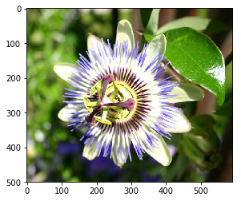
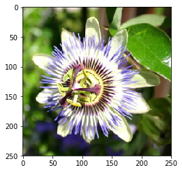
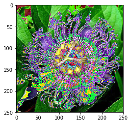

# Fine-tuning InceptionV3 for flowers classification

In this task you will fine-tune InceptionV3 architecture for flowers classification task.

InceptionV3 architecture (https://research.googleblog.com/2016/03/train-your-own-image-classifier-with.html):


Flowers classification dataset (http://www.robots.ox.ac.uk/~vgg/data/flowers/102/index.html) consists of 102 flower categories commonly occurring in the United Kingdom. Each class contains between 40 and 258 images:


# Import stuff


```python
import sys
sys.path.append("..")
import grading
import download_utils
```


```python
download_utils.link_all_keras_resources()
```


```python
import tensorflow as tf
import keras
from keras import backend as K
import numpy as np
%matplotlib inline
import matplotlib.pyplot as plt
print(tf.__version__)
print(keras.__version__)
import cv2  # for image processing
from sklearn.model_selection import train_test_split
import scipy.io
import os
import tarfile
import tqdm
import keras_utils
```

    Using TensorFlow backend.


    1.2.1
    2.0.6


# Fill in your Coursera token and email
To successfully submit your answers to our grader, please fill in your Coursera submission token and email


```python
grader = grading.Grader(assignment_key="2v-uxpD7EeeMxQ6FWsz5LA", 
                        all_parts=["wuwwC", "a4FK1", "qRsZ1"])
```


```python
# token expires every 30 min
COURSERA_TOKEN = "RChy2yey1TaVHHrQ"
COURSERA_EMAIL = "ssq6554@126.com"
```

# Load dataset

Dataset was downloaded for you, it takes 12 min and 400mb.
Relevant links (just in case):
- http://www.robots.ox.ac.uk/~vgg/data/flowers/102/index.html
- http://www.robots.ox.ac.uk/~vgg/data/flowers/102/102flowers.tgz
- http://www.robots.ox.ac.uk/~vgg/data/flowers/102/imagelabels.mat


```python
# we downloaded them for you, just link them here
download_utils.link_week_3_resources()
```

# Prepare images for model


```python
# we will crop and resize input images to IMG_SIZE x IMG_SIZE
IMG_SIZE = 250
```


```python
def decode_image_from_raw_bytes(raw_bytes):
    img = cv2.imdecode(np.asarray(bytearray(raw_bytes), dtype=np.uint8), 1)
    img = cv2.cvtColor(img, cv2.COLOR_BGR2RGB)
    return img
```

We will take a center crop from each image like this:


```python
def image_center_crop(img):
    """
    Makes a square center crop of an img, which is a [h, w, 3] numpy array.
    Returns [min(h, w), min(h, w), 3] output with same width and height.
    For cropping use numpy slicing.
    """
    h, w, c = img.shape
    if h > w:
        cropped_h_length = (h - w) / 2
        cropped_img = img[cropped_h_length:(w+cropped_h_length), :, :]
    else:
        cropped_w_length = (w - h) / 2
        cropped_img = img[:, cropped_w_length:(h+cropped_w_length), :] 
    
    return cropped_img
```


```python
def prepare_raw_bytes_for_model(raw_bytes, normalize_for_model=True):
    img = decode_image_from_raw_bytes(raw_bytes)  # decode image raw bytes to matrix
    img = image_center_crop(img)  # take squared center crop
    #print("cropped image shape: " + str(img.shape))
    img = cv2.resize(img, (IMG_SIZE, IMG_SIZE))  # resize for our model
    if normalize_for_model:
        img = img.astype("float32")  # prepare for normalization
        img = keras.applications.inception_v3.preprocess_input(img)  # normalize for model
    return img
```


```python
# reads bytes directly from tar by filename (slow, but ok for testing, takes ~6 sec)
def read_raw_from_tar(tar_fn, fn):
    with tarfile.open(tar_fn) as f:
        m = f.getmember(fn)
        return f.extractfile(m).read()
```


```python
# test cropping
raw_bytes = read_raw_from_tar("102flowers.tgz", "jpg/image_00001.jpg")

img = decode_image_from_raw_bytes(raw_bytes)
print(img.shape)
plt.imshow(img)
plt.show()

img = prepare_raw_bytes_for_model(raw_bytes, normalize_for_model=False)
print(img.shape)
plt.imshow(img)
plt.show()
```

    (500, 591, 3)





    /opt/conda/lib/python3.6/site-packages/ipykernel/__main__.py:13: VisibleDeprecationWarning: using a non-integer number instead of an integer will result in an error in the future


    cropped image shape: (500, 500, 3)
    (250, 250, 3)





```python
## GRADED PART, DO NOT CHANGE!
# Test image preparation for model
prepared_img = prepare_raw_bytes_for_model(read_raw_from_tar("102flowers.tgz", "jpg/image_00001.jpg"))
grader.set_answer("qRsZ1", list(prepared_img.shape) + [np.mean(prepared_img), np.std(prepared_img)])
```

    /opt/conda/lib/python3.6/site-packages/ipykernel/__main__.py:13: VisibleDeprecationWarning: using a non-integer number instead of an integer will result in an error in the future


```python
# you can make submission with answers so far to check yourself at this stage
grader.submit(COURSERA_EMAIL, COURSERA_TOKEN)
```

    Submitted to Coursera platform. See results on assignment page!


# Prepare for training


```python
# read all filenames and labels for them

# read filenames firectly from tar
def get_all_filenames(tar_fn):
    with tarfile.open(tar_fn) as f:
        return [m.name for m in f.getmembers() if m.isfile()]

all_files = sorted(get_all_filenames("102flowers.tgz"))  # list all files in tar sorted by name
all_labels = scipy.io.loadmat('imagelabels.mat')['labels'][0] - 1  # read class labels (0, 1, 2, ...)
# all_files and all_labels are aligned now
N_CLASSES = len(np.unique(all_labels))
print(N_CLASSES)
```

    102


```python
# split into train/test
tr_files, te_files, tr_labels, te_labels = \
    train_test_split(all_files, all_labels, test_size=0.2, random_state=42, stratify=all_labels)
```


```python
# will yield raw image bytes from tar with corresponding label
def raw_generator_with_label_from_tar(tar_fn, files, labels):
    label_by_fn = dict(zip(files, labels))
    with tarfile.open(tar_fn) as f:
        for m in f.getmembers():  # listing members is slow, but then it's fast!
            if m.name in label_by_fn:
                yield f.extractfile(m).read(), label_by_fn[m.name]
```


```python
# batch generator
BATCH_SIZE = 32

def batch_generator(items, batch_size):
    """
    Implement batch generator that yields items in batches of size batch_size.
    There's no need to shuffle input items, just chop them into batches.
    Remember about the last batch that can be smaller than batch_size!
    Input: any iterable (list, generator, ...). You should do `for item in items: ...`
        In case of generator you can pass through your items only once!
    Output: In output yield each batch as a list of items.
    """
    
    ### YOUR CODE HERE
    mini_batch = []
    for item in items:
        if len(mini_batch) < batch_size:
            mini_batch.append(item)
        else:
            yield mini_batch
            mini_batch=[]
            mini_batch.append(item)
    yield mini_batch
```


```python
## GRADED PART, DO NOT CHANGE!
# Test batch generator
def _test_items_generator():
    for i in range(10):
        yield i

grader.set_answer("a4FK1", list(map(lambda x: len(x), batch_generator(_test_items_generator(), 3))))
```


```python
# Test block written by myself(SSQ)
for batch in batch_generator(_test_items_generator(), 3):
    print(batch)
```


```python
# you can make submission with answers so far to check yourself at this stage
grader.submit(COURSERA_EMAIL, COURSERA_TOKEN)
```

    Submitted to Coursera platform. See results on assignment page!


```python
def train_generator(files, labels):
    while True:  # so that Keras can loop through this as long as it wants
        for batch in batch_generator(raw_generator_with_label_from_tar(
                "102flowers.tgz", files, labels), BATCH_SIZE):
            # prepare batch images
            batch_imgs = []
            batch_targets = []
            for raw, label in batch:
                img = prepare_raw_bytes_for_model(raw)
                batch_imgs.append(img)
                batch_targets.append(label)
            # stack images into 4D tensor [batch_size, img_size, img_size, 3]
            batch_imgs = np.stack(batch_imgs, axis=0)
            # convert targets into 2D tensor [batch_size, num_classes]
            batch_targets = keras.utils.np_utils.to_categorical(batch_targets, N_CLASSES)
            yield batch_imgs, batch_targets
```


```python
# test training generator
for _ in train_generator(tr_files, tr_labels):
    print(_[0].shape, _[1].shape)
    plt.imshow(_[0][0])
    break
```

    /opt/conda/lib/python3.6/site-packages/ipykernel/__main__.py:11: VisibleDeprecationWarning: using a non-integer number instead of an integer will result in an error in the future
    /opt/conda/lib/python3.6/site-packages/ipykernel/__main__.py:15: VisibleDeprecationWarning: using a non-integer number instead of an integer will result in an error in the future


    (32, 250, 250, 3) (32, 102)





# Training

You cannot train such a huge architecture from scratch with such a small dataset.

But using fine-tuning of last layers of pre-trained network you can get a pretty good classifier very quickly.


```python
# remember to clear session if you start building graph from scratch!
K.clear_session()
# don't call K.set_learning_phase() !!! (otherwise will enable dropout in train/test simultaneously)
```


```python
def inception(use_imagenet=True):
    # load pre-trained model graph, don't add final layer
    model = keras.applications.InceptionV3(include_top=False, input_shape=(IMG_SIZE, IMG_SIZE, 3),
                                          weights='imagenet' if use_imagenet else None)
    # add global pooling just like in InceptionV3
    new_output = keras.layers.GlobalAveragePooling2D()(model.output)
    # add new dense layer for our labels
    new_output = keras.layers.Dense(N_CLASSES, activation='softmax')(new_output)
    model = keras.engine.training.Model(model.inputs, new_output)
    return model
```


```python
model = inception()
```


```python
model.summary()
```

    ____________________________________________________________________________________________________
    Layer (type)                     Output Shape          Param #     Connected to                     
    ====================================================================================================
    input_1 (InputLayer)             (None, 250, 250, 3)   0                                            
    ____________________________________________________________________________________________________
    conv2d_1 (Conv2D)                (None, 124, 124, 32)  864         input_1[0][0]                    
    ____________________________________________________________________________________________________
    batch_normalization_1 (BatchNorm (None, 124, 124, 32)  96          conv2d_1[0][0]                   
    ____________________________________________________________________________________________________
    activation_1 (Activation)        (None, 124, 124, 32)  0           batch_normalization_1[0][0]      
    ____________________________________________________________________________________________________
    conv2d_2 (Conv2D)                (None, 122, 122, 32)  9216        activation_1[0][0]               
    ____________________________________________________________________________________________________
    batch_normalization_2 (BatchNorm (None, 122, 122, 32)  96          conv2d_2[0][0]                   
    ____________________________________________________________________________________________________
    activation_2 (Activation)        (None, 122, 122, 32)  0           batch_normalization_2[0][0]      
    ____________________________________________________________________________________________________
    conv2d_3 (Conv2D)                (None, 122, 122, 64)  18432       activation_2[0][0]               
    ____________________________________________________________________________________________________
    batch_normalization_3 (BatchNorm (None, 122, 122, 64)  192         conv2d_3[0][0]                   
    ____________________________________________________________________________________________________
    activation_3 (Activation)        (None, 122, 122, 64)  0           batch_normalization_3[0][0]      
    ____________________________________________________________________________________________________
    max_pooling2d_1 (MaxPooling2D)   (None, 60, 60, 64)    0           activation_3[0][0]               
    ____________________________________________________________________________________________________
    conv2d_4 (Conv2D)                (None, 60, 60, 80)    5120        max_pooling2d_1[0][0]            
    ____________________________________________________________________________________________________
    batch_normalization_4 (BatchNorm (None, 60, 60, 80)    240         conv2d_4[0][0]                   
    ____________________________________________________________________________________________________
    activation_4 (Activation)        (None, 60, 60, 80)    0           batch_normalization_4[0][0]      
    ____________________________________________________________________________________________________
    conv2d_5 (Conv2D)                (None, 58, 58, 192)   138240      activation_4[0][0]               
    ____________________________________________________________________________________________________
    batch_normalization_5 (BatchNorm (None, 58, 58, 192)   576         conv2d_5[0][0]                   
    ____________________________________________________________________________________________________
    activation_5 (Activation)        (None, 58, 58, 192)   0           batch_normalization_5[0][0]      
    ____________________________________________________________________________________________________
    max_pooling2d_2 (MaxPooling2D)   (None, 28, 28, 192)   0           activation_5[0][0]               
    ____________________________________________________________________________________________________
    conv2d_9 (Conv2D)                (None, 28, 28, 64)    12288       max_pooling2d_2[0][0]            
    ____________________________________________________________________________________________________
    batch_normalization_9 (BatchNorm (None, 28, 28, 64)    192         conv2d_9[0][0]                   
    ____________________________________________________________________________________________________
    activation_9 (Activation)        (None, 28, 28, 64)    0           batch_normalization_9[0][0]      
    ____________________________________________________________________________________________________
    conv2d_7 (Conv2D)                (None, 28, 28, 48)    9216        max_pooling2d_2[0][0]            
    ____________________________________________________________________________________________________
    conv2d_10 (Conv2D)               (None, 28, 28, 96)    55296       activation_9[0][0]               
    ____________________________________________________________________________________________________
    batch_normalization_7 (BatchNorm (None, 28, 28, 48)    144         conv2d_7[0][0]                   
    ____________________________________________________________________________________________________
    batch_normalization_10 (BatchNor (None, 28, 28, 96)    288         conv2d_10[0][0]                  
    ____________________________________________________________________________________________________
    activation_7 (Activation)        (None, 28, 28, 48)    0           batch_normalization_7[0][0]      
    ____________________________________________________________________________________________________
    activation_10 (Activation)       (None, 28, 28, 96)    0           batch_normalization_10[0][0]     
    ____________________________________________________________________________________________________
    average_pooling2d_1 (AveragePool (None, 28, 28, 192)   0           max_pooling2d_2[0][0]            
    ____________________________________________________________________________________________________
    conv2d_6 (Conv2D)                (None, 28, 28, 64)    12288       max_pooling2d_2[0][0]            
    ____________________________________________________________________________________________________
    conv2d_8 (Conv2D)                (None, 28, 28, 64)    76800       activation_7[0][0]               
    ____________________________________________________________________________________________________
    conv2d_11 (Conv2D)               (None, 28, 28, 96)    82944       activation_10[0][0]              
    ____________________________________________________________________________________________________
    conv2d_12 (Conv2D)               (None, 28, 28, 32)    6144        average_pooling2d_1[0][0]        
    ____________________________________________________________________________________________________
    batch_normalization_6 (BatchNorm (None, 28, 28, 64)    192         conv2d_6[0][0]                   
    ____________________________________________________________________________________________________
    batch_normalization_8 (BatchNorm (None, 28, 28, 64)    192         conv2d_8[0][0]                   
    ____________________________________________________________________________________________________
    batch_normalization_11 (BatchNor (None, 28, 28, 96)    288         conv2d_11[0][0]                  
    ____________________________________________________________________________________________________
    batch_normalization_12 (BatchNor (None, 28, 28, 32)    96          conv2d_12[0][0]                  
    ____________________________________________________________________________________________________
    activation_6 (Activation)        (None, 28, 28, 64)    0           batch_normalization_6[0][0]      
    ____________________________________________________________________________________________________
    activation_8 (Activation)        (None, 28, 28, 64)    0           batch_normalization_8[0][0]      
    ____________________________________________________________________________________________________
    activation_11 (Activation)       (None, 28, 28, 96)    0           batch_normalization_11[0][0]     
    ____________________________________________________________________________________________________
    activation_12 (Activation)       (None, 28, 28, 32)    0           batch_normalization_12[0][0]     
    ____________________________________________________________________________________________________
    mixed0 (Concatenate)             (None, 28, 28, 256)   0           activation_6[0][0]               
                                                                       activation_8[0][0]               
                                                                       activation_11[0][0]              
                                                                       activation_12[0][0]              
    ____________________________________________________________________________________________________
    conv2d_16 (Conv2D)               (None, 28, 28, 64)    16384       mixed0[0][0]                     
    ____________________________________________________________________________________________________
    batch_normalization_16 (BatchNor (None, 28, 28, 64)    192         conv2d_16[0][0]                  
    ____________________________________________________________________________________________________
    activation_16 (Activation)       (None, 28, 28, 64)    0           batch_normalization_16[0][0]     
    ____________________________________________________________________________________________________
    conv2d_14 (Conv2D)               (None, 28, 28, 48)    12288       mixed0[0][0]                     
    ____________________________________________________________________________________________________
    conv2d_17 (Conv2D)               (None, 28, 28, 96)    55296       activation_16[0][0]              
    ____________________________________________________________________________________________________
    batch_normalization_14 (BatchNor (None, 28, 28, 48)    144         conv2d_14[0][0]                  
    ____________________________________________________________________________________________________
    batch_normalization_17 (BatchNor (None, 28, 28, 96)    288         conv2d_17[0][0]                  
    ____________________________________________________________________________________________________
    activation_14 (Activation)       (None, 28, 28, 48)    0           batch_normalization_14[0][0]     
    ____________________________________________________________________________________________________
    activation_17 (Activation)       (None, 28, 28, 96)    0           batch_normalization_17[0][0]     
    ____________________________________________________________________________________________________
    average_pooling2d_2 (AveragePool (None, 28, 28, 256)   0           mixed0[0][0]                     
    ____________________________________________________________________________________________________
    conv2d_13 (Conv2D)               (None, 28, 28, 64)    16384       mixed0[0][0]                     
    ____________________________________________________________________________________________________
    conv2d_15 (Conv2D)               (None, 28, 28, 64)    76800       activation_14[0][0]              
    ____________________________________________________________________________________________________
    conv2d_18 (Conv2D)               (None, 28, 28, 96)    82944       activation_17[0][0]              
    ____________________________________________________________________________________________________
    conv2d_19 (Conv2D)               (None, 28, 28, 64)    16384       average_pooling2d_2[0][0]        
    ____________________________________________________________________________________________________
    batch_normalization_13 (BatchNor (None, 28, 28, 64)    192         conv2d_13[0][0]                  
    ____________________________________________________________________________________________________
    batch_normalization_15 (BatchNor (None, 28, 28, 64)    192         conv2d_15[0][0]                  
    ____________________________________________________________________________________________________
    batch_normalization_18 (BatchNor (None, 28, 28, 96)    288         conv2d_18[0][0]                  
    ____________________________________________________________________________________________________
    batch_normalization_19 (BatchNor (None, 28, 28, 64)    192         conv2d_19[0][0]                  
    ____________________________________________________________________________________________________
    activation_13 (Activation)       (None, 28, 28, 64)    0           batch_normalization_13[0][0]     
    ____________________________________________________________________________________________________
    activation_15 (Activation)       (None, 28, 28, 64)    0           batch_normalization_15[0][0]     
    ____________________________________________________________________________________________________
    activation_18 (Activation)       (None, 28, 28, 96)    0           batch_normalization_18[0][0]     
    ____________________________________________________________________________________________________
    activation_19 (Activation)       (None, 28, 28, 64)    0           batch_normalization_19[0][0]     
    ____________________________________________________________________________________________________
    mixed1 (Concatenate)             (None, 28, 28, 288)   0           activation_13[0][0]              
                                                                       activation_15[0][0]              
                                                                       activation_18[0][0]              
                                                                       activation_19[0][0]              
    ____________________________________________________________________________________________________
    conv2d_23 (Conv2D)               (None, 28, 28, 64)    18432       mixed1[0][0]                     
    ____________________________________________________________________________________________________
    batch_normalization_23 (BatchNor (None, 28, 28, 64)    192         conv2d_23[0][0]                  
    ____________________________________________________________________________________________________
    activation_23 (Activation)       (None, 28, 28, 64)    0           batch_normalization_23[0][0]     
    ____________________________________________________________________________________________________
    conv2d_21 (Conv2D)               (None, 28, 28, 48)    13824       mixed1[0][0]                     
    ____________________________________________________________________________________________________
    conv2d_24 (Conv2D)               (None, 28, 28, 96)    55296       activation_23[0][0]              
    ____________________________________________________________________________________________________
    batch_normalization_21 (BatchNor (None, 28, 28, 48)    144         conv2d_21[0][0]                  
    ____________________________________________________________________________________________________
    batch_normalization_24 (BatchNor (None, 28, 28, 96)    288         conv2d_24[0][0]                  
    ____________________________________________________________________________________________________
    activation_21 (Activation)       (None, 28, 28, 48)    0           batch_normalization_21[0][0]     
    ____________________________________________________________________________________________________
    activation_24 (Activation)       (None, 28, 28, 96)    0           batch_normalization_24[0][0]     
    ____________________________________________________________________________________________________
    average_pooling2d_3 (AveragePool (None, 28, 28, 288)   0           mixed1[0][0]                     
    ____________________________________________________________________________________________________
    conv2d_20 (Conv2D)               (None, 28, 28, 64)    18432       mixed1[0][0]                     
    ____________________________________________________________________________________________________
    conv2d_22 (Conv2D)               (None, 28, 28, 64)    76800       activation_21[0][0]              
    ____________________________________________________________________________________________________
    conv2d_25 (Conv2D)               (None, 28, 28, 96)    82944       activation_24[0][0]              
    ____________________________________________________________________________________________________
    conv2d_26 (Conv2D)               (None, 28, 28, 64)    18432       average_pooling2d_3[0][0]        
    ____________________________________________________________________________________________________
    batch_normalization_20 (BatchNor (None, 28, 28, 64)    192         conv2d_20[0][0]                  
    ____________________________________________________________________________________________________
    batch_normalization_22 (BatchNor (None, 28, 28, 64)    192         conv2d_22[0][0]                  
    ____________________________________________________________________________________________________
    batch_normalization_25 (BatchNor (None, 28, 28, 96)    288         conv2d_25[0][0]                  
    ____________________________________________________________________________________________________
    batch_normalization_26 (BatchNor (None, 28, 28, 64)    192         conv2d_26[0][0]                  
    ____________________________________________________________________________________________________
    activation_20 (Activation)       (None, 28, 28, 64)    0           batch_normalization_20[0][0]     
    ____________________________________________________________________________________________________
    activation_22 (Activation)       (None, 28, 28, 64)    0           batch_normalization_22[0][0]     
    ____________________________________________________________________________________________________
    activation_25 (Activation)       (None, 28, 28, 96)    0           batch_normalization_25[0][0]     
    ____________________________________________________________________________________________________
    activation_26 (Activation)       (None, 28, 28, 64)    0           batch_normalization_26[0][0]     
    ____________________________________________________________________________________________________
    mixed2 (Concatenate)             (None, 28, 28, 288)   0           activation_20[0][0]              
                                                                       activation_22[0][0]              
                                                                       activation_25[0][0]              
                                                                       activation_26[0][0]              
    ____________________________________________________________________________________________________
    conv2d_28 (Conv2D)               (None, 28, 28, 64)    18432       mixed2[0][0]                     
    ____________________________________________________________________________________________________
    batch_normalization_28 (BatchNor (None, 28, 28, 64)    192         conv2d_28[0][0]                  
    ____________________________________________________________________________________________________
    activation_28 (Activation)       (None, 28, 28, 64)    0           batch_normalization_28[0][0]     
    ____________________________________________________________________________________________________
    conv2d_29 (Conv2D)               (None, 28, 28, 96)    55296       activation_28[0][0]              
    ____________________________________________________________________________________________________
    batch_normalization_29 (BatchNor (None, 28, 28, 96)    288         conv2d_29[0][0]                  
    ____________________________________________________________________________________________________
    activation_29 (Activation)       (None, 28, 28, 96)    0           batch_normalization_29[0][0]     
    ____________________________________________________________________________________________________
    conv2d_27 (Conv2D)               (None, 13, 13, 384)   995328      mixed2[0][0]                     
    ____________________________________________________________________________________________________
    conv2d_30 (Conv2D)               (None, 13, 13, 96)    82944       activation_29[0][0]              
    ____________________________________________________________________________________________________
    batch_normalization_27 (BatchNor (None, 13, 13, 384)   1152        conv2d_27[0][0]                  
    ____________________________________________________________________________________________________
    batch_normalization_30 (BatchNor (None, 13, 13, 96)    288         conv2d_30[0][0]                  
    ____________________________________________________________________________________________________
    activation_27 (Activation)       (None, 13, 13, 384)   0           batch_normalization_27[0][0]     
    ____________________________________________________________________________________________________
    activation_30 (Activation)       (None, 13, 13, 96)    0           batch_normalization_30[0][0]     
    ____________________________________________________________________________________________________
    max_pooling2d_3 (MaxPooling2D)   (None, 13, 13, 288)   0           mixed2[0][0]                     
    ____________________________________________________________________________________________________
    mixed3 (Concatenate)             (None, 13, 13, 768)   0           activation_27[0][0]              
                                                                       activation_30[0][0]              
                                                                       max_pooling2d_3[0][0]            
    ____________________________________________________________________________________________________
    conv2d_35 (Conv2D)               (None, 13, 13, 128)   98304       mixed3[0][0]                     
    ____________________________________________________________________________________________________
    batch_normalization_35 (BatchNor (None, 13, 13, 128)   384         conv2d_35[0][0]                  
    ____________________________________________________________________________________________________
    activation_35 (Activation)       (None, 13, 13, 128)   0           batch_normalization_35[0][0]     
    ____________________________________________________________________________________________________
    conv2d_36 (Conv2D)               (None, 13, 13, 128)   114688      activation_35[0][0]              
    ____________________________________________________________________________________________________
    batch_normalization_36 (BatchNor (None, 13, 13, 128)   384         conv2d_36[0][0]                  
    ____________________________________________________________________________________________________
    activation_36 (Activation)       (None, 13, 13, 128)   0           batch_normalization_36[0][0]     
    ____________________________________________________________________________________________________
    conv2d_32 (Conv2D)               (None, 13, 13, 128)   98304       mixed3[0][0]                     
    ____________________________________________________________________________________________________
    conv2d_37 (Conv2D)               (None, 13, 13, 128)   114688      activation_36[0][0]              
    ____________________________________________________________________________________________________
    batch_normalization_32 (BatchNor (None, 13, 13, 128)   384         conv2d_32[0][0]                  
    ____________________________________________________________________________________________________
    batch_normalization_37 (BatchNor (None, 13, 13, 128)   384         conv2d_37[0][0]                  
    ____________________________________________________________________________________________________
    activation_32 (Activation)       (None, 13, 13, 128)   0           batch_normalization_32[0][0]     
    ____________________________________________________________________________________________________
    activation_37 (Activation)       (None, 13, 13, 128)   0           batch_normalization_37[0][0]     
    ____________________________________________________________________________________________________
    conv2d_33 (Conv2D)               (None, 13, 13, 128)   114688      activation_32[0][0]              
    ____________________________________________________________________________________________________
    conv2d_38 (Conv2D)               (None, 13, 13, 128)   114688      activation_37[0][0]              
    ____________________________________________________________________________________________________
    batch_normalization_33 (BatchNor (None, 13, 13, 128)   384         conv2d_33[0][0]                  
    ____________________________________________________________________________________________________
    batch_normalization_38 (BatchNor (None, 13, 13, 128)   384         conv2d_38[0][0]                  
    ____________________________________________________________________________________________________
    activation_33 (Activation)       (None, 13, 13, 128)   0           batch_normalization_33[0][0]     
    ____________________________________________________________________________________________________
    activation_38 (Activation)       (None, 13, 13, 128)   0           batch_normalization_38[0][0]     
    ____________________________________________________________________________________________________
    average_pooling2d_4 (AveragePool (None, 13, 13, 768)   0           mixed3[0][0]                     
    ____________________________________________________________________________________________________
    conv2d_31 (Conv2D)               (None, 13, 13, 192)   147456      mixed3[0][0]                     
    ____________________________________________________________________________________________________
    conv2d_34 (Conv2D)               (None, 13, 13, 192)   172032      activation_33[0][0]              
    ____________________________________________________________________________________________________
    conv2d_39 (Conv2D)               (None, 13, 13, 192)   172032      activation_38[0][0]              
    ____________________________________________________________________________________________________
    conv2d_40 (Conv2D)               (None, 13, 13, 192)   147456      average_pooling2d_4[0][0]        
    ____________________________________________________________________________________________________
    batch_normalization_31 (BatchNor (None, 13, 13, 192)   576         conv2d_31[0][0]                  
    ____________________________________________________________________________________________________
    batch_normalization_34 (BatchNor (None, 13, 13, 192)   576         conv2d_34[0][0]                  
    ____________________________________________________________________________________________________
    batch_normalization_39 (BatchNor (None, 13, 13, 192)   576         conv2d_39[0][0]                  
    ____________________________________________________________________________________________________
    batch_normalization_40 (BatchNor (None, 13, 13, 192)   576         conv2d_40[0][0]                  
    ____________________________________________________________________________________________________
    activation_31 (Activation)       (None, 13, 13, 192)   0           batch_normalization_31[0][0]     
    ____________________________________________________________________________________________________
    activation_34 (Activation)       (None, 13, 13, 192)   0           batch_normalization_34[0][0]     
    ____________________________________________________________________________________________________
    activation_39 (Activation)       (None, 13, 13, 192)   0           batch_normalization_39[0][0]     
    ____________________________________________________________________________________________________
    activation_40 (Activation)       (None, 13, 13, 192)   0           batch_normalization_40[0][0]     
    ____________________________________________________________________________________________________
    mixed4 (Concatenate)             (None, 13, 13, 768)   0           activation_31[0][0]              
                                                                       activation_34[0][0]              
                                                                       activation_39[0][0]              
                                                                       activation_40[0][0]              
    ____________________________________________________________________________________________________
    conv2d_45 (Conv2D)               (None, 13, 13, 160)   122880      mixed4[0][0]                     
    ____________________________________________________________________________________________________
    batch_normalization_45 (BatchNor (None, 13, 13, 160)   480         conv2d_45[0][0]                  
    ____________________________________________________________________________________________________
    activation_45 (Activation)       (None, 13, 13, 160)   0           batch_normalization_45[0][0]     
    ____________________________________________________________________________________________________
    conv2d_46 (Conv2D)               (None, 13, 13, 160)   179200      activation_45[0][0]              
    ____________________________________________________________________________________________________
    batch_normalization_46 (BatchNor (None, 13, 13, 160)   480         conv2d_46[0][0]                  
    ____________________________________________________________________________________________________
    activation_46 (Activation)       (None, 13, 13, 160)   0           batch_normalization_46[0][0]     
    ____________________________________________________________________________________________________
    conv2d_42 (Conv2D)               (None, 13, 13, 160)   122880      mixed4[0][0]                     
    ____________________________________________________________________________________________________
    conv2d_47 (Conv2D)               (None, 13, 13, 160)   179200      activation_46[0][0]              
    ____________________________________________________________________________________________________
    batch_normalization_42 (BatchNor (None, 13, 13, 160)   480         conv2d_42[0][0]                  
    ____________________________________________________________________________________________________
    batch_normalization_47 (BatchNor (None, 13, 13, 160)   480         conv2d_47[0][0]                  
    ____________________________________________________________________________________________________
    activation_42 (Activation)       (None, 13, 13, 160)   0           batch_normalization_42[0][0]     
    ____________________________________________________________________________________________________
    activation_47 (Activation)       (None, 13, 13, 160)   0           batch_normalization_47[0][0]     
    ____________________________________________________________________________________________________
    conv2d_43 (Conv2D)               (None, 13, 13, 160)   179200      activation_42[0][0]              
    ____________________________________________________________________________________________________
    conv2d_48 (Conv2D)               (None, 13, 13, 160)   179200      activation_47[0][0]              
    ____________________________________________________________________________________________________
    batch_normalization_43 (BatchNor (None, 13, 13, 160)   480         conv2d_43[0][0]                  
    ____________________________________________________________________________________________________
    batch_normalization_48 (BatchNor (None, 13, 13, 160)   480         conv2d_48[0][0]                  
    ____________________________________________________________________________________________________
    activation_43 (Activation)       (None, 13, 13, 160)   0           batch_normalization_43[0][0]     
    ____________________________________________________________________________________________________
    activation_48 (Activation)       (None, 13, 13, 160)   0           batch_normalization_48[0][0]     
    ____________________________________________________________________________________________________
    average_pooling2d_5 (AveragePool (None, 13, 13, 768)   0           mixed4[0][0]                     
    ____________________________________________________________________________________________________
    conv2d_41 (Conv2D)               (None, 13, 13, 192)   147456      mixed4[0][0]                     
    ____________________________________________________________________________________________________
    conv2d_44 (Conv2D)               (None, 13, 13, 192)   215040      activation_43[0][0]              
    ____________________________________________________________________________________________________
    conv2d_49 (Conv2D)               (None, 13, 13, 192)   215040      activation_48[0][0]              
    ____________________________________________________________________________________________________
    conv2d_50 (Conv2D)               (None, 13, 13, 192)   147456      average_pooling2d_5[0][0]        
    ____________________________________________________________________________________________________
    batch_normalization_41 (BatchNor (None, 13, 13, 192)   576         conv2d_41[0][0]                  
    ____________________________________________________________________________________________________
    batch_normalization_44 (BatchNor (None, 13, 13, 192)   576         conv2d_44[0][0]                  
    ____________________________________________________________________________________________________
    batch_normalization_49 (BatchNor (None, 13, 13, 192)   576         conv2d_49[0][0]                  
    ____________________________________________________________________________________________________
    batch_normalization_50 (BatchNor (None, 13, 13, 192)   576         conv2d_50[0][0]                  
    ____________________________________________________________________________________________________
    activation_41 (Activation)       (None, 13, 13, 192)   0           batch_normalization_41[0][0]     
    ____________________________________________________________________________________________________
    activation_44 (Activation)       (None, 13, 13, 192)   0           batch_normalization_44[0][0]     
    ____________________________________________________________________________________________________
    activation_49 (Activation)       (None, 13, 13, 192)   0           batch_normalization_49[0][0]     
    ____________________________________________________________________________________________________
    activation_50 (Activation)       (None, 13, 13, 192)   0           batch_normalization_50[0][0]     
    ____________________________________________________________________________________________________
    mixed5 (Concatenate)             (None, 13, 13, 768)   0           activation_41[0][0]              
                                                                       activation_44[0][0]              
                                                                       activation_49[0][0]              
                                                                       activation_50[0][0]              
    ____________________________________________________________________________________________________
    conv2d_55 (Conv2D)               (None, 13, 13, 160)   122880      mixed5[0][0]                     
    ____________________________________________________________________________________________________
    batch_normalization_55 (BatchNor (None, 13, 13, 160)   480         conv2d_55[0][0]                  
    ____________________________________________________________________________________________________
    activation_55 (Activation)       (None, 13, 13, 160)   0           batch_normalization_55[0][0]     
    ____________________________________________________________________________________________________
    conv2d_56 (Conv2D)               (None, 13, 13, 160)   179200      activation_55[0][0]              
    ____________________________________________________________________________________________________
    batch_normalization_56 (BatchNor (None, 13, 13, 160)   480         conv2d_56[0][0]                  
    ____________________________________________________________________________________________________
    activation_56 (Activation)       (None, 13, 13, 160)   0           batch_normalization_56[0][0]     
    ____________________________________________________________________________________________________
    conv2d_52 (Conv2D)               (None, 13, 13, 160)   122880      mixed5[0][0]                     
    ____________________________________________________________________________________________________
    conv2d_57 (Conv2D)               (None, 13, 13, 160)   179200      activation_56[0][0]              
    ____________________________________________________________________________________________________
    batch_normalization_52 (BatchNor (None, 13, 13, 160)   480         conv2d_52[0][0]                  
    ____________________________________________________________________________________________________
    batch_normalization_57 (BatchNor (None, 13, 13, 160)   480         conv2d_57[0][0]                  
    ____________________________________________________________________________________________________
    activation_52 (Activation)       (None, 13, 13, 160)   0           batch_normalization_52[0][0]     
    ____________________________________________________________________________________________________
    activation_57 (Activation)       (None, 13, 13, 160)   0           batch_normalization_57[0][0]     
    ____________________________________________________________________________________________________
    conv2d_53 (Conv2D)               (None, 13, 13, 160)   179200      activation_52[0][0]              
    ____________________________________________________________________________________________________
    conv2d_58 (Conv2D)               (None, 13, 13, 160)   179200      activation_57[0][0]              
    ____________________________________________________________________________________________________
    batch_normalization_53 (BatchNor (None, 13, 13, 160)   480         conv2d_53[0][0]                  
    ____________________________________________________________________________________________________
    batch_normalization_58 (BatchNor (None, 13, 13, 160)   480         conv2d_58[0][0]                  
    ____________________________________________________________________________________________________
    activation_53 (Activation)       (None, 13, 13, 160)   0           batch_normalization_53[0][0]     
    ____________________________________________________________________________________________________
    activation_58 (Activation)       (None, 13, 13, 160)   0           batch_normalization_58[0][0]     
    ____________________________________________________________________________________________________
    average_pooling2d_6 (AveragePool (None, 13, 13, 768)   0           mixed5[0][0]                     
    ____________________________________________________________________________________________________
    conv2d_51 (Conv2D)               (None, 13, 13, 192)   147456      mixed5[0][0]                     
    ____________________________________________________________________________________________________
    conv2d_54 (Conv2D)               (None, 13, 13, 192)   215040      activation_53[0][0]              
    ____________________________________________________________________________________________________
    conv2d_59 (Conv2D)               (None, 13, 13, 192)   215040      activation_58[0][0]              
    ____________________________________________________________________________________________________
    conv2d_60 (Conv2D)               (None, 13, 13, 192)   147456      average_pooling2d_6[0][0]        
    ____________________________________________________________________________________________________
    batch_normalization_51 (BatchNor (None, 13, 13, 192)   576         conv2d_51[0][0]                  
    ____________________________________________________________________________________________________
    batch_normalization_54 (BatchNor (None, 13, 13, 192)   576         conv2d_54[0][0]                  
    ____________________________________________________________________________________________________
    batch_normalization_59 (BatchNor (None, 13, 13, 192)   576         conv2d_59[0][0]                  
    ____________________________________________________________________________________________________
    batch_normalization_60 (BatchNor (None, 13, 13, 192)   576         conv2d_60[0][0]                  
    ____________________________________________________________________________________________________
    activation_51 (Activation)       (None, 13, 13, 192)   0           batch_normalization_51[0][0]     
    ____________________________________________________________________________________________________
    activation_54 (Activation)       (None, 13, 13, 192)   0           batch_normalization_54[0][0]     
    ____________________________________________________________________________________________________
    activation_59 (Activation)       (None, 13, 13, 192)   0           batch_normalization_59[0][0]     
    ____________________________________________________________________________________________________
    activation_60 (Activation)       (None, 13, 13, 192)   0           batch_normalization_60[0][0]     
    ____________________________________________________________________________________________________
    mixed6 (Concatenate)             (None, 13, 13, 768)   0           activation_51[0][0]              
                                                                       activation_54[0][0]              
                                                                       activation_59[0][0]              
                                                                       activation_60[0][0]              
    ____________________________________________________________________________________________________
    conv2d_65 (Conv2D)               (None, 13, 13, 192)   147456      mixed6[0][0]                     
    ____________________________________________________________________________________________________
    batch_normalization_65 (BatchNor (None, 13, 13, 192)   576         conv2d_65[0][0]                  
    ____________________________________________________________________________________________________
    activation_65 (Activation)       (None, 13, 13, 192)   0           batch_normalization_65[0][0]     
    ____________________________________________________________________________________________________
    conv2d_66 (Conv2D)               (None, 13, 13, 192)   258048      activation_65[0][0]              
    ____________________________________________________________________________________________________
    batch_normalization_66 (BatchNor (None, 13, 13, 192)   576         conv2d_66[0][0]                  
    ____________________________________________________________________________________________________
    activation_66 (Activation)       (None, 13, 13, 192)   0           batch_normalization_66[0][0]     
    ____________________________________________________________________________________________________
    conv2d_62 (Conv2D)               (None, 13, 13, 192)   147456      mixed6[0][0]                     
    ____________________________________________________________________________________________________
    conv2d_67 (Conv2D)               (None, 13, 13, 192)   258048      activation_66[0][0]              
    ____________________________________________________________________________________________________
    batch_normalization_62 (BatchNor (None, 13, 13, 192)   576         conv2d_62[0][0]                  
    ____________________________________________________________________________________________________
    batch_normalization_67 (BatchNor (None, 13, 13, 192)   576         conv2d_67[0][0]                  
    ____________________________________________________________________________________________________
    activation_62 (Activation)       (None, 13, 13, 192)   0           batch_normalization_62[0][0]     
    ____________________________________________________________________________________________________
    activation_67 (Activation)       (None, 13, 13, 192)   0           batch_normalization_67[0][0]     
    ____________________________________________________________________________________________________
    conv2d_63 (Conv2D)               (None, 13, 13, 192)   258048      activation_62[0][0]              
    ____________________________________________________________________________________________________
    conv2d_68 (Conv2D)               (None, 13, 13, 192)   258048      activation_67[0][0]              
    ____________________________________________________________________________________________________
    batch_normalization_63 (BatchNor (None, 13, 13, 192)   576         conv2d_63[0][0]                  
    ____________________________________________________________________________________________________
    batch_normalization_68 (BatchNor (None, 13, 13, 192)   576         conv2d_68[0][0]                  
    ____________________________________________________________________________________________________
    activation_63 (Activation)       (None, 13, 13, 192)   0           batch_normalization_63[0][0]     
    ____________________________________________________________________________________________________
    activation_68 (Activation)       (None, 13, 13, 192)   0           batch_normalization_68[0][0]     
    ____________________________________________________________________________________________________
    average_pooling2d_7 (AveragePool (None, 13, 13, 768)   0           mixed6[0][0]                     
    ____________________________________________________________________________________________________
    conv2d_61 (Conv2D)               (None, 13, 13, 192)   147456      mixed6[0][0]                     
    ____________________________________________________________________________________________________
    conv2d_64 (Conv2D)               (None, 13, 13, 192)   258048      activation_63[0][0]              
    ____________________________________________________________________________________________________
    conv2d_69 (Conv2D)               (None, 13, 13, 192)   258048      activation_68[0][0]              
    ____________________________________________________________________________________________________
    conv2d_70 (Conv2D)               (None, 13, 13, 192)   147456      average_pooling2d_7[0][0]        
    ____________________________________________________________________________________________________
    batch_normalization_61 (BatchNor (None, 13, 13, 192)   576         conv2d_61[0][0]                  
    ____________________________________________________________________________________________________
    batch_normalization_64 (BatchNor (None, 13, 13, 192)   576         conv2d_64[0][0]                  
    ____________________________________________________________________________________________________
    batch_normalization_69 (BatchNor (None, 13, 13, 192)   576         conv2d_69[0][0]                  
    ____________________________________________________________________________________________________
    batch_normalization_70 (BatchNor (None, 13, 13, 192)   576         conv2d_70[0][0]                  
    ____________________________________________________________________________________________________
    activation_61 (Activation)       (None, 13, 13, 192)   0           batch_normalization_61[0][0]     
    ____________________________________________________________________________________________________
    activation_64 (Activation)       (None, 13, 13, 192)   0           batch_normalization_64[0][0]     
    ____________________________________________________________________________________________________
    activation_69 (Activation)       (None, 13, 13, 192)   0           batch_normalization_69[0][0]     
    ____________________________________________________________________________________________________
    activation_70 (Activation)       (None, 13, 13, 192)   0           batch_normalization_70[0][0]     
    ____________________________________________________________________________________________________
    mixed7 (Concatenate)             (None, 13, 13, 768)   0           activation_61[0][0]              
                                                                       activation_64[0][0]              
                                                                       activation_69[0][0]              
                                                                       activation_70[0][0]              
    ____________________________________________________________________________________________________
    conv2d_73 (Conv2D)               (None, 13, 13, 192)   147456      mixed7[0][0]                     
    ____________________________________________________________________________________________________
    batch_normalization_73 (BatchNor (None, 13, 13, 192)   576         conv2d_73[0][0]                  
    ____________________________________________________________________________________________________
    activation_73 (Activation)       (None, 13, 13, 192)   0           batch_normalization_73[0][0]     
    ____________________________________________________________________________________________________
    conv2d_74 (Conv2D)               (None, 13, 13, 192)   258048      activation_73[0][0]              
    ____________________________________________________________________________________________________
    batch_normalization_74 (BatchNor (None, 13, 13, 192)   576         conv2d_74[0][0]                  
    ____________________________________________________________________________________________________
    activation_74 (Activation)       (None, 13, 13, 192)   0           batch_normalization_74[0][0]     
    ____________________________________________________________________________________________________
    conv2d_71 (Conv2D)               (None, 13, 13, 192)   147456      mixed7[0][0]                     
    ____________________________________________________________________________________________________
    conv2d_75 (Conv2D)               (None, 13, 13, 192)   258048      activation_74[0][0]              
    ____________________________________________________________________________________________________
    batch_normalization_71 (BatchNor (None, 13, 13, 192)   576         conv2d_71[0][0]                  
    ____________________________________________________________________________________________________
    batch_normalization_75 (BatchNor (None, 13, 13, 192)   576         conv2d_75[0][0]                  
    ____________________________________________________________________________________________________
    activation_71 (Activation)       (None, 13, 13, 192)   0           batch_normalization_71[0][0]     
    ____________________________________________________________________________________________________
    activation_75 (Activation)       (None, 13, 13, 192)   0           batch_normalization_75[0][0]     
    ____________________________________________________________________________________________________
    conv2d_72 (Conv2D)               (None, 6, 6, 320)     552960      activation_71[0][0]              
    ____________________________________________________________________________________________________
    conv2d_76 (Conv2D)               (None, 6, 6, 192)     331776      activation_75[0][0]              
    ____________________________________________________________________________________________________
    batch_normalization_72 (BatchNor (None, 6, 6, 320)     960         conv2d_72[0][0]                  
    ____________________________________________________________________________________________________
    batch_normalization_76 (BatchNor (None, 6, 6, 192)     576         conv2d_76[0][0]                  
    ____________________________________________________________________________________________________
    activation_72 (Activation)       (None, 6, 6, 320)     0           batch_normalization_72[0][0]     
    ____________________________________________________________________________________________________
    activation_76 (Activation)       (None, 6, 6, 192)     0           batch_normalization_76[0][0]     
    ____________________________________________________________________________________________________
    max_pooling2d_4 (MaxPooling2D)   (None, 6, 6, 768)     0           mixed7[0][0]                     
    ____________________________________________________________________________________________________
    mixed8 (Concatenate)             (None, 6, 6, 1280)    0           activation_72[0][0]              
                                                                       activation_76[0][0]              
                                                                       max_pooling2d_4[0][0]            
    ____________________________________________________________________________________________________
    conv2d_81 (Conv2D)               (None, 6, 6, 448)     573440      mixed8[0][0]                     
    ____________________________________________________________________________________________________
    batch_normalization_81 (BatchNor (None, 6, 6, 448)     1344        conv2d_81[0][0]                  
    ____________________________________________________________________________________________________
    activation_81 (Activation)       (None, 6, 6, 448)     0           batch_normalization_81[0][0]     
    ____________________________________________________________________________________________________
    conv2d_78 (Conv2D)               (None, 6, 6, 384)     491520      mixed8[0][0]                     
    ____________________________________________________________________________________________________
    conv2d_82 (Conv2D)               (None, 6, 6, 384)     1548288     activation_81[0][0]              
    ____________________________________________________________________________________________________
    batch_normalization_78 (BatchNor (None, 6, 6, 384)     1152        conv2d_78[0][0]                  
    ____________________________________________________________________________________________________
    batch_normalization_82 (BatchNor (None, 6, 6, 384)     1152        conv2d_82[0][0]                  
    ____________________________________________________________________________________________________
    activation_78 (Activation)       (None, 6, 6, 384)     0           batch_normalization_78[0][0]     
    ____________________________________________________________________________________________________
    activation_82 (Activation)       (None, 6, 6, 384)     0           batch_normalization_82[0][0]     
    ____________________________________________________________________________________________________
    conv2d_79 (Conv2D)               (None, 6, 6, 384)     442368      activation_78[0][0]              
    ____________________________________________________________________________________________________
    conv2d_80 (Conv2D)               (None, 6, 6, 384)     442368      activation_78[0][0]              
    ____________________________________________________________________________________________________
    conv2d_83 (Conv2D)               (None, 6, 6, 384)     442368      activation_82[0][0]              
    ____________________________________________________________________________________________________
    conv2d_84 (Conv2D)               (None, 6, 6, 384)     442368      activation_82[0][0]              
    ____________________________________________________________________________________________________
    average_pooling2d_8 (AveragePool (None, 6, 6, 1280)    0           mixed8[0][0]                     
    ____________________________________________________________________________________________________
    conv2d_77 (Conv2D)               (None, 6, 6, 320)     409600      mixed8[0][0]                     
    ____________________________________________________________________________________________________
    batch_normalization_79 (BatchNor (None, 6, 6, 384)     1152        conv2d_79[0][0]                  
    ____________________________________________________________________________________________________
    batch_normalization_80 (BatchNor (None, 6, 6, 384)     1152        conv2d_80[0][0]                  
    ____________________________________________________________________________________________________
    batch_normalization_83 (BatchNor (None, 6, 6, 384)     1152        conv2d_83[0][0]                  
    ____________________________________________________________________________________________________
    batch_normalization_84 (BatchNor (None, 6, 6, 384)     1152        conv2d_84[0][0]                  
    ____________________________________________________________________________________________________
    conv2d_85 (Conv2D)               (None, 6, 6, 192)     245760      average_pooling2d_8[0][0]        
    ____________________________________________________________________________________________________
    batch_normalization_77 (BatchNor (None, 6, 6, 320)     960         conv2d_77[0][0]                  
    ____________________________________________________________________________________________________
    activation_79 (Activation)       (None, 6, 6, 384)     0           batch_normalization_79[0][0]     
    ____________________________________________________________________________________________________
    activation_80 (Activation)       (None, 6, 6, 384)     0           batch_normalization_80[0][0]     
    ____________________________________________________________________________________________________
    activation_83 (Activation)       (None, 6, 6, 384)     0           batch_normalization_83[0][0]     
    ____________________________________________________________________________________________________
    activation_84 (Activation)       (None, 6, 6, 384)     0           batch_normalization_84[0][0]     
    ____________________________________________________________________________________________________
    batch_normalization_85 (BatchNor (None, 6, 6, 192)     576         conv2d_85[0][0]                  
    ____________________________________________________________________________________________________
    activation_77 (Activation)       (None, 6, 6, 320)     0           batch_normalization_77[0][0]     
    ____________________________________________________________________________________________________
    mixed9_0 (Concatenate)           (None, 6, 6, 768)     0           activation_79[0][0]              
                                                                       activation_80[0][0]              
    ____________________________________________________________________________________________________
    concatenate_1 (Concatenate)      (None, 6, 6, 768)     0           activation_83[0][0]              
                                                                       activation_84[0][0]              
    ____________________________________________________________________________________________________
    activation_85 (Activation)       (None, 6, 6, 192)     0           batch_normalization_85[0][0]     
    ____________________________________________________________________________________________________
    mixed9 (Concatenate)             (None, 6, 6, 2048)    0           activation_77[0][0]              
                                                                       mixed9_0[0][0]                   
                                                                       concatenate_1[0][0]              
                                                                       activation_85[0][0]              
    ____________________________________________________________________________________________________
    conv2d_90 (Conv2D)               (None, 6, 6, 448)     917504      mixed9[0][0]                     
    ____________________________________________________________________________________________________
    batch_normalization_90 (BatchNor (None, 6, 6, 448)     1344        conv2d_90[0][0]                  
    ____________________________________________________________________________________________________
    activation_90 (Activation)       (None, 6, 6, 448)     0           batch_normalization_90[0][0]     
    ____________________________________________________________________________________________________
    conv2d_87 (Conv2D)               (None, 6, 6, 384)     786432      mixed9[0][0]                     
    ____________________________________________________________________________________________________
    conv2d_91 (Conv2D)               (None, 6, 6, 384)     1548288     activation_90[0][0]              
    ____________________________________________________________________________________________________
    batch_normalization_87 (BatchNor (None, 6, 6, 384)     1152        conv2d_87[0][0]                  
    ____________________________________________________________________________________________________
    batch_normalization_91 (BatchNor (None, 6, 6, 384)     1152        conv2d_91[0][0]                  
    ____________________________________________________________________________________________________
    activation_87 (Activation)       (None, 6, 6, 384)     0           batch_normalization_87[0][0]     
    ____________________________________________________________________________________________________
    activation_91 (Activation)       (None, 6, 6, 384)     0           batch_normalization_91[0][0]     
    ____________________________________________________________________________________________________
    conv2d_88 (Conv2D)               (None, 6, 6, 384)     442368      activation_87[0][0]              
    ____________________________________________________________________________________________________
    conv2d_89 (Conv2D)               (None, 6, 6, 384)     442368      activation_87[0][0]              
    ____________________________________________________________________________________________________
    conv2d_92 (Conv2D)               (None, 6, 6, 384)     442368      activation_91[0][0]              
    ____________________________________________________________________________________________________
    conv2d_93 (Conv2D)               (None, 6, 6, 384)     442368      activation_91[0][0]              
    ____________________________________________________________________________________________________
    average_pooling2d_9 (AveragePool (None, 6, 6, 2048)    0           mixed9[0][0]                     
    ____________________________________________________________________________________________________
    conv2d_86 (Conv2D)               (None, 6, 6, 320)     655360      mixed9[0][0]                     
    ____________________________________________________________________________________________________
    batch_normalization_88 (BatchNor (None, 6, 6, 384)     1152        conv2d_88[0][0]                  
    ____________________________________________________________________________________________________
    batch_normalization_89 (BatchNor (None, 6, 6, 384)     1152        conv2d_89[0][0]                  
    ____________________________________________________________________________________________________
    batch_normalization_92 (BatchNor (None, 6, 6, 384)     1152        conv2d_92[0][0]                  
    ____________________________________________________________________________________________________
    batch_normalization_93 (BatchNor (None, 6, 6, 384)     1152        conv2d_93[0][0]                  
    ____________________________________________________________________________________________________
    conv2d_94 (Conv2D)               (None, 6, 6, 192)     393216      average_pooling2d_9[0][0]        
    ____________________________________________________________________________________________________
    batch_normalization_86 (BatchNor (None, 6, 6, 320)     960         conv2d_86[0][0]                  
    ____________________________________________________________________________________________________
    activation_88 (Activation)       (None, 6, 6, 384)     0           batch_normalization_88[0][0]     
    ____________________________________________________________________________________________________
    activation_89 (Activation)       (None, 6, 6, 384)     0           batch_normalization_89[0][0]     
    ____________________________________________________________________________________________________
    activation_92 (Activation)       (None, 6, 6, 384)     0           batch_normalization_92[0][0]     
    ____________________________________________________________________________________________________
    activation_93 (Activation)       (None, 6, 6, 384)     0           batch_normalization_93[0][0]     
    ____________________________________________________________________________________________________
    batch_normalization_94 (BatchNor (None, 6, 6, 192)     576         conv2d_94[0][0]                  
    ____________________________________________________________________________________________________
    activation_86 (Activation)       (None, 6, 6, 320)     0           batch_normalization_86[0][0]     
    ____________________________________________________________________________________________________
    mixed9_1 (Concatenate)           (None, 6, 6, 768)     0           activation_88[0][0]              
                                                                       activation_89[0][0]              
    ____________________________________________________________________________________________________
    concatenate_2 (Concatenate)      (None, 6, 6, 768)     0           activation_92[0][0]              
                                                                       activation_93[0][0]              
    ____________________________________________________________________________________________________
    activation_94 (Activation)       (None, 6, 6, 192)     0           batch_normalization_94[0][0]     
    ____________________________________________________________________________________________________
    mixed10 (Concatenate)            (None, 6, 6, 2048)    0           activation_86[0][0]              
                                                                       mixed9_1[0][0]                   
                                                                       concatenate_2[0][0]              
                                                                       activation_94[0][0]              
    ____________________________________________________________________________________________________
    global_average_pooling2d_1 (Glob (None, 2048)          0           mixed10[0][0]                    
    ____________________________________________________________________________________________________
    dense_1 (Dense)                  (None, 102)           208998      global_average_pooling2d_1[0][0] 
    ====================================================================================================
    Total params: 22,011,782
    Trainable params: 21,977,350
    Non-trainable params: 34,432
    ____________________________________________________________________________________________________


```python
# how many layers our model has
print(len(model.layers))
```

    313


```python
# set all layers trainable by default and prepare batch norm for fine-tuning
for layer in model.layers:
    layer.trainable = True
    if isinstance(layer, keras.layers.BatchNormalization):
        # we do aggressive exponential smoothing of batch norm 
        # parameters to faster adjust to our new dataset
        layer.momentum = 0.8
    
# fix deep layers (fine-tuning only last 50)
for layer in model.layers[:-50]:
    layer.trainable = False
```


```python
# compile new model
model.compile(
    loss='categorical_crossentropy',  # we train 102-way classification
    optimizer=keras.optimizers.adamax(lr=1e-2),  # we can take big lr here because we fixed first layers
    metrics=['accuracy']  # report accuracy during training
)
```


```python
# fine tune for 2 epochs
model.fit_generator(
    train_generator(tr_files, tr_labels), 
    steps_per_epoch=len(tr_files) // BATCH_SIZE, 
    epochs=2,
    validation_data=train_generator(te_files, te_labels), 
    validation_steps=len(te_files) // BATCH_SIZE // 2,
    callbacks=[keras_utils.TqdmProgressCallback()],
    verbose=0
)
```

    Epoch 1/2


    /opt/conda/lib/python3.6/site-packages/ipykernel/__main__.py:10: VisibleDeprecationWarning: using a non-integer number instead of an integer will result in an error in the future
    /opt/conda/lib/python3.6/site-packages/ipykernel/__main__.py:13: VisibleDeprecationWarning: using a non-integer number instead of an integer will result in an error in the future


    Epoch 2/2


    <keras.callbacks.History at 0x7f29ff697ba8>


```python
## GRADED PART, DO NOT CHANGE!
# Accuracy on validation set
test_accuracy = model.evaluate_generator(
    train_generator(te_files, te_labels), 
    len(te_files) // BATCH_SIZE // 2
)[1]
grader.set_answer("wuwwC", test_accuracy)
print(test_accuracy)
```

    /opt/conda/lib/python3.6/site-packages/ipykernel/__main__.py:13: VisibleDeprecationWarning: using a non-integer number instead of an integer will result in an error in the future
    /opt/conda/lib/python3.6/site-packages/ipykernel/__main__.py:10: VisibleDeprecationWarning: using a non-integer number instead of an integer will result in an error in the future


    0.92875


```python
# you can make submission with answers so far to check yourself at this stage
grader.submit(COURSERA_EMAIL, COURSERA_TOKEN)
```

    Submitted to Coursera platform. See results on assignment page!


That's it! Congratulations!

What you've done:
- prepared images for the model
- implemented your own batch generator
- fine-tuned the pre-trained model
